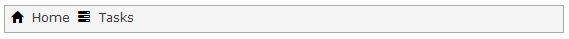

## 1 Introduction

The menu bar widget shows a configured menu in the form of a horizontal bar with items. Items can have subitems in which case the main item can be expanded. Subitems cannot have subitems again. In the end a [Menu Item](menu-item) points to either the page or the microflow that will opened or started when the item is clicked.

## 2 Common Properties

{}

{}

{}

## 3 General Properties

{}
