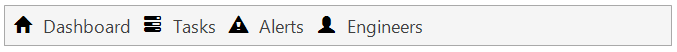
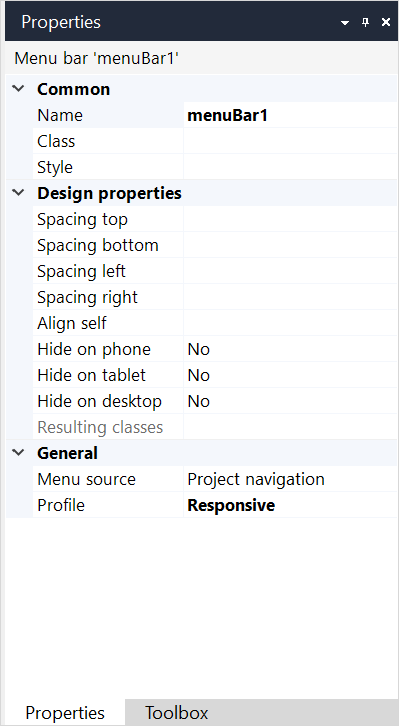

{}The menu bar widget is not supported on native mobile pages.{}

## 1 Introduction

The menu bar widget shows a configured menu in the form of a horizontal bar with items. Menu bars can go two levels deep, that means menu items can have sub-items. For more information on menu items and their properties, see [Menu](menu).

## 2 Properties

An example of menu bar properties is represented in the image below:

{}
{}

Menu bar properties consist of the following sections:

* [Common](#common)
* [Design properties](#design)
* [General](#general)

### 2.1 Common Section {#common}

{}

### 2.2 Design Properties Section {#design}

{}

### 2.3 General Section {#general}

#### 2.3.1 Menu Source {#menu-source}

The items that are shown in the menu widget are determined by the menu source. A menu widget is either filled from a menu configured in the [Navigation](navigation) document or a [Menu](menu) document.

| Value              | Description                                                  |
| ------------------ | ------------------------------------------------------------ |
| Project navigation | The menu items are taken from one of the menus defined in the [Navigation](navigation) document. Use this for the main menu of your application. |
| Menu document      | The menu items are taken from a [Menu](menu) document. Use menu documents for auxiliary menus. |

_Default value:_ Project navigation

#### 2.3.2 Profile 

Only available when the [menu source](#menu-source) is set to **Project navigation**. The **Profile** property specifies what [navigation profile](navigation#profiles) is used for the widget. 

_Default value:_ Responsive

#### 2.3.3 Menu 

Only available when the [menu source](#menu-source) is set to **Menu document**. The **Menu** property specifies what [Menu](menu) document is used for the widget.

## 3 Read More

* [Page](page)
* [Menu Widgets](menu-widgets)
* [Properties Common for Widgets](common-widget-properties)