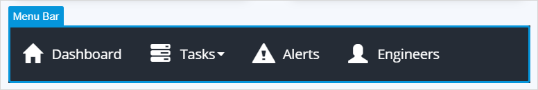
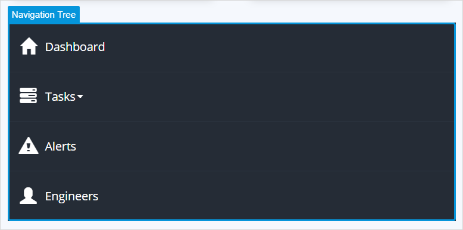
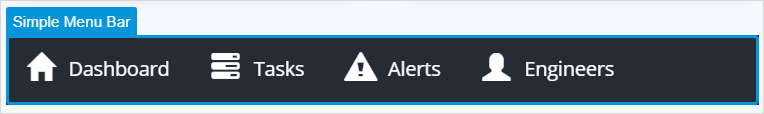

## 1 Introduction

Menu widgets display menu items configured in the [navigation](navigation) or in a [menu](menu) document.

* [**Menu Bar**](menu-bar) – displays a [navigation](navigation) or [menu](menu) document in a form of a horizontal bar

    

* [**Navigation Tree**](navigation-tree) – displays a [navigation](navigation) or [menu](menu) document in a form of a tree

    

* [**Simple Menu Bar**](simple-menu-bar) – displays a [navigation](navigation) or [menu](menu) document in a form a horizontal or vertical bar 

    

## 2 Performing Basic Functions

{}

## 3 Read More

* [Page](page)
* [Pages](pages)