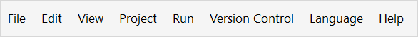

## 1 Introduction

The top-bar of Studio Pro contains the following menus:

* [Switch-to](#switch-to) – allows you to navigate to other parts of the platform
* [File](#file) – allows you to manage documents and apps
* [Edit](#edit) – allows you to perform editing functions such as search or copy within Studio Pro
* [View](#view) – allows you to choose how Studio Pro and dockable panes within Studio Pro are displayed
* [App](#project) – contains app-wide settings
* [Run](#run) – contains actions for deploying and monitoring your app 
* [Version Control](#version-control) – contains setting for version control
* [Language](#language) – contains language and translation settings
* [Help](#help)  – allows you to view documentation, the [Mendix Forum](https://forum.mendixcloud.com/index4.html), open log file directory, or view information on  the current information of Studio Pro

## 2 Switch-to Menu {#switch-to}

The **Switch-to** menu is located at the top-left of Studio Pro and is represented as a nine dots icon. It contains links to various parts of the platform that will open in a new browser window. For more information on the **Switch-to** menu, see the [Navigation](/developerportal/#navigation) section in the *Developer Portal Guide*.

## 3 File Menu {#file}

Via the **File** menu you can manage documents and apps. For more information on the **File** menu, see [File Menu](file-menu).

## 4 Edit Menu {#edit}

The **Edit** menu allows you to perform editing functions, such as cut/copy/paste. You can also set [preferences](preferences-dialog) via this menu. For more information on the **Edit** menu, see [Edit Menu](edit-menu).

## 5 View Menu {#view}

The **View** menu allows you to view dockable panes, to enable the full screen mode, and reset the projappect layout. For more information on the **View** menu and its items, see [View Menu](view-menu).

## 6 App Menu {#project}

In the **App** menu, you can view and/or manipulate settings that are connected to your app and deployment. For more information on the **App** menu, see [App Menu](app-menu).

## 7 Run Menu {#run}

The **Run** menu contains actions for deploying and monitoring your app, such as **Publish**, **Run locally**, or **Debugger**. For more information on the **Run** menu, see [Run Menu](run-menu). 

## 8 Version Control Menu {#version-control}

In the **Version Control** menu, you can view and/or manipulate settings on the version control. For more information on the **Version Control** menu, see [Version Control Menu](version-control-menu).

## 9 Language Menu {#language}

In the **Language** menu, you can add alternative languages to your app so that end-users can see the app in their preferred language. You can also make batch changes to identical texts, even if you are only working in one language. For more information on the **Language** menu, see [Language Menu](translatable-texts).

## 10 Help Menu {#help}

| Menu Item | Description | Shortcut Key |
| --- | --- | --- |
| **Help** | Opens the documentation page about the currently selected element. If an entity is selected, for example, the documentation for entities will be shown. | <kbd>F1</kbd> |
| **Help Contents** | Opens the start page of the documentation in the default web browser. |   |
| **Ask a Question** | Opens the [Mendix Forum](https://forum.mendixcloud.com/index4.html) in the default web browser. |   |
| **Open Log File Directory** | Opens the log files for your app locally. |   |
| **About Mendix Studio Pro** | Shows information about the current version of Mendix Studio Pro. |   |

## 11 Read More

* [Studio Pro Overview](studio-pro-overview)
