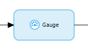
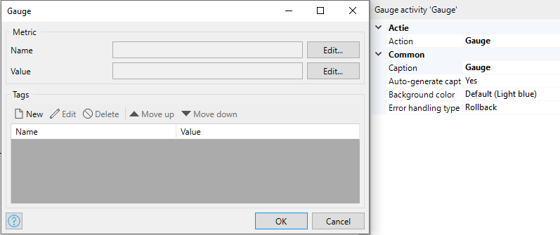

{}
This activity can only be used in **Microflows**.
{}

## 1 Introduction

The **Gauge** activity can be used to set a gauge to a specific value.

## 2 Properties

An example of gauge properties is represented in the image below:

There are two sets of properties for this activity, those in the dialog box on the left, and those in the properties pane on the right.

The **Complete task** properties pane consists of the following sections:

* [Action](#action)
* [Common](#common)

## 3 Action Section {#action}

The **Action** section of the properties pane shows the action associated with this activity.

You can open a dialog box to configure this action by clicking the ellipsis (**…**) next to the action.

You can also open the dialog box by double-clicking the activity in the microflow or right-clicking the activity and selecting **Properties**.

### 3.1 Name

The name of the gauge to increment the value.

### 3.2 Value

The value used to set the gauge to. Values are specified with [expressions](expressions) and should be of type Decimal.

### 3.3 Tags

You can specify a list of tags to enrich the gauge name with key/value pairs.

## 4 Common Section {#common}

{}

## 5 Read More

* [Metric Configuration](metrics)
* [Metrics Activities](metrics-activities)
* [Meter Concepts](https://micrometer.io/docs/concepts)
