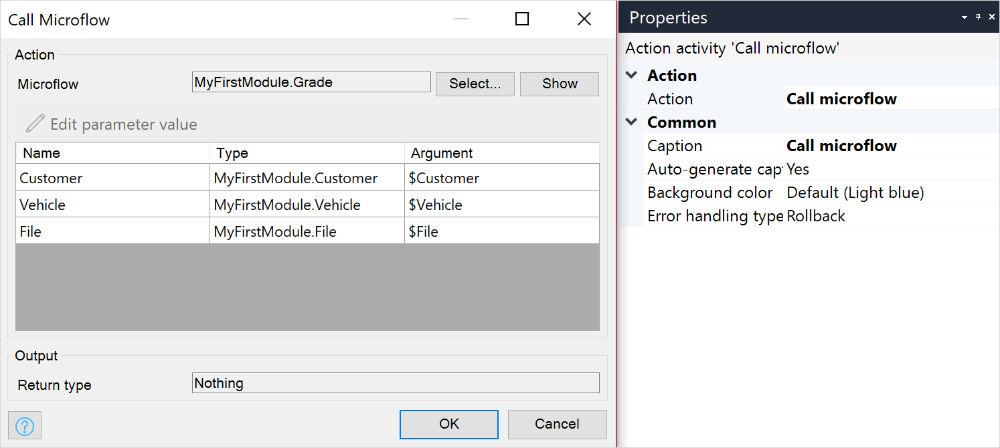

{}
This activity can be used in both **Microflows** and **Nanoflows**.
{}

## 1 Introduction

The **Microflow call** activity can be used to call a [microflow](microflows). Arguments can be passed to the microflow and the result can be stored.

## 2 Properties

There are two sets of properties for this activity, those in the dialog box on the left, and those in the properties pane on the right:

The **Microflow call** properties pane consists of the following sections:

* [Action](#action)
* [Common](#common)

## 3 Action Section {#action}

The **Action** section of the properties pane shows the action associated with this activity.

You can open a dialog box to configure this action by clicking the ellipsis (**…**) next to the action.

You can also open the dialog box by double-clicking the activity in the microflow or right-clicking the activity and selecting **Properties**.

### 3.1 Microflow

The microflow that is called by this activity.

### 3.2 Arguments

For each parameter of the microflow, you have to supply an argument of the same type. The values of the arguments are expressed using [expressions](expressions). There is a difference in the way argument values are passed to a sub-microflow:
  * Lists and objects are passed as references (meaning, if the list/object is changed in a sub-microflow, the original list/object is altered)
  * Primitive types (strings, numbers, etc.) are passed as values (meaning, they are immutable, and not changeable via sub-microflows)

{}
When used inside a nanoflow in an offline profile, only primitives and non-persistable entities that have no associations with persistable entities are allowed as arguments for the call. For more information, see the [Microflows](offline-first#microflows) section of the *Offline-First Reference Guide*.
{}

### 3.3 Return Type

The data type of the result of the called microflow. The return type is defined by the called microflow.

### 3.4 Use Return Value

If **Use return value** is set to *Yes* you will be asked to give the return value a name.

### 3.5 Variable Name, Object Name, or List Name

The name of the result of the called microflow.

## 4 Common Section {#common}

{}