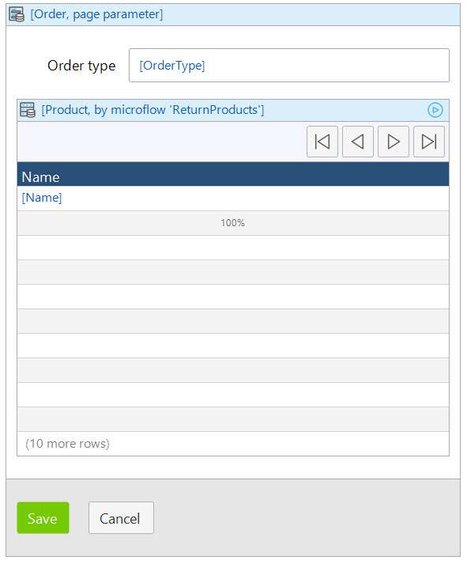
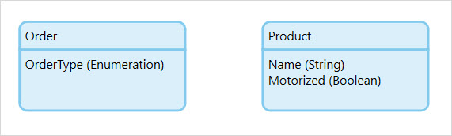

## 1 Introduction

In most cases, you use the *database*, *association* or *XPath* data sources to fill a [data widget](data-widgets). For example, if the properties of a data grid require an object selected in the data grid, a data grid gets its objects from a database query. A nested template grid can retrieve its objects over an association. However, sometimes the target objects need to adhere to very specific criteria, or different objects are shown under different circumstances that cannot be handled by an [XPath](xpath-constraints). In these situations a *microflow data source* may be required.

When a data widget with a microflow data source is displayed in the browser or refreshed, it runs the designated microflow and displays the return value. The manner in which the objects are acquired in the microflow is entirely up to you, which allows for unlimited control over what objects to return.

A microflow data source ignores all context. It performs actions described in the microflow, nothing else. For example, nested data widgets with a microflow data source will not automatically create or invoke associations to the encasing data widget.

## 2 Microflow Data Source Example

For example, you have a data grid that needs to display a list of potential orders based on the order type:

If the *OrderType* of the *Order* entity is set to *Cars*, then the data grid should display all *Products* for which the Boolean *Motorized* is set to true. If the *OrderType* is *Bicycles* only objects for which *Motorized* is set to false need be shown. If *OrderType* is empty the data grid should remain empty.

Because of the mismatch in attribute types this cannot be constrained by XPath and a microflow data source is required. 

The microflow for the use-case should look like this:

This microflow does the following:

1. It passes the *Order* of the enclosing data view as a parameter. 

2. It then splits on the *OrderType* attribute and retrieves a different set of products for each enumeration value. 

3. The microflow returns a list of products and each end event is configured to return a list. 

    {}The *empty* path also requires a value, where `empty` is also a value.
    {}

## 3 Properties

###  3.1 Microflow

Designates the microflow used to populate the widget. This microflow will be run whenever the widget is loaded into the browser or refreshed. The microflow must have a return value of either an object or a list of objects, depending on the widget being used.

### 3.2 Microflow settings

See [Starting Microflows](starting-microflows).

## 4 Read More

* [Starting Microflows](starting-microflows)
* [Data Widgets](data-widgets)