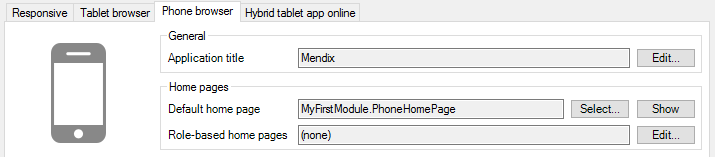
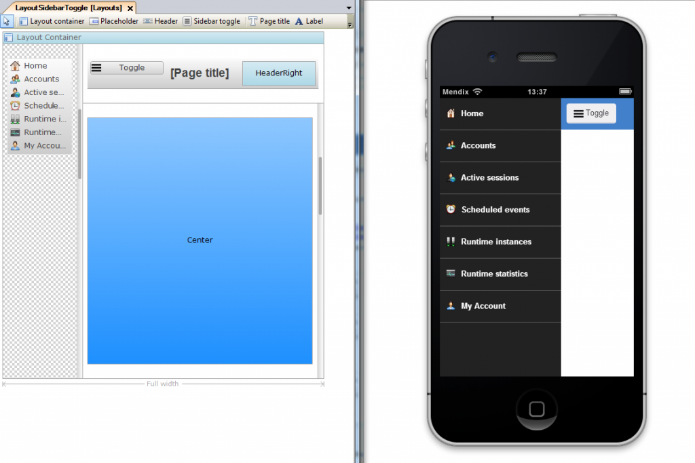
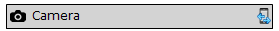

## 1 Introduction

Mendix allows you to quickly build apps for mobile devices. This document gives an overview of mobile app development with Mendix and points to relevant documentation pages.

## 2 Navigation

Every app starts at the home page. You can specify different home pages for phones and tablets in the [Navigation](navigation) document. The mobile profiles can be added and removed separately. If you add a profile, you also have to provide its home page. Apart from the home page, different home page for different user roles can be specified. In addition, there is a default menu that can be used in [menu widgets](menu-widgets).

## 3 Layout

In theory, you can show the whole desktop site on mobile devices, but you probably want to have optimized pages with simpler layouts and less information. [Layouts](layout) help you to create pages that suit a device.

For mobile devices, you might want to have a layout that hides the menu in a collapsible [sidebar](sidebar-toggle-button).

You will need at least one layout per supported device type (desktop, tablet, phone) to optimize your app, but you can create as many as you like.

## 4 Widgets

Some widgets are more suitable to mobile use than others. For example, the [data grid](data-grid) is not very well suited because of its reliance on multiple columns and multiple search fields. The [list view](list-view) is a simpler, more compact widget for showing a list of objects. [Data views](data-view) lend themselves equally to mobile and desktop usage, but of course this depends on all the widgets you place inside. Some custom widgets can only be used in hybrid mobile apps, because they access native features of the device.

## 5 Hybrid Mobile Apps

Mendix apps can simply be viewed in mobile web browsers. However, some features of mobile devices cannot be accessed through HTML and JavaScript.

If you want to publish your app in the Apple App Store or Google Play, you have to wrap the app in a native shell. We use [PhoneGap](http://phonegap.com/) to do this. PhoneGap creates a native wrapper around a web application and provides access to native functions through a Javascript API. These apps are also called "hybrid" apps, because they are a hybrid of a web and a native app. Mendix facilitates the creation of hybrid mobile apps in a number of ways.

### 5.1 Hybrid Mobile Widgets

To access native functions of the device, we provide a number of PhoneGap widgets in the Mendix App Store. And, of course, you can build your own custom widgets that use native features. PhoneGap widgets can be recognized by their special icon. You can also search for them by via **Edit** > **Find Advanced** in the Mendix Desktop Modeler.

### 5.2 Offline Apps

{}
This is a new feature still in beta, and is subject to change before the final release.
{}

Separate profiles are available for building [offline apps](offline). These apps can run even when there is no network connection available, because they store their data on the device itself. When the device connects to the network, the user can synchronize with the main application. Note that there are some restrictions compared to connected apps.

## 6 Documents in This Category

* [Configuring Hybrid Mobile Apps To Run Offline](configuring-hybrid-mobile-apps-to-run-offline)
* [Customizing Hybrid Mobile Apps](customizing-hybrid-mobile-apps)
* [Customizing PhoneGap Build Packages](customizing-phonegap-build-packages)
* [Developing Hybrid Mobile Apps](developing-hybrid-mobile-apps)
* [Getting the Mendix Mobile App](getting-the-mendix-app)
* [Managing App Signing Keys](managing-app-signing-keys)
* [Packaging Hybrid Mobile Apps](packaging-hybrid-mobile-apps)
* [Publishing Hybrid Mobile Apps](publish-packages-to-mobile-stores)
