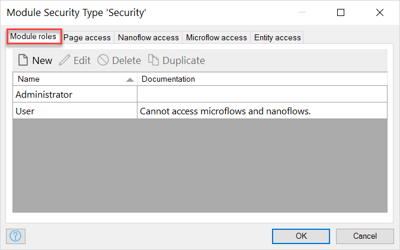

## 1 Introduction

{}

For more general information on security, see [Security](security).

{}

Within a module you can define module roles and specify security settings for pages, microflows, entities, and datasets.

## 2 Module Role

A module role defines a set of access permissions that you can assign to a user. For more information on module roles, [user roles](user-roles), and their relation, see [Security](security).

A module role has the following properties:

* **Name** – the name of a module role. End-users do not see the names of module roles, if they create or view user accounts, only see the names of user roles.

*  **Documentation** – the documentation of a module role is there only for the convenience of Studio Pro users; it is not visible for the end-users.

    

## 2 Page Access

Page access defines which pages each module role can access. The menu bar is optimized so that it only shows pages and microflows that the user has access to.

The **Page access** tab is displayed as a matrix showing pages and modules roles. For each combination you can indicate whether or not the module role has access to the page. 

You can also edit this information in a [page](page) using the **Visible for** property.

## 3 Microflow Access

The **Microflow Access** tab defines which microflows can be executed by users with a certain module role. The menu bar is optimized so that it only shows pages and microflows that the user has access to.

The **Microflow access** tab is displayed as a matrix showing microflows and modules roles. For each combination you can indicate whether or not the module role has access to the microflow. You can also edit this information in a [microflow](microflow) using the **Allowed roles** property.

{}

Note that these roles are only checked when the microflow is executed from the client. A microflow is always allowed to call another microflow and these roles are not checked then.

{}

## 4 Entity Access

The **Entity Access** tab defines for each module role whether users with this role are authorized to Create, Read, Write and/or Delete objects of the entity.

The **Entity Access** tab is displayed as a matrix showing access rules that apply to entities. Each access rule in turn applies to a set of module roles. See [Access Rules](access-rules) for more information.

## 5 OData Access 

OData Access defines for each module role whether users with this role are authorized to access OData resources for each OData service exposed within the module.

OData Access is displayed as a matrix showing published OData services and modules roles. For each combination, you can indicate whether the module role has access to the published OData service. You can also edit this information in [published OData services](published-odata-services) using the **Allowed roles** property in the **Settings** tab.

## 6 REST Access

REST Access defines for each module role whether users with this role are authorized to access REST resources for each REST service exposed within the module. 

REST Access is displayed as a matrix showing published REST services and modules roles. For each REST service, you can indicate whether or not the module role has access to the published REST service.

The **REST Access** tab is visible only when the service has the security set to require authentication. For more information, see [published REST services](published-rest-services).

## 7 Data Set Access

Data Set Access shows for each [dataset](data-sets) (used for [reporting](report-widgets)) and each module role which access the module role has to the dataset.

| Value | Description |
| --- | --- |
| Full access | No constraint applies to the parameters for the dataset, and all eventual range parameters are allowed. |
| Limited access | At least one constraint applies to the parameters for the dataset, or at least one range parameter is not allowed. |
| No access | Users with this module role have no access to the dataset. |

{}

The constraints are defined in the parameter definitions of the dataset. Whether they apply is defined in the dataset access.
The ranges are defined in the parameters of the dataset. Whether values in these ranges are allowed is defined in the dataset access.

{}
