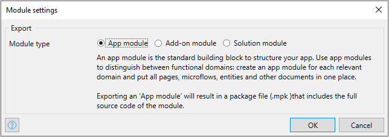
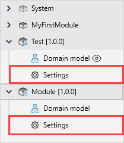

## 1 Introduction

Module settings allow you to choose the type of the module when you configure your app:

To open module settings, select the module in the App Explorer and double-click **Settings**:

There are three different types of modules and the choice of the type depends on the purpose of the module. You can choose the following module types:

* [App module](#app-module)
* [Add-on module](#add-on-module)
* [Solution Module](#solution-module)

## 2 App Module {#app-module}

App modules is a standard way of structuring your app. Use app modules to distinguish between functional domains: create an app module for each relevant domain and put all pages, microflows, entities and other documents in one place.

Exporting an ‘App module’ will result in a package file (.mpk ) that includes the full source code of the module.

## 3 Add-on Module {#add-on-module}

An add-on module is a stand-alone module that is not dependent on other modules and is used as a separate element, for example, a connector. 

Exporting an add-on module will result in an module file (.mxmodule) that only exposes the elements with the Usable export level. Its source cannot be inspected by the consumer of the module.

If you are creating functionality that can be exported and used by other users separately and independently of the rest of the app, you can set your module to an add-on type.  

## 4 Solution Module {#solution-module}

A solution module is only used when developing a solution and is an inseparable part of it. Solutions modules will be exported as a solution package and distributed as an app to multiple consumers.

## 5 Read More

* [Modules](modules)
* [Add-on and Solution Modules](add-on-and-solution-modules)
* [IP Protection](/appstore/creating-content/sol-ip-protection)

