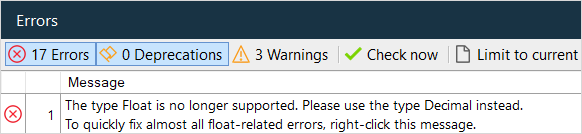
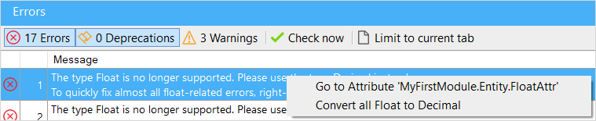
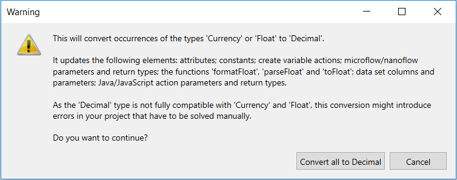
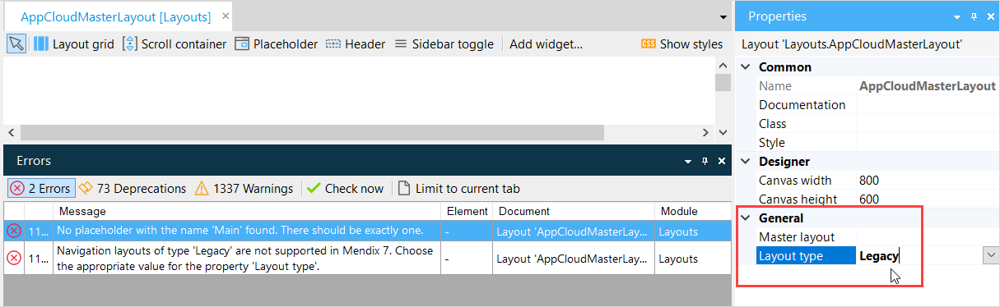

## 1 Introduction

When converting your Mendix app project from Desktop Modeler version 7 to Studio Pro version 8, there is a recommended series of steps you need to take. These are documented below.

For information about new features in Mendix 8, see [Studio Pro 8 release notes](/releasenotes/studio-pro/).

{}
Mendix version 8 and Studio Pro 8 are still in beta. There may be additional breaking changes and update requirements introduced in future beta releases and when Mendix version 8 is made generally available (GA).
{}

## 2 Converting Your Project

The following sub-sections explain the steps to take in converting your project from Mendix 7 to Mendix 8.

### 2.1 Backup Your Project

Make sure that you have either committed your latest changes to Team Server, or taken a backup of your local project before you start the conversion.

### 2.2 Upgrade to the Latest Release of Version 7

You should always convert your project from the latest release of Mendix version 7.

1. Download the latest version of Desktop Modeler version 7.
2. Open your app in the latest version of the Desktop Modeler version 7.
3. Allow it to upgrade the app, if necessary.

### 2.3 Review Your Mendix 7 Project

Review your app project in combination with the sections below and assess if further action needs to be taken before upgrading to Mendix 8.

In particular, it is easier to fix deprecations in Java actions (see [Deprecated and Removed APIs](#deprecated-apis)) in Mendix 7 before upgrading to Mendix 8.

### 2.4 Save Version 7 Project

Your app project is now ready to be upgraded to Mendix Version 8.

It is recommended that you backup/commit your project at this point so that you can return to it if necessary.

You can now close the project in Desktop Modeler version 7.

### 2.5 Upgrade Your App Project to Version 8

Mendix will upgrade your app project for you.

Open the project in Mendix Studio Pro version 8 and allow Studio Pro to update your app to version 8.

### 2.6 Review Errors, Warnings & Deprecations in Studio Pro

Review all error messages and messages about deprecated items and make changes where necessary.

If you are using one, or both, of the deprecated data types Currency and Float you will see errors. See the section [Attributes of Type Float and Currency](#float-currency) below for more information.

### 2.7 Upgrade All Widgets

To minimize the chance of problems, you should update all widgets and other App Store models used by your project to the latest version.

Check if there is a newer version of your App Store modules available in the App Store. Read the version release notes in the App Store to see whether you need to perform specific actions when upgrading.

In general you should not remove and reimport modules, unless this is recommended in the release notes. If you do remove and reimport them, you may lose data or configuration related to the module.

### 2.8 Review & Test Your App

Finally, review the sections below and ensure that you have made all the changes necessary.

Test the app for any unexpected results.

{}
Congratulations! Your app has been successfully upgraded to Mendix 8 and you can continue working as normal.
{}

## 3 Deprecated & Removed APIs{#deprecated-apis}

Deprecated Java actions should be fixed in Mendix 7, before you migrate the app project to Mendix 8.

Fix the deprecations in your Java actions by importing your project into your Java IDE (Eclipse, for example) and reviewing and solving all the deprecations.

Details of removed and deprecated APIs will be added to the *Breaking Changes* section of the [Studio Pro 8 release notes](/releasenotes/studio-pro/).

## 4 Attributes of Type Float & Currency{#float-currency}

Attributes of type Float and Currency were deprecated in Mendix version 7, and have now been removed from Mendix version 8. If your app contains attributes of type Float and/or Currency, these will need to be converted to type Decimal.

We recommend that you make this change separately from other changes as it will force a change to your domain model and the underlying database.

To convert attributes of type float and currency to decimal, do the following.

1. In Studio Pro 8, find the error message which relates to the support of Currency and Float data types.

    

2. Right-click the error message.

    

3. Click **Convert attributes of type 'Currency' or 'Float' to 'Decimal'…** to convert all the attributes automatically.

    

4. Click **Convert all to Decimal** to perform the conversion

5. Find all references to the converted attributes (within microflow actions, for example) and ensure that they expect the *Decimal* attribute type. If the attribute types do not match, you may have additional errors and warnings.

Alternatively, you can convert each attribute manually by clicking **Find attributes of type 'Currency' or 'Float'** and then convert each of them manually.

{}
The next time your app is run locally or deployed the database will be converted to support the new attribute types.

**This database conversion could take a long time!** We suggest that you first test the data conversion on a representative dataset, so that you can estimate how long it will take to convert your production database.
{}

## 5 64-Bit Studio Pro

Mendix Desktop Modeler version 7 was 64-bit application but could also run on 32-bit.

Mendix Studio Pro is a 64-bit application which will **only** run on 64-bit versions of Windows. This must be the 64-bit version of Windows 7, Service Pack 1, or above.

## 6 Collaborative Development with Studio

If your original project was version 7.23.2 or below and you want to work collaboratively with developers using Mendix Studio, you will need to enable collaborative development.

Follow the instructions in [Migration From the Sync Process to Collaborative Development](/refguide7/collaborative-development-migration).

[//]: # "Java Action Parameters - Java Action code generation can break the code in beta 2. See Ivan"

[//]: # "open JDK 11 - future betas"

[//]: # "Widget DOM Changes - future betas"

## 7 Troubleshooting

### 7.1 Cannot Open Project: `Layout … has an invalid value …`

Very rarely, you may receive a message similar to the one below when opening a project in Mendix Studio Pro 8 which needs to be upgraded from a previous version of Mendix.

This happens when a layout has an invalid value for the **Layout type**. This will still cause an error, *even if the invalid layout has been excluded* from the project.

See the image below for an indication of where you might find the error in your project.

To resolve this issue, use the previous version of Mendix to change the invalid **Layout type** (in the example above, `Legacy`) to a valid value.
