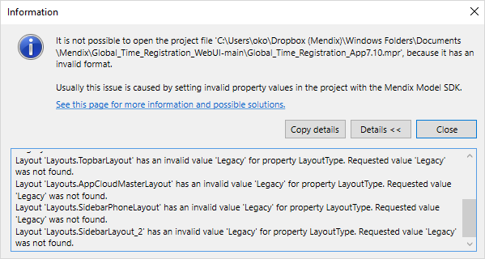

{}[Work in Progress]{}

## 1 Introduction

{}
This document is being written and will be available later today
{}

<!--
## 1 General Information

To move your app to Mendix version 8 from a previous version, do the following:

1. Download the latest version of Desktop Modeler version 7.

2. Open your app in the latest version of the Desktop Modeler version 7.

3. Allow it to upgrade the app, if necessary.

4. Update all the widgets to the latest version.

5. Review all messages about deprecated items and make changes where necessary. See the sections below for more information on how to deal with specific issues.

6. Review the sections below and assess if further action needs to be taken.

7. Save the project.

8. Open the project in Mendix Studio Pro version 8.

9. Allow Studio Pro to update your app to version 8.

10. Review any Error, Warning, or Deprecation messages in Studio Pro.

11. Test the app for any unexpected results.

12. Continue working on your app in Studio Pro, as normal.

## 2 Attributes of Type Float and Currency

## 3 64-bit Studio Pro

## 4 Deprecated and Removed APIs

## 5 Open GDK 11

## 6 Widget DOM Changes

## 7 Troubleshooting

### 7.1 Cannot Open Project: `Layout … has an invalid value …`

Very rarely, you may receive a message similar to the one below when opening a project in Mendix Studio Pro 8 which needs to be upgraded from a previous version of Mendix.

This happens when a layout has an invalid value for the **Layout type**. This will still cause an error, *even if the invalid layout has been excluded* from the project.

See the image below for an indication of where you might find the error in your project.

To resolve this issue, use the previous version of Mendix to change the invalid **Layout type** (in the example above, `Legacy`) to a valid value.

-->

