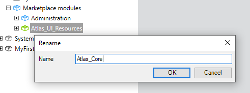
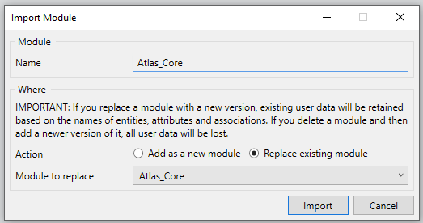
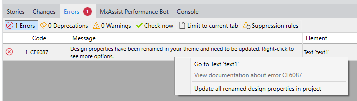
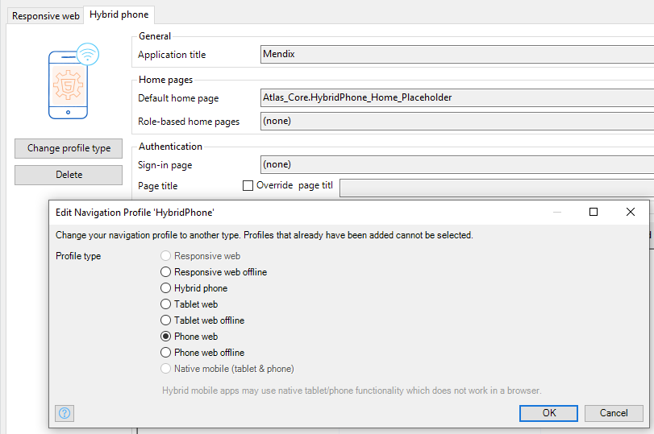
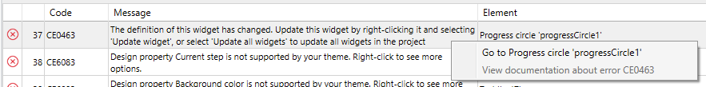
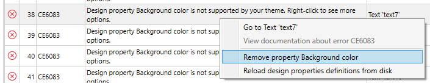
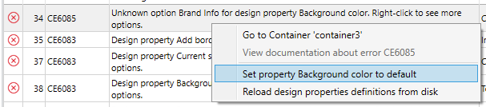
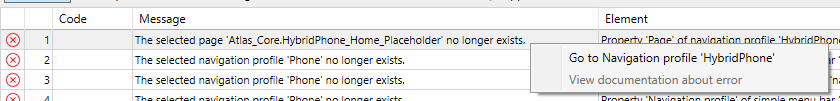

## 1 Introduction

Atlas 3 brings a new degree of power and sophistication to styling in Mendix. To upgrade from Atlas 2 to Atlas 3, see the [Upgrade from Atlas 2 to Atlas 3](#upgrade) section below. To view a high-level summary of the changes Atlas 3 brings to Mendix, see the [Atlas 3 Change Summary](#changes) section below.

Please note that for the majority of users migrating from Atlas 2 to Atlas 3, the process you need to follow is simple. If you have not made major custom changes to your Atlas styling, you will follow these steps:

1. Complete steps 1 and 2 in the [Modify Existing Module](#modify-existing) section below.
2. Complete the [Modify Existing Module (Continued)](#modify-2) section below.
3. Fix errors per the [Expected Issues After Upgrading to Atlas 3](#expected-issues) section below.

## 2 Upgrade from Atlas 2 to Atlas 3 {#upgrade}

Before upgrading, please note that in Atlas 3 all hybrid content is removed because hybrid profiles are deprecated in Mendix 9. If your project requires hybrid content, we recommend not upgrading to Atlas 3 unless you have created all your own hybrid content separate from Atlas’.

Before you start the upgrading process, it may help if you consult the folder structure changes introduced in Atlas 3 by reading the [File and Folder Structure](/howto/front-end/customize-styling-new#file-and-folder) section of *How to Customize Styling*. 

### 2.1 Modify Existing Module {#modify-existing}

To upgrade to Atlas 3, please do the steps below as they apply to your use case:

1. Rename your **theme** directory. We suggest naming it *theme_atlas2*.
2. Download this [theme.zip](https://www.dropbox.com/s/guffms4u5idx3us/theme.zip?dl=1) and extract it into the root of your Mendix project folder. Ensure the folder structure is **Mendix project root**, then **theme**, then **web** and **native**.
3. If you have made any modifications to Atlas 2 in your Mendix project, the following actions need to be taken (otherwise you can skip to [this section](#modify-2) below. Modifications include changes to pages, layouts, design properties and custom styles added to the `Atlas_UI_Resources` module:

| Section    | Atlas 2 Context                                              | Action Required                                              |
| ---------- | ------------------------------------------------------------ | ------------------------------------------------------------ |
| For Web    |                                                              |                                                              |
| 1          | Modifications to Atlas' variables in:<ul><li>*theme_atlas2/styles/web/sass/app/_custom-variables.scss*</li> | There are two options based on your requirements: <ul><li>If the variables apply to the app level, these should be moved into *theme/web/custom-variables.scss*</li><li>If you want to extract the variables into a reusable module, move them to a module you have created in *themesource/your-module/web/custom-variables.scss*</li></ul> |
| 2          | Modifications to Atlas styling in:<ul><li>*theme_atlas2/styles/web/sass/app/_custom.scss*</li> | There are two options based on your requirements: <ul><li>If the styling applies to the app level, these should be moved into *theme/web/main.scss*</li><li>If you want to extract the styles into a reusable module, move them to a module you have created in *themesource/your-module/web/main.scss*</li></ul> |
| 3          | Additional styling files in:<ul><li>*theme_atlas2/styles/web/sass/app/</li><li>any custom *.scss* file</li></ul> | There are two options based on your requirements: <ul><li>If the variables apply to the app level, these changes should be moved into *theme/web/*. Remember to include `@import<file name>` in *theme/web/main.scss* to include your additional files in SCSS compilation.</li><li>If you want to extract the variables into a reusable module, move them to a module you have created in *themesource/your-module/web/*. Remember to include `@import<file name>` in *theme/web/main.scss* to include your additional files in SCSS compilation.</li></ul> |
| 4          | Modifications to Atlas HTML in:<ul><li>*theme_atlas2/login.html*</li><li>*theme_atlas2/login-with-sso.html*</li></ul> | <ul><li>Any HTML or document changes in *theme_atlas2/login.html* not included in *theme/web/login.html* should be moved to *theme/web/login.html*.</li><li>Any HTML or document changes in *theme_atlas2/login-with-sso.html* no included in *theme/web/login-with-mendixsso-button.html* should be moved to *theme/web/login-with-mendixsso-button.html*.</li></ul> |
| 5          | Additional (user-defined) HTML in:<ul><li>*theme_atlas2/<filename>.html*</li> | Move these files into *theme/web*.                           |
| 6          | Additional static resources (for example, images) in:<ul><li>*theme_atlas2/resources*</li> | Move these files into *theme/web/resources*.                 |
| 7          | Additional static resources (for example, images) in:<ul><li>*theme_atlas2*</li> | Move these files into *theme/web*.                           |
| 8          | User-defined design properties in:<ul><li>*theme_atlas2/settings/json*</li> In Atlas 2's *theme_atlas2/settings.json* it is possible to both extend platform-supported widgets with design properties (for these platform widgets: Widget, DivContainer, Button, ListView, DataGrid, TemplateGrid, GroupBox, StaticImageViewer, DynamicImageViewer, Label, DynamicText) as well as define design properties for community-supported widgets. Both scenarios will be addressed in the **Action Required** cell to the right as well as the [Fixing User-Defined Design Properties](#user-design-props) section below. | Generally, the design properties need to be moved into *themesource/your-module/web/design-properties.json* where your-module is a module created by you, **not** *Atlas_Core*, *Atlas_Web_Content*, or *Atlas_NativeMobile_Content*. Follow one or both of the scenarios below in [Fixing User-Defined Design Properties](#user-design-props) for detailed instructions. |
| For Native |                                                              |                                                              |
| 1          | Modifications to Atlas' variables in:<ul><li>*theme_atlas2/styles/native/sass/app/custom-variables.js*</li> | There are two options based on your requirements: <ul><li>If the variables apply to the app level, these changes should be moved into *theme/native/custom-variables.js*.</li><li>If you want to extract the variables into a reusable module, move them to a module you have created in *themesource/your-module/native/main.js*.</li></ul> |
| 2          | Modifications to Atlas' styling in:<ul><li>*theme_atlas2/styles/native/sass/app/custom.js*</li> | There are two options based on your requirements: <ul><li>If the changes apply to the app level, these changes should be moved into *theme/native/main/js*.</li><li>If you want to extract the variables into a reusable module, move them to a module you have created in *themesource/your-module/native/main.js*.</li></ul> |
| 3          | Additional styling files in:<ul><li>*theme_atlas2/styles/native/app/</li><li>any custom *.js* file</li></ul> | There are two options based on your requirements:<ul><li>If the changes are on the app level the changes should be moved into *theme/native*. Remember to import the file using JavaScript's `import` syntax in *theme/native/main.js* and export the variable exposed by the imported file.</li><li>If you want to extract the changes into a reusable module, move the variables to a module you have created in *themesource/your-module/native*. Remember to import the file using JavaScript's `import` syntax in *themesource/your-module/native/main.js* and export the variable exposed by the imported file.</li></ul> |
| 4          | User-defined design properties in:<ul><li>*theme_atlas2/settings-native.json*</li> | Refer to **Web Cell 8** for this case. However, changes should be moved to *themesource/your-module/native/design-properties.json* where your-module is created by you, **not** *Atlas_Core*, *Atlas_Web_Content*, or *Atlas_NativeMobile_Content*. |

#### 2.1.1 Fixing User-Defined Design Properties {#user-design-props}

Please take action based on which of the two scenarios below fits your use case.

##### 2.1.1.1 Scenario 1: Design Properties for Platform-Supported Widgets

Follow this guide if, in Atlas 2, you have extended one or more platform supported widgets with your own design property similar to the following example.

In this example all container widgets are extended with a toggle type `“Border”` design property to add a border to a container, which can be seen in the fragment below. Note that for design properties the `Element` name is called `DivContainer`.

```
{
 "pageTemplates": "WebModeler",
 "cssFiles": ["styles/web/css/main.css"],
 "designProperties": {
  "DivContainer": [
   {
    "name": "Border", // custom design property targeting the platform's DivContainer
    "type": "Toggle",
    "description": "Add a border.",
    "class": "div-container-border"
   }
  ]
 }
}
```

As this was a custom-added design property, this needs to be added to *themesource/your-module/web/design-properties.json* including the widget name, which would result in something similar to this:

```
{
 "DivContainer": [
  {
   "name": "Border",
   "type": "Toggle",
   "description": "Add a border.",
   "class": "div-container-border"
  }
 ]
}
```

##### 2.1.1.2 Scenario 2: Design Properties for Community Widgets

Follow this guide if you have defined your own design property for a community-supported widget in your project.

In the following example a design property `“Opacity”` is added for MyCustomWidget widgets. In Atlas 2 it would appear as follows in *theme_atlas2/settings.json*: 

```
{
 "pageTemplates": "WebModeler",
 "cssFiles": ["styles/web/css/main.css"],
 "designProperties": {
  "MyCustomWidget": [
   {
    "name": "Opacity",
    "type": "Dropdown",
    "description": "Emphasize the visual-importance via opacity.",
    "options": [
     {
      "name": "Light",
      "class": "opacity-light"
     },
     {
      "name": "Normal",
      "class": "opacity-normal"
     }
    ]
   }
  ]
 }
}
```

Note that depending on your Atlas 2 project, you may or may not have design properties for platform or community-supported widgets. In the example image above, the design properties for platform supported widgets are folded.

Copy and paste the design property key, array, and design property object from *theme_atlas2/settings.json* into the root object in *themesource/your-module/web/design-properties.json* where your-module is a module of your choosing. 

In this example, the result is as follows:

```
{
 "MyCustomWidget": [
  {
   "name": "Opacity",
   "type": "Dropdown",
   "description": "Emphasize the visual-importance via opacity.",
   "options": [
    {
     "name": "Light",
     "class": "opacity-light"
    },
    {
     "name": "Normal",
     "class": "opacity-normal"
    }
   ]
  }
 ]
}
```

### 2.2 Modify Existing Module (Continued) {#modify-2}

Once you have completed the necessary steps above, finish modifying existing files by doing the following: 

1.  Rename the *Atlas_UI_Resources* module to *Atlas_Core* in Studio Pro by right-clicking the module then clicking **Rename**:

	

2.  Download the [Atlas Core module](https://marketplace.mendix.com/link/component/117187) from the Marketplace and replace the existing *Atlas_UI_Resources* renamed to *Atlas_Core*:

	

{}[add atlas core files later, and add this text to step 2 For internal testing, download **Atlas_Core** file below this step]{}

## 3 Expected Issues After Upgrading to Atlas 3 {#expected-issues}

When you have completed the sections above, you may have errors in your error list:

*   For errors relating to renamed design properties, right-click a related error and click **Updated all renamed design properties in project**:

	
	
* For errors about the **Phone** or **Tablet** navigation profile no longer existing, right-click the error and select **Go to** which will navigate you to the widget that points to a missing Phone or Tablet profile — use one of these methods to solve the error:
	* Delete the layout
	* Delete the widget in the layout
	* Add the **Phone web** or **Tablet web** navigation profile to your Mendix application
	* In the widget's properties pane change the **Profile** to an already existed profile, like **Responsive web**

	Note that navigation profiles have changed in Mendix 9. See the [Mendix 9 Release Notes](/releasenotes/studio-pro/9.0) for more information.

	

*  If you are using Hybrid phone profiles, please make sure you change them to their equivalent web profiles by clicking **Change profile type** in your navigation profile:
	* Hybrid tablet app offline → Tablet web offline
	* Hybrid tablet app online → Tablet web
	* Hybrid phone app offline → Phone web offline
	* Hybrid phone app online → Phone web

	

*  If you are using Badge, Progress Circle, Progress Bar, or Maps widgets, please make sure you update the definitions of the widgets and reconfigure following the new properties added for each widget:

	

*  If you have **Design property X is not supported by your theme** errors, it either means a design property has been removed in Atlas 3 or you need to add your own design properties to the new file structure as instructed in the [Fixing User-Defined Design Properties](#user-design-props) section above. To suppress the error, right-click the error, then select **Remove property**. To check how to extend your design properties, please follow [How to Extend Design Properties](/howto/front-end/extend-design-properties).

	

* If you have errors saying **Unknown option X for design property**, it means the design property option has been removed in Atlas 3. Use one of the following methods to solve the error: 
	* Set the design property to its default option: right-click the error, then select **Set property X to default**
	* Search for the design property option's CSS class in *theme_atlas2/settings.json* for web and *theme_atlas2/settings-native.json* for native, then add it to the applicable [widget's style property](common-widget-properties#style)  

	

* If you have errors saying **Nanoflow commons/Native mobile resources are not compatible** get the new major versions from **Marketplace**.

## 4 Edge Case Issues After Upgrading to Atlas 3

In Mendix 9 the Hybrid profile is deprecated. In Atlas 3 all hybrid content is removed. When upgrading from Atlas 2 to Atlas 3, you may have errors about pages used as the default home page for a hybrid profile which no longer exists:



To fix this, right-click the error then select **Go to Navigation profile ‘HybridPhone’** and change the default home page:
	


## 5 Modified Design Properties for Native Mobile

Here are the modified design properties for native mobile:

| Parent                                                       | Property                  | Removed                                                      | Added                                                        |
| ------------------------------------------------------------ | ------------------------- | ------------------------------------------------------------ | ------------------------------------------------------------ |
| All                                                          | Background color          | {<br>    "name": "Primary",<br>    "class": "backgroundPrimary"<br>},<br>{<br>    "name": "Gray",<br>    "class": "backgroundGray"<br>}, | {<br>    "name": "Background Primary",<br>    "oldNames": ["Background Default"],<br>    "class": "background-main"<br>},<br>{<br>    "name": "Background Secondary",<br>    "oldNames": ["Background Dashboard"],<br>    "class": "background-secondary"<br>}, |
| Widget                                                       | Spacing top               |                                                              | {<br>    "name": "Smaller",<br>    "class": "spacingOuterTopSmaller"<br>},<br>{<br>    "name": "Larger",<br>    "class": "spacingOuterTopLarger"<br>}, |
| Widget                                                       | Spacing bottom            |                                                              | {<br>    "name": "Smaller",<br>    "class": "spacingOuterBottomSmaller"<br>},<br>{<br>    "name": "Larger",<br>    "class": "spacingOuterBottomLarger"<br>}, |
| Widget                                                       | Spacing right             |                                                              | {<br>    "name": "Smaller",<br>    "class": "spacingOuterRightSmaller"<br>},<br>{<br>    "name": "Larger",<br>    "class": "spacingOuterRightLarger"<br>}, |
| Widget                                                       | Spacing left              |                                                              | {<br>    "name": "Smaller",<br>    "class": "spacingOuterLeftSmaller"<br>},<br>{<br>    "name": "Larger",<br>    "class": "spacingOuterLeftLarger"<br>}, |
| DivContainer                                                 | Background color          | {<br>    "name": "Secondary",<br>    "class": "backgroundSecondary"<br>}, | {<br>    "name": "Gray",<br>    "class": "backgroundGray"<br>},<br>{<br>    "name": "Brand Info",<br>    "class": "backgroundBrandInfo"<br>} |
| ScrollContainer                                              | Background color          | {<br>    "name": "Secondary",<br>    "class": "backgroundSecondary"<br>}, | {<br>    "name": "Gray",<br>    "class": "backgroundGray"<br>},<br>{<br>    "name": "Brand Info",<br>    "class": "backgroundBrandInfo"<br>} |
| Image                                                        | No longer exists          | No longer exists                                             | No longer exists                                             |
| StaticImageViewer                                            | Shape                     |                                                              | {<br>    "name": "Square",<br>    "class": "imageSquare"<br>},<br>{<br>    "name": "Circle",<br>    "class": "imageCircle"<br>} |
| StaticImageViewer                                            | Size                      |                                                              | {<br>    "name": "Icon",<br>    "class": "imageIcon",<br>    "oldNames": ["imageCircleIcon", "imageSquareIcon"]<br>},<br>{<br>    "name": "Small",<br>    "class": "imageSmall",<br>    "oldNames": ["imageCircleSmall", "imageSquareSmall"]<br>},<br>{<br>    "name": "Medium",<br>    "class": "imageMedium",<br>    "oldNames": ["imageCircleMedium", "imageSquareMedium"]<br>},<br>{<br>    "name": "Large",<br>    "class": "imageLarge",<br>    "oldNames": ["imageCircleLarge", "imageSquareLarge"]<br>},<br>{<br>    "name": "Larger",<br>    "class": "imageLarger",<br>    "oldNames": ["imageCircleLarger", "imageSquareLarger"]<br>},<br>{<br>    "name": "FullSize",<br>    "class": "imageFullSize"<br>} |
| DynamicImage                                                 | No longer exists          | No longer exists                                             | No longer exists                                             |
| DynamicImageViewer                                           | Same as StaticImageViewer | Same as StaticImageViewer                                    | Same as StaticImageViewer                                    |
| DynamicText                                                  | Color                     | {<br>    "name": "Contrast lowest",<br>    "class": "textContrastLowest"<br>},<br>{<br>    "name": "Contrast lower",<br>    "class": "textContrastLower"<br>},<br>{<br>    "name": "Contrast low",<br>    "class": "textContrastLow"<br>},<br>{<br>    "name": "Contrast default",<br>    "class": "textContrastDefault"<br>},<br>{<br>    "name": "Contrast high",<br>    "class": "textContrastHigh"<br>},<br>{<br>    "name": "Contrast higher",<br>    "class": "textContrastHigher"<br>},<br>{<br>    "name": "Contrast highest",<br>    "class": "textContrastHighest"<br>} | {<br>    "name": "Paragraph",<br>    "class": "textParagraph"<br>},<br>{<br>    "name": "Disabled",<br>    "class": "textDisabled"<br>},<br>{<br>    "name": "Black",<br>    "class": "textBlack"<br>}, |
| DynamicText                                                  | Size                      |                                                              | {<br>    "name": "Smallest",<br>    "class": "textSmallest"<br>},<br>{<br>    "name": "Largest",<br>    "class": "textLargest"<br>} |
| DynamicText                                                  | Weight                    | {<br>    "name": "Light",<br>    "class": "textLight"<br>},<br>{<br>    "name": "Semibold",<br>    "class": "textSemiBold"<br>}, |                                                              |
|                                                              | Decoration (New)          |                                                              | {<br>    "name": "Underline",<br>    "class": "textUnderline"<br>},<br>{<br>    "name": "Line Through",<br>    "class": "textLineThrough"<br>} |
| LayoutGrid (New)                                             |                           |                                                              |                                                              |
| LayoutGridRow (New)                                          |                           |                                                              |                                                              |
| LayoutGridColumn (New)                                       |                           |                                                              |                                                              |
| ListView                                                     | Background color (new)    |                                                              | {<br>    "name": "Primary",<br>    "class": "backgroundPrimary"<br>},<br>{<br>    "name": "Gray",<br>    "class": "backgroundGray"<br>},<br>{<br>    "name": "Brand Primary",<br>    "class": "backgroundBrandPrimary"<br>},<br>{<br>    "name": "Brand Success",<br>    "class": "backgroundBrandSuccess"<br>},<br>{<br>    "name": "Brand Warning",<br>    "class": "backgroundBrandWarning"<br>},<br>{<br>    "name": "Brand Danger",<br>    "class": "backgroundBrandDanger"<br>},<br>{<br>    "name": "Brand Info",<br>    "class": "backgroundBrandInfo"<br>} |
| com.mendix.widget.native.animation.Animation                 | Background color          | {<br>    "name": "Secondary",<br>    "class": "backgroundSecondary"<br>}, | {<br>    "name": "Gray",<br>    "class": "backgroundGray"<br>},<br>{<br>    "name": "Brand Info",<br>    "class": "backgroundBrandInfo"<br>} |
| com.mendix.widget.native.floatingactionbutton.FloatingActionButton | Style                     |                                                              | {<br>    "name": "Secondary",<br>    "class": "floatingActionButtonSecondary"<br>}, |
| com.mendix.widget.native.safeareaview.SafeAreaView           | Background color          | {<br>    "name": "Secondary",<br>    "class": "backgroundSecondary"<br>}, | {<br>    "name": "Gray",<br>    "class": "backgroundGray"<br>},<br>{<br>    "name": "Brand Info",<br>    "class": "backgroundBrandInfo"<br>} |

## 6 Modified Design Properties for Web

Here are the modified design properties for web:

| Parent                                                       | Property                     | Removed                                                      | Added                                                        | Renamed                                                      |
| ------------------------------------------------------------ | ---------------------------- | ------------------------------------------------------------ | ------------------------------------------------------------ | ------------------------------------------------------------ |
| Widget                                                       | Spacing Top                  |                                                              | {"name": "Inner none","class": "spacing-inner-top-none"},{"name": "Inner small","class": "spacing-inner-top"},{"name": "Inner medium","class": "spacing-inner-top-medium"},{"name": "Inner large","class": "spacing-inner-top-large"} | “None” => "Outer none”“Small” => “Outer small”“Medium” => “Outer medium”“Large” => “Outer large” |
| Widget                                                       | Spacing bottom               |                                                              | Same as Spacing Top                                          | Same as Spacing Top                                          |
| Widget                                                       | Spacing right                |                                                              | Same as Spacing Top                                          | Same as Spacing Top                                          |
| Widget                                                       | Spacing left                 |                                                              | Same as Spacing Top                                          | Same as Spacing Top                                          |
| DivContainer                                                 | Background color             | {  "name": "Brand Default",  "oldNames": [    "Default"  ],  "class": "background-default"},{  "name": "Brand Inverse",  "oldNames": ["Inverse"],  "class": "background-inverse"},{  "name": "Brand Info",  "oldNames": ["Info"],  "class": "background-info"}, | {  "name": "Background Primary",  "oldNames": ["Background Default"],  "class": "background-main"},{  "name": "Brand Secondary",  “oldNames”: [“Brand Default”, “Default”]  "class": "background-secondary"},{  "name": "Brand Gradient",  "class": "background-brand-gradient"} |                                                              |
| DivContainer                                                 | Shade (new)                  |                                                              | {"name": "Light","class": "background-light"},{"name": "Dark","class": "background-dark"} |                                                              |
| GroupBox                                                     | Style                        | {"name": "Brand Default","oldNames": ["Default"],"class": "groupbox-default"},{"name": "Brand Inverse","oldNames": ["Inverse"],"class": "groupbox-inverse"},{"name": "Brand Info","oldNames": ["Info"],"class": "groupbox-info"}, | {"name": "Brand Secondary","oldNames": ["Default", "Brand Default"],"class": "groupbox-secondary"}, |                                                              |
| StaticImageViewer                                            | Fit (new)                    |                                                              | {"name": "Fill","class": "img-fill"},{"name": "Contain","class": "img-contain"},{"name": "Cover","class": "img-cover"},{"name": "Scale-down","class": "img-scale-down"} |                                                              |
| DynamicImageViewer                                           | Fit (new)                    |                                                              | Same as StaticImageViewer                                    |                                                              |
| Label                                                        | Style                        | {"name": "Brand Default","oldNames": ["Default"],"class": "label-default"},{"name": "Brand Inverse","oldNames": ["Inverse"],"class": "label-inverse"},{"name": "Brand Info","oldNames": ["Info"],"class": "label-info"}, | {"name": "Brand Secondary","oldNames": ["Default", "Brand Default"],"class": "label-secondary"}, |                                                              |
| TabContainer (new)                                           |                              |                                                              |                                                              |                                                              |
| DynamicText                                                  | FontWeight renamed to Weight |                                                              |                                                              |                                                              |
| DynamicText                                                  | Size (new)                   |                                                              | {"name": "Small","class": "text-small"},{"name": "Large","class": "text-large"} |                                                              |
| DynamicText                                                  | Color                        | {"name": "Brand Default","oldNames": ["Default"],"class": "text-default"},{"name": "Brand Inverse","oldNames": ["Inverse"],"class": "text-inverse"},{"name": "Brand Info","oldNames": ["Info"],"class": "text-info"}, | {"name": "White","class": "text-white"},{  "name": "Brand Secondary",  "oldNames": ["Default", "Brand Default"],  "class": "text-secondary"}, |                                                              |
| Table (new )                                                 |                              |                                                              |                                                              |                                                              |
| com.mendix.widget.custom.badge.Badge (new)                   |                              |                                                              |                                                              |                                                              |
| com.mendix.widget.custom.progressbar.ProgressBar (new)       |                              |                                                              |                                                              |                                                              |
| com.mendix.widget.custom.badgebutton.BadgeButton (new)       |                              |                                                              |                                                              |                                                              |
| com.mendix.widget.custom.progresscircle.ProgressCircle (new) |                              |                                                              |                                                              |                                                              |

## 7 Building Blocks and Page Templates

If you are using building blocks or page templates, please make sure you download the corresponding modules from **Marketplace**.

For the web platform, download the [Atlas Web Content](https://marketplace.mendix.com/link/component/117183) module.

For native platform, download the [Atlas Native Mobile Content](https://marketplace.mendix.com/link/component/117175) module.

## 8 Atlas 3 Change Summary {#changes}

Atlas 3 includes many changes around style and branding. It has a different, more modern look and feel. The differences are best expressed through comparison, using our Reference Apps. 

{}[show atlas 2 and 3 RA comparison in paragraph above]{}

On both web and native, improvements have been made to layouts, widgets, building blocks, and page templates. These changes include but are not limited to layout and spacing, colors and aesthetics, and user experience.

### 8.1 New Theme

Our new theme has the following advantages:

* Updated color palette
* Values changed in variables
* Introduced exclusion variables for widget default styling
* Changed from Mendix blue to Ultramarine
* MxDock added to template to create one unified platform experience

### 8.2 Grid System

Our new grid system has the following advantages:

* Moved to an 8 pixel grid system
* This new system provides good basic unit to work with (the numbers 4 and 8 are easily multiplied)
* Created more uniformity in design

### 8.3 Float Removal

Our removal of float has the following advantages:

* Removal of the use of “float: left” and “float:right” throughout Atlas core
* Migration of float to flex layout
* Removal of the reliance on floats for layout (flex is more a modern option compared to float)

### 8.4 Design Properties 

Consult the table below for a summary of the changes to existing design properties.

| Spacing options - <br>added spacing-inner, spacing-inner-medium, spacing-inner-large | Introduction of options for inner spacing to all components. Align design properties with that with of native. Design in the two mediums of native and web should be the same experience.                                              |
| ------------------------------------------------------------------------------------ | -------------------------------------------------------------------------------------------------------------------------------------------------------------------------------------------------------------------------------------- |
| Spacing outer options                                                                | Previous spacing options are renamed to outer to be more explicit and to refer to “margin”, while inner refers to “padding”. Aligning design implementation between native and web.                                                    |
| Streamlined style options                                                            | Across a number of widgets we have streamlined the options available for style to primary, secondary, success, warning and danger. The options of “brand-inverse” and “brand-info” are still actionable classes in the sass framework. |

Consult the table below for a summary of additional design properties.

| Tab Container                    | Addition of design properties for tab styling and positioning.                                                                                    |
| -------------------------------- | ------------------------------------------------------------------------------------------------------------------------------------------------- |
| Datagrid 2                       | Addition of design properties for styling and layout of the datagrid 2.                                                                           |
| Badge                            | Addition of style design property for styling the new updated badge.                                                                              |
| Badge Button                     | Addition of design properties for design of the badge button, same properties as that of the standard button: style, size, full-width and border. |
| Progress Circle                  | Addition of design properties for styling the new updated progress circle. Properties including bar color and bar thickness.                      |
| Progress Bar                     | Addition of design properties for the styling the new updated progress bar. Properties including bar color and bar thickness.                     |
| Additional background variants   | Dark and light variations can be added to your background colors via design properties.                                                           |
| Responsive images with image-fit | Options can now be added for images to be resized to fit its container. options include fill, contain, cover and scale-down.                      |

### 8.5 Web Environment Changes

Here is a list of key changes pertaining to the web environment:

* The color palette has been improved which influences all aspects of design and user-experience, from widgets to page templates
* Layout and spacing now relies on a “8px” system, creating more uniformity in design
* Display type “flex” has been used instead of “float” where possible
* Many design properties have been introduced or options added:
    * “Inner” spacing options allowing users to configure “padding” for widgets. This applies to all widgets
        * Previous spacing options are now renamed to “Outer” to be more explicit and apply to “margin” for widgets
    * Container widgets get a new “gradient” option for background color
    * Container widgets get a “shade” design property with options to apply shades to background colors
    * List View widgets get a “style” option to add horizontal borders at the top and bottom of each list item
    * Static and Dynamic images each get a new design property to assist with fitting images (for example fill, contain, cover, or scale-down)
    * Tab Container widgets get new design properties to style and space tabs
    * Text widgets get a new “color” option to color text white
    * Table widgets get new design properties for styling and layout
* Helper classes have been added to assist with (in *core/base/_spacing.scss*):
    * Spacing
    * Shadows
    * Widget height
    * Widget width
    * Widget borders
* Some design properties have been removed:
    * Info and Inverse brand styles for all widgets
* Some design properties have been deprecated:
    * List View widgets’ “styleless” option
* Design Properties such as Style, Color, and Background color that had a “Brand Default” option are now called “Brand Secondary”

## 9 Troubleshoot

To troubleshoot common Atlas problems, do the following:

* If you have **Layout X no longer exists** errors, right-click the error then go to the page on which the error occurs. In the page’s properties, select a new, appropriate layout.
* If you have **The selected image X no longer exists** errors, right-click the error and go to the page on which it occurs and choose a new image. Depending on your project you may want to download the **Atlas_NativeMobile_Content** module and use an image from the module.
* If you have **The selected placeholder X no longer exists** errors, right-click the error and go to the page on which it occurs, thereafter you have alternative options to correct the error:
	*  Adjust the layout the page uses to include a placeholder with matching name.
	* On the page, move the content out of the placeholder.