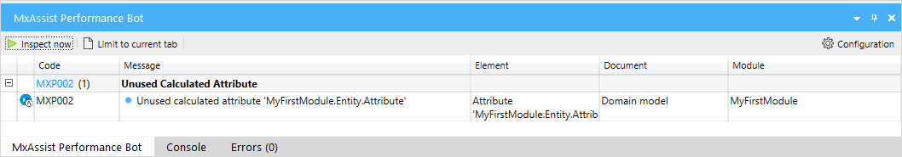
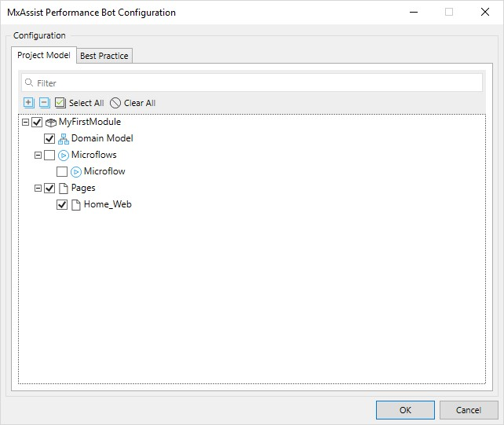
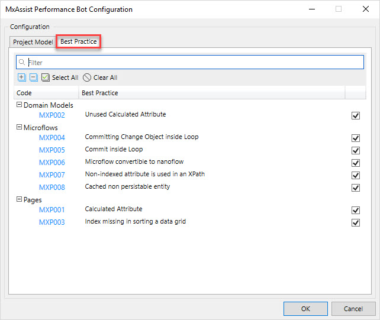
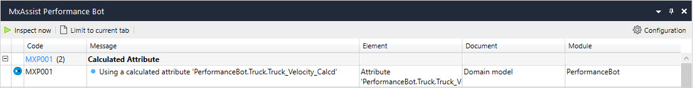
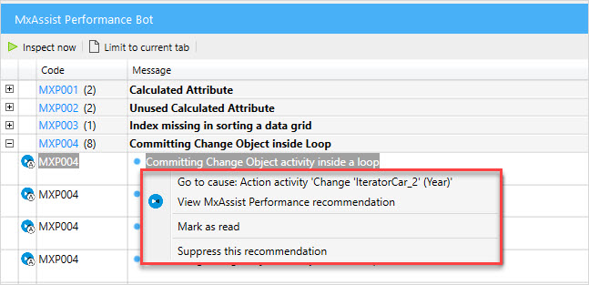
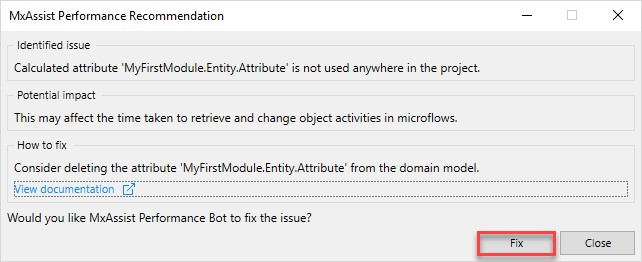

## 1 Introduction 

MxAssist Performance Bot is an intelligent virtual co-developer bot that helps you improve the performance of your project by inspecting your project model against Mendix development best practice in Mendix Studio Pro. It detects anti-patterns during the design and development, pinpoints you to these anti-patterns, suggests you how to resolve it, and in many cases can automatically fix these issues. 

MxAssist Performance Bot is built using statistical analysis of thousands of anonymized Mendix projects to learn common anti-patterns as well as using Mendix Expert Services best practices in the development of microflows, domain models, pages, security, etc..

It consists of a three-level assistance:

1. **Detection** – the bot inspects the model, identifies issue, and pinpoints you to the document/element causing the issue 
2. **Recommendation** – the bot explains the identified issue, the potential impact, and how to fix it. There is also a detailed best practice guide with a     dedicated step-by-step guideline of how to fix the issue.
3. **Auto-fixing** – the bot can automatically implement the best practice and fix the issue.

## 2 MxAssist Performance Bot Pane

To access settings of MxAssist Performance Bot, open Edit > Preferences >the General tab >the MxAssist Performance Bot section:

{}[add screenshot]{}

In the MxAssist Logic Bot section, you can set the following: 
* Show recommendations in the editor 

MxAssist Performance Bot is enabled by default and is designed as a pane. To access the **MxAssist Performance Bot** pane, click **View** > **MxAssist Performance Bot.**

The pane gives you information on each anti-pattern and contains MxAssist Performance Bot settings and configurations:

### 2.1 Options and Configuration

At the top of the **MxAssist Performance Bot** pane you can see the following options: 

* **Inspect now** – inspects your project model on performance issues. 

* **Limit to current  tab** – limits the messages displayed in the pane to the current document.

* **Configuration** – defines the modules and documents that the MxAssist  Performance Bot will analyze. Click the **Configuration** button to open the **MxAssist Performance Bot Configuration** dialog box that contains the **Project Model** and **Best Practice** tabs:

    

    * The **Project Model** tab lists all relevant documents in your project. You can choose which specific modules or documents to inspect or leave out. 

        

    * The **Best Practice** tab lists the available best practice. You can choose your preferred best practices to inspect your model against to. 

        

You can use both project model and best practice configuration together. 

### 2.2 Anti-Pattern Overview

Each anti-pattern line in the pane provides you with the following information: 

* **Icon** – indicates if the anti-pattern can be automatically fixed

* **Code** – a unique code that is specific to the anti-pattern type 

* **Blue circle** – indicates a new detected anti-pattern

* **Message** – description/explanation of the anti-pattern 

* **Element** – the element causing the issue

* **Document** – the document containing the element

* **Module** – the module containing the document 

    

Right-clicking the message line of an anti-pattern in the pane opens the drop-down menu:

The following actions are available in the drop-down menu:

* **Go to Cause {the name of the element}** – takes you to the element causing the issue.
* **Go to Usage {the name of the location}** – opens the corresponding locations where the anti-pattern is used.
* **View MxAssist Performance recommendation** – similar to double-clicking the message, opens the pop-up window with recommendations.
* **Mark as read** – marks the issue as read. This will make the blue circle to disappear. 
* **Suppress this recommendation** – suppresses the issue. This will gray out the issue and send to the bottom of the list. The related indicator in the editor will also disappear. 

## 3 Using MxAssist Performance Bot in App Development  

### 3.1 Detecting an Anti-Pattern 

The first level of assistance is **detection** that includes inspecting the project model, identifying anti-patterns, and pinpointing you to the document causing the issue. 

To inspect your project model, click **Inspect now** in the **MxAssist Performance Bot** pane. Please note that the Inspect now will be decative if there are consistency erroes in the project. In this case, you need to resolve the consistency errors first. 

The bot will detect performance anti-patterns and list them in the pane under the associated anti-pattern type. To learn more about each anti-pattern type, click the anti-pattern code link. Click the plus icon next to the anti-pattern type to see the detected cases of this type:

To view the element or document where the anti-pattern is located, double cick on an anti-pattern message. Alternatively, right-click the anti-pattern message in the pane and choose one of the following in the drop-down menu:

* **Go to Cause {the name of the element}** 
* **Go to Usage {the name of the location}**

In the in the drop-down menu, you can mark an issue as read or suppress it. 

### 3.2 Recommending a Fix

The second level of assistance is **recommendation** – giving you an overview of the issue and recommending how to fix it. 

There are two ways to view the recommendations. First in the pane by right-clicking an anti-pattern message and select **View MxAssist Performance Recommendation** in the drop-down menu. 

The second way is to so-called on-canvas indicators in the editor. To see the detected issues in a document, you can open it. If there is any detected issue for that document, there will be MxAssist Performance Bot indicators where you can click on them to open the recommendation.

{}[add screenshot]{}

The recommendation pop-up contains the description of the identified issue, potential impact from it, the way to fix it, and a link to a more detailed guidance on fixing the issue: 

### 3.3. Auto-Fixing the Anti-Pattern 

The third level of assistance is **auto-fixing** where the bot can automatically implement the best practice and fix the issue with just one user click. To avoid undesirable changes, the automatic refactor is only available when the bot can safely refactor the code without creating an error or making other undesirable change in the model. Each performance issue has an icon in the pane that indicates whether it is auto-fixable or not. If the icon has the “A” letter, the issue can be auto-fixed:

To auto-fix the issue, follow the steps below:

1. Right-click the message line in the pane and select **View MxAssist Performance Recommendation** in the drop-down menu or click on the associated on-canvas indicatorto open the recommendation.

2. In the **MxAssist Performance Recommendation** pop-up window, click the available action button, for example, **Fix**: 

    

After the issue is auto-fixed, a pop-up window listing the changes appears. You can click **Show the fix** to view the changed document and element. 

## 4 Read More

* [Mendix Assist](mx-assist-studio-pro)
* [MxAssist Logic Bot](mx-assist-logic-bot)
* [How to Implement Mendix Best Practices for Development](/howto/general/dev-best-practices)
