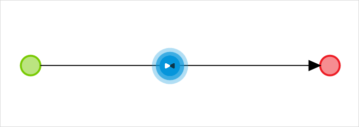
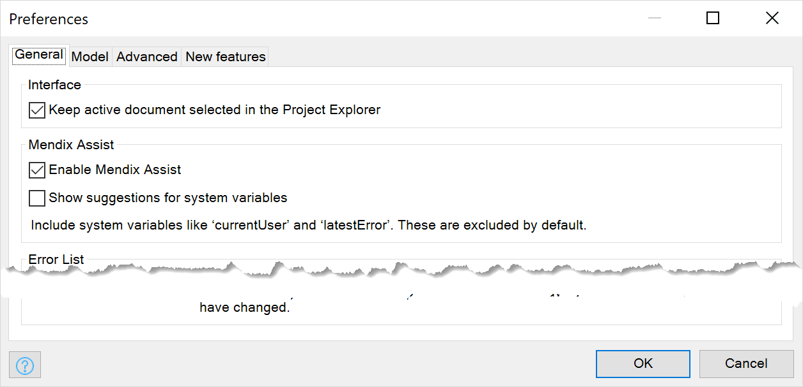
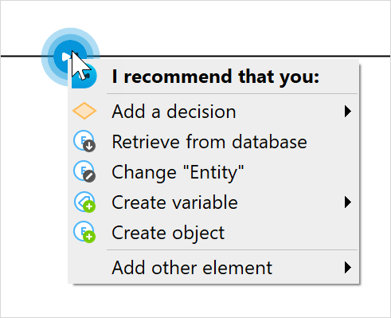
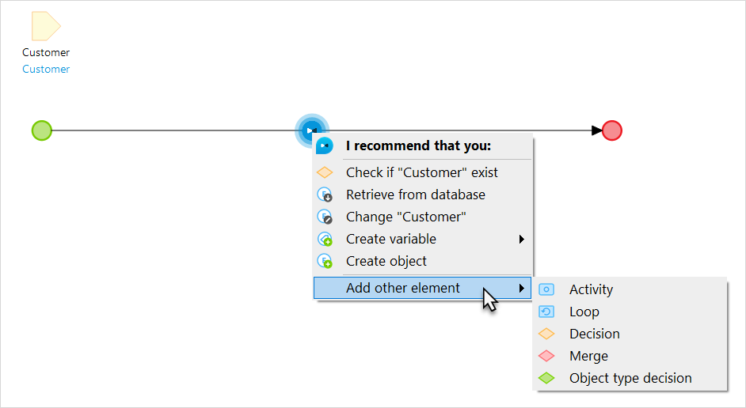

## 1 Introduction 

Mendix Assist is an Artificially Intelligence powered agent that helps you configure microflows in Mendix Studio Pro. It gives users recommendations on configuring the next step of the microflow based on activities, parameters, and events that already exist in the microflow.

Mendix Assist was built using Machine Learning analysis of over twelve million anonymized application flows built with Mendix. Mendix uses Deep Learning to detect best practice patterns in microflows. Based on these patterns Mendix Assist predicts the best options for the next activity in a microflow. Moreover, Mendix Assist keeps learning by analyzing new microflows being built.  

## 2 Mendix Assist Overview

Mendix Assist is enabled by default and is displayed as a blue dot in the flow of a [microflow](microflows). A bow-tie appears on the dot when you hover over it. 

{}

{}

{}

It is possible to add activities in a regular way without using Mendix Assist. 

{}

Click the bow-tie to see Mendix Assist recommendations: 

{}
{}

Mendix Assist lists the top five recommendations from the most probable to less probable ones for the particular microflow. Click the suggestion to proceed with it and insert it into a microflow. For more information, see section [4 Adding Activities and Elements with Mendix Assist](#add-activities).

Once you have selected an activity or an event to insert to the microflow using Mendix Assist, the
**Properties** dialog window to configure this activity/event pops up.

## 3 Settings

To open settings of Mendix Assist, click **Edit** > **Preference**. In the **General** tab, you can see the Mendix **Assist (Beta)** section:

Mendix Assist has the following properties:

* **Enable Mendix Assist** – switches Mendix Assist on and off

* **Show suggestions for system variable** – when enabled, Mendix Assist will make suggestions for system variables as well, for example, it can suggest you changing such variables as *currentUser* or *currentSession*:

  

## 4 Adding Activities and Elements with Mendix Assist {#add-activities}

You can add various activities and elements using Mendix Assist. 

To add an activity/element do the following:

1. Click a blue Mendix Assist dot in a microflow.
2. Browse the suggestions and select the activity you need.
3. Click the selected activity to add it to the flow.
4. Configure activity's properties to avoid consistency errors.

The activity/element is added to the flow.

When you select **Add a check**, an exclusive split will be added (for more information, see [Exclusive Split](exclusive-split)):

 

If you do not see the activity or element that you would like to add in the suggestions, click **Add other element** and choose an activity, a loop, and exclusive split, a merge, or a inheritance split.

## 5 Read More

* [Microflows](microflows)
