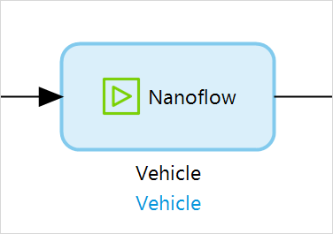

## 1 Introduction

{}
This activity can only be used in **Nanoflows**.
{}

The **Call nanoflow** activity can be used to call another [nanoflow](nanoflows). 

Arguments can be passed to the nanoflow and the result can be stored in a variable.

## 2 Properties

There are two sets of properties for this activity, those in the dialog box on the left, and those in the properties pane on the right:

The **Nanoflow call** properties pane consists of the following sections:

* [Action](#action)
* [Common](#common)

## 3 Action Section {#action}

The **Action** section of the properties pane shows the action associated with this activity.

You can open a dialog box to configure this action by clicking the ellipsis (**…**) next to the action.

You can also open the dialog box by double-clicking the activity in the microflow or right-clicking the activity and selecting **Properties**.

### 3.1 Nanoflow

The nanoflow that is called by this activity.

#### 3.1.1 Name

The name of the parameter.

#### 3.1.2 Type

The type of the parameter. For more information on possible types of parameters, see [Data Types](data-types).

#### 3.1.3 Argument {#argument}

The **Edit parameter value** button allows you to edit the argument value. For each parameter of the nanoflow, you have to supply an argument of the same type. The values of the arguments are expressed using [expressions](expressions).

### 3.3 Return Type

This read-only property indicates whether you will retrieve a variable, object or list. 

### 3.4 Use Return Value

This property determines if the returned value from the called nanoflow should be available in the rest of the current nanoflow. If **Use return value** is set to *Yes*, you will need to fill in the [name](#name) of the variable, object, or list returned by the activity.

### 3.5 Variable Name, Object Name, or List Name {#name}

The name of the variable, list, or object returned by the activity.

## 4 Common Section {#common}

{}