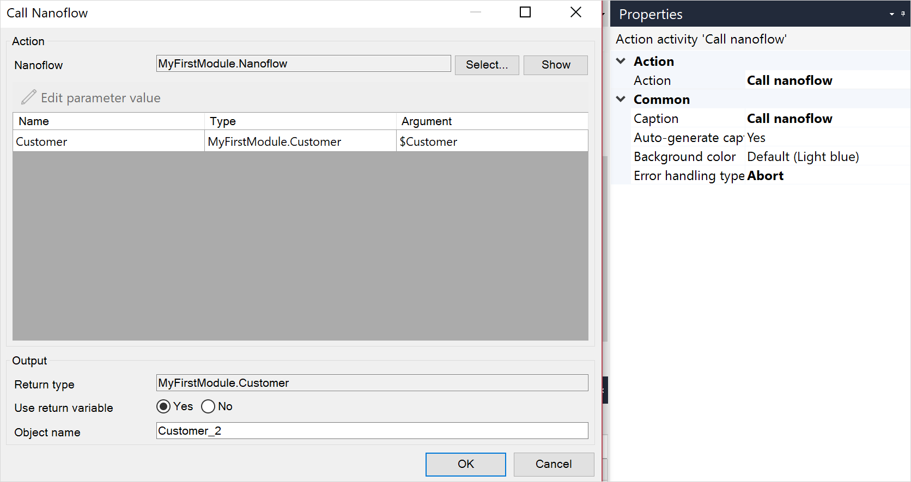

## 1 Introduction

{}
This activity can only be used in **Nanoflows**.
{}

The nanoflow call activity can be used to call another [nanoflow](nanoflows). Arguments can be passed to the nanoflow and the result can be stored in a variable.

## 2 Properties

There are two sets of properties for this activity, those in the dialog box on the left, and those in the properties pane on the right:

The **Nanoflow call** properties pane consists of the following sections:

* [Action](#action)
* [Common](#common)

## 3 Action Section {#action}

The **Action** section of the properties pane shows the action associated with this activity.

You can open a dialog box to configure this action by clicking the ellipsis (**…**) next to the action.

You can also open the dialog box by double-clicking the activity in the microflow or right-clicking the activity and selecting **Properties**.

### 3.1 Nanoflow

The nanoflow that is called by this activity.

### 3.2 Arguments

For each parameter of the nanoflow, you have to supply an argument of the same type. The values of the arguments are expressed using [expressions](expressions).

### 3.3 Return Type

This is the data type of the result of the called nanoflow. The return type is defined by the called nanoflow.

### 3.4 Use Return Value

If **Use return value** is set to *Yes* you will be asked to give the return value a name.

### 3.5 Variable Name, Object Name, or List Name

The name of the variable, object, or list that will contain the result of the called nanoflow.

## 4 Common Section {#common}

{}