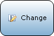
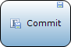
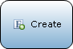
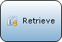
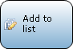
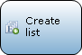
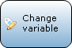
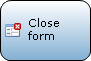
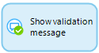

## 1 Introduction

{}

This part is an overview of all the elements that can be used in a nanoflow. For the properties of the nanoflow itself, see [Nanoflow](nanoflow).

{}

Nanoflows are similar to [microflows](microflows): they allow you to express the logic of your application. However, they do have some specific benefits: they run directly on the browser/device and can be used in an offline app. Furthermore, most of the actions run directly on the device so there is also a speed benefit.

## 2 When to use Nanoflows

Nanoflows are designed with offline applications in mind, so business logic can also be executed in them. Since all actions will be run to the offline local database, nanoflows in offline applications will be super fast.

Nanoflows can be beneficial for online applications as well when you do not perform a lot of database-releated actions, like creating, committing and retrieving objects. Each data-related activity in a nanoflow will create a separate network request to the runtime, therefore might be slower than microflows. Changing objects without committing is an exception to this list, since it is configured not to commit, changes will be applied locally.

## 3 Differences from Microflows

* When a nanoflow steps through its actions, client actions are directly executed. For example, an Open Page action immediately opens a page instead of at the end of the nanoflow. This is different from client actions in a microflow which only run when the client receives the result from the microflow.
* When used in nanoflow activities, expressions do not support the following variables: `$latestError`, `$latestSoapFault`, `$latestHttpResponse`, `$currentSession`, `$currentUser`, `$currentDeviceType`.
* Nanoflows are not run inside a transaction, so an error won't rollback any previous changes if an error occures in the nanoflow.

## 4 Keyboard Support

The nanoflow editor offers keyboard support for navigating and manipulating nanoflows. The following table shows the keys that can be used.

| Key | Effect |
| --- | --- |
| Arrow Keys | Select nearby element (activity, event, loop or parameter) in the direction of the arrow. |
| Enter | Edit the properties of the selected element. |
| F2 | Rename the variable introduced by the selected element. |
| Shift+F2 or just start typing | Edit the caption of the selected element. |
| Ctrl+Arrow Keys | Move the selected element in the direction of the arrow. |
| Tab | If a loop is selected, the first element inside the loop will be selected. |
| Shift+Tab | If an element inside a loop is selected, the loop itself will be selected. |
| Home | Select the start event. |
| End | Cycle through the end events. |
| Context-menu key or Shift-F10 | Open the context-menu for the currently selected element. |

## 3 Notation

The graphical notation of nanoflows is based on the [Business Process Model and Notation](https://en.wikipedia.org/wiki/Business_Process_Model_and_Notation) (BPMN). BPMN is a standardized graphical notation for drawing business processes in a workflow.

A nanoflow is composed of elements. Below is a categorized overview of all elements. The following categories are used:

*   [Events](#events) represent start and end points of a nanoflow and special operations in a loop.
*   [Flows](#flows) form the connection between elements.
*   [Gateways](#gateways) deal with making choices and merging different paths again.
*   [Activities](#activities) are the actions that are executed in a nanoflow.
*   [Artifacts](#artifacts) provide the nanoflow with input and allow comments to be made.

## 4 Events

Events represent start and end points of a nanoflow and special operations in a loop.

| Graphic | Name | Description |
| --- | --- | --- |
|  | [Start Event](start-event) | A start event is the starting point of the nanoflow. A nanoflow can only have one start event. |
|  | [End Event](end-event) | An end event defines the location where the nanoflow will stop. Depending on the return type of the nanoflow in some cases a value must be specified. There can be more than one end event. |
|  | [Continue Event](continue-event) | A continue event is used to stop the current iteration of a loop and continue with the next iteration. Please note that continue events can only be used inside a [Loop](loop). |
|  | [Break Event](break-event) | A break event is used to stop iterating over the list of objects and continue with the rest of the flow after the loop. Please note that break events can only be used inside a [Loop](loop). |

## 5 Flows

Flows form the connection between elements.

| Graphic | Name | Description |
| --- | --- | --- |
|  | [Sequence Flow](sequence-flow) | A sequence flow is an arrow that links events, activities, splits and merges with each other. Together they defined the order of execution within a nanoflow. |
|  | [Annotation flow](annotation-flow) | An association is a connection that can be used to connect an annotation to another element. |

## 6 Gateways

Gateways deal with making choices and merging different paths again..

| Graphic | Name | Description |
| --- | --- | --- |
|  | [Exclusive Split](exclusive-split) | An exclusive split makes a decision based on a condition and follows one and only one of the outgoing flows.
**Note**: There is no parallell execution in nanoflows. |
|  | [Merge](merge) | A merge can be used to combine multiple sequence flows into one. If a choice is made in a nanoflow and afterwards some common work needs to be done, you can combine the two (or more) paths using a merge. |

## 7 Activities

Activities are the actions that are executed in a nanoflow.

### 7.1 Object Activitities

Object activities can be used to create and manipulate objects. The [domain model](domain-model) defines the object types ([entities](entities)) that can be used.

| Graphic | Name | Description |
| --- | --- | --- |
|  | [Change object](change-object) | Change object can be used to change the members of an object. This can be done with or without commiting. |
|  | [Commit object(s)](committing-objects) | Commit object(s) can be used to commit the changes to one or more objects. |
|  | [Create object](create-object) | Create object can be used to create an object. |
|  | [Retrieve](retrieve) | Retrieve can be used to get one (or more) associated objects of another object. Furthermore the activity can also get one (or more) objects directly from the database. |
|  | [Rollback object](rollback-object) | Rollback object can be used to undo changes (that have not been committed) that were made to the object in the part of the nanoflow preceding the activity. Furthermore it deletes objects that have been created but have never been committed. |

### 7.2 List Activitities

List activities can be used to create and manipulate lists of objects.

| Graphic | Name | Description |
| --- | --- | --- |
|  | [Change list](change-list) | Change list can be used to change the content of a list variable. |
|  | [Create list](create-list) | Create list can be used to create a (empty) list variable. |

### 7.3 Variable Activitities

Variable activities can be used to create or change a variable within a microflow.

| Graphic | Name | Description |
| --- | --- | --- |
|  | [Change variable](change-variable) | Change variable can be used to change the value of a variable. |
|  | [Create variable](create-variable) | Create variable can be used to create a new variable. |

### 7.4 Client Activitities

Client activities can be used to have the web client of your application perform an action, such as showing a different page or downloading a file.

| Graphic | Name | Description |
| --- | --- | --- |
|  | [Close form](close-form) | Close form closes the form that is opened last by the user that calls the microflow where this activity is used in. |
|  | [Show page](show-page) | Show form can be used to show a form to the user that calls the microflow where this activity is used in. |
|  | [Validation feedback](validation-feedback) | Validation feedback can be used to display a red text below a widget that displays an attribute or association. |

### 7.5 Loop

| Graphic | Name | Description |
| --- | --- | --- |
|  | [Loop](loop) | A looped activity is used to iterate over a list of objects. For every object the flow inside the looped activity is executed. A looped activity can contain all elements used in nanoflows, with the exception of start and stop events. The flow starts at the first element with no incoming flows. |

## 8 Artifacts

Artifacts provide the nanoflow with input and allow comments to be made.

| Graphic | Name | Description |
| --- | --- | --- |
|  | [Parameter](parameter) | A parameter is data that serves as input for the nanoflow. Parameters are filled at the location from where the nanoflow is triggered. |
|  | [Annotation](annotation) | An annotation is an element that can be used to put comments in a nanoflow. |

## 9 Variable Usages

The Modeler visualizes which variables are used by the selected object(s). It does this by showing the used variables in white text on a blue background. Conversely, elements that use the variable(s) defined by the selected object(s) are marked with the word 'Usage' in white text on a green background.

In the example below, the parameter AccountPasswordData is highlighted because it is used in the selected activity. And the activity 'Save password' has a usage label because it uses the variable defined by the selected activity.

## 10 Errors

When an error occurs in a nanoflow, all changes that have been made to objects will not be rolled back and the nanoflow is aborted. Nanoflow actions do not support error handlers.

## 11 Nanoflow Debugging

There is currently no debugging support for nanoflows.

## 12 Security

Nanoflows are executed in the context of the current user: any operation for which the user is unauthorized will fail.