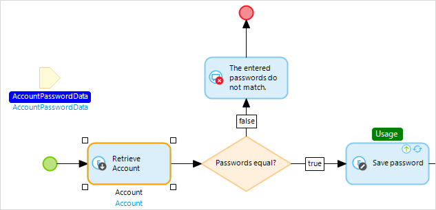

## 1 Introduction

Nanoflows are similar to [microflows](microflows), in that they allow you to express the logic of your application. However, they do have some specific benefits (for example, they run directly on the browser/device and can be used in an offline app). Furthermore, most of the actions run directly on the device, so there is also a speed benefit for logic which does not need access to the server.

{}
This page is an overview of all the elements that can be used in a nanoflow. For the properties of the nanoflow itself, see [Nanoflow Properties](nanoflow).
{}

## 2 When to Use Nanoflows

### 2.1 Offline Mobile Apps

Nanoflows are designed with offline-first applications in mind, as they allow you to model application logic that works in offline apps. Since all database-related actions will be executed on the local offline database, nanoflows in offline apps will be fast.

### 2.2 Logic Where No Connection Is Needed

Nanoflows also offer great value to online applications (for example, for UI logic, validations, calculations, and navigation). However, please keep in mind that, when you perform database-related actions, each action will create a separate network request to the Mendix Runtime.

The following actions interact with the database:

* Create
* Commit
* Retrieve
* Rollback

Therefore, the best practice is to use nanoflows in online applications when they do not contain the above actions.

{}
Changing objects without committing is not a database-related action, as changes are applied on the device or in the browser.
{}

#### 2.2.1 Other Cases

Although nanoflows perform best in online applications when no database-related actions are used, and these are generally the best cases, nanoflows that contain at most one database-related action can also still perform well. Because such nanoflows only require one network call, they perform as well as a microflow. An example of such a use case is performing validation logic on an object and committing the object in the same nanoflow.

## 3 Differences from Microflows

There are five main differences between nanoflows and microflows:

1. When a nanoflow steps through its actions, client actions are directly executed. For example, an open page action immediately opens a page instead of at the end of the nanoflow. This is different from client actions in a microflow, which only run when the client receives the result from the microflow.
2. When used in nanoflow activities, expressions do not support the following objects and variables: `$latestError`, `$latestSoapFault`, `$latestHttpResponse`, `$currentSession`, `$currentUser`, `$currentDeviceType`.
3. Nanoflows are not run inside a transaction so, if an error occurs in a nanoflow, it will not roll back any previous changes.
4. Nanoflows and microflows do not provide the same actions. Some actions available in microflows are not available in nanoflows, and vice versa.
5. Because nanoflows use JavaScript libraries and microflows use Java libraries, there can sometimes be slight differences in the way expressions are executed.

## 4 Notation & Categories

The graphical notation of nanoflows is based on the [Business Process Model and Notation](https://en.wikipedia.org/wiki/Business_Process_Model_and_Notation) (BPMN). BPMN is a standardized graphical notation for drawing business processes in a workflow.

A nanoflow is composed of elements. The following categories are used:

* [Events](#events) represent the start and endpoints of a nanoflow and special operations in a loop
* [Flows](#flows) form the connection between elements
* [Decisions](#decisions) deal with making choices and merging different paths again
* [Activities](#activities) are the actions that are executed in a nanoflow
* [Artifacts](#artifacts) provide the nanoflow with input and allow comments to be made

### 4.1 Events {#events}

Events represent the start and endpoints of a nanoflow and special operations in a loop.

| Graphic | Name | Description |
| --- | --- | --- |
|  | [Start event](start-event) | The starting point of the nanoflow. A nanoflow can only have one start event. |
|  | [End event](end-event) | Defines the location where the nanoflow will stop. Depending on the return type of the nanoflow, in some cases a value must be specified. There can be more than one end event. |
|  | [Error Event](error-event) | An error event defines a location where the nanoflow will stop and throw an error that occurred earlier. If you call a nanoflow, you may want to know whether any errors occurred within the nanoflow or not. |
|  | [Continue event](continue-event) | Used to stop the current iteration of a loop and continue with the next iteration. Continue events can only be used inside a [loop](loop). |
|  | [Break Event](break-event) | Used to stop iterating over the list of objects and to continue with the rest of the flow after the loop. Break events can only be used inside a [loop](loop). |

### 4.2 Flows {#flows}

Flows form the connection between elements.

| Graphic | Name | Description |
| --- | --- | --- |
|  | [Sequence flow](sequence-flow) | An arrow that links events, activities, decisions, and merges with each other. Together they define the order of execution within a nanoflow. |
|  | [Annotation flow](annotation#annotation-flow) | A connection that can be used to connect an annotation to another element. |

### 4.3 Decisions {#decisions}

Decisions deal with making choices and merging different paths.

| Graphic | Name | Description |
| --- | --- | --- |
|  | [Decision](decision) | Makes a decision based on a condition and follows one and only one of the outgoing flows. **Note**: there is no parallel execution in nanoflows. |
|  | [Merge](merge) | Can be used to combine multiple sequence flows into one. If a choice is made in a nanoflow and afterwards some common work needs to be done, you can combine the two (or more) paths using a merge. |

### 4.4 Activities {#activities}

Activities are the actions that are executed in a nanoflow.

#### 4.4.1 Object Activities

Object activities can be used to create and manipulate objects. The [domain model](domain-model) defines the object types ([entities](entities)) that can be used.

| Graphic | Name | Description |
| --- | --- | --- |
|  | [Change object](change-object) | Can be used to change the members of an object. This can be done with or without committing. |
|  | [Commit object(s)](committing-objects) | Can be used to commit the changes to one or more objects. |
|  | [Create object](create-object) | Can be used to create an object. |
|  | [Retrieve](retrieve) | Can be used to get one (or more) associated objects of another object. The activity can also get one (or more) objects directly from the database. |
|  | [Rollback object](rollback-object) | Can be used to undo the changes (that have not been committed) made to the object in the part of the nanoflow preceding the activity. This also deletes objects that have been created but never committed. |

#### 4.4.2 List Activities

List activities can be used to create and manipulate lists of objects.

| Graphic | Name | Description |
| --- | --- | --- |
|  | [Aggregate list](aggregate-list) | Can be used to calculate aggregated values such as the maximum, minimum, sum, average, and total amount of objects over a list of objects. |
|  | [Change list](change-list) | Can be used to change the content of a list variable. |
|  | [Create list](create-list) | Can be used to create a (empty) list variable. |
|  | [List operation](list-operation) | Can be used to combine or compare two lists with objects of the same entity. |

#### 4.4.3 Action Call Activities

| Graphic | Name | Description |
| --- | --- | --- |
|  | [Microflow call](microflow-call) | Can be used to call a microflow. Arguments can be passed to the microflow and the result can be stored in a variable. |
|  | [JavaScript action call](javascript-action-call) | Can be used to execute a JavaScript action. |
|  | [Call nanoflow](nanoflow-call) | Can be used to call a nanoflow. |

The [JavaScript action call](javascript-action-call) activity executes a JavaScript action.

#### 4.4.4 Variable Activities

Variable activities can be used to create or change a variable within a microflow.

| Graphic | Name | Description |
| --- | --- | --- |
|  | [Change variable](change-variable) | Can be used to change the value of a variable. |
|  | [Create variable](create-variable) | Can be used to create a new variable. |

#### 4.4.5 Client Activities

Client activities can be used to have the web client of your application perform an action, such as showing a different page or downloading a file.

| Graphic | Name | Description |
| --- | --- | --- |
|  | [Close page](close-page) | Closes the page that is opened last by the user that calls the nanoflow in which this activity is used. |
|  | [Show page](show-page) | Can be used to show a page to the user that calls the nanoflow in which this activity is used. |
|  | [Validation feedback](validation-feedback) | Can be used to display red text below a widget that displays an attribute or association. |
|  | [Show message](show-message) | Can be used to show a blocking or non-blocking message to the user that calls the nanoflow in which this activity is used. |
|  | [Synchronize](synchronize) | Can be used to synchronize data. |

### 4.5 Loop

| Graphic | Name | Description |
| --- | --- | --- |
|  | [Loop](loop) | A looped activity is used to iterate over a list of objects. For every object the flow inside the looped activity is executed. A looped activity can contain all elements used in nanoflows, with the exception of start and stop events. The flow starts at the first element with no incoming flows. |

### 4.6 Artifacts {#artifacts}

Artifacts provide the nanoflow with input and allow comments to be made.

| Graphic | Name | Description |
| --- | --- | --- |
|  | [Parameter](parameter) | Data that serves as input for the nanoflow. Parameters are filled at the location from which the nanoflow is triggered. |
|  | [Annotation](annotation) | An element that can be used to put comments in a nanoflow. |

### 4.7 Item Usages

Studio Pro visualizes which items are used by the selected element(s). It does this by showing the used items in white text on a blue background. Conversely, elements that use the item(s) returned by the selected element(s) are marked with the word 'Usage' in white text on a green background.

In the example below, the parameter **AccountPasswordData** is highlighted because it is used in the selected activity (**Retrieve Account**). And the activity **Save password** has a **Usage** label because it uses the object returned by **Retrieve Account**.

## 5 Keyboard Support

The nanoflow editor offers keyboard support for navigating and manipulating the nanoflows. The following table shows the keys that can be used.

| Key(s) | Effect |
| --- | --- |
| Arrow keys | Selects the nearby element (activity, event, loop, or parameter) in the direction of the arrow. |
| <kbd>Enter</kbd> | Edits the properties of the selected element. |
| <kbd>F2</kbd> | Renames the item returned by the selected element. |
| <kbd>Shift</kbd> + <kbd>F2</kbd> or just starting to type | Edits the caption of the selected element. |
| <kbd>Ctrl</kbd> + arrow keys | Moves the selected element in the direction of the arrow. |
| <kbd>Tab</kbd> | If a loop is selected, the first element inside the loop is selected. |
| <kbd>Shift</kbd> + <kbd>Tab</kbd> | If an element inside a loop is selected, the loop itself is selected. |
| <kbd>Home</kbd> | Selects the start event. |
| <kbd>End</kbd> | Cycles through the end events. |
| Context-menu key or <kbd>Shift</kbd> + <kbd>F10</kbd> | Opens the context menu for the currently selected element. |

## 6 Nanoflow Debugging

Step-by-step debugging is not supported yet. For now, we recommend using a log message activity, which is shown in the console log of Studio Pro.

## 7 Security

Nanoflows are executed in the context of the current user. Any operation for which the user is unauthorized will fail. For instance, when objects are retrieved in a nanoflow, only the ones for which the current user has read access will be returned. Committing an object only succeeds when the current user has write access for all changes.
