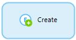
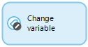
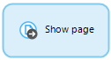

## 1 Introduction

This page is an overview of all the elements that can be used in a nanoflow. For the properties of the nanoflow itself, see [Nanoflow Properties](nanoflow).

Nanoflows are similar to [microflows](microflows), as they allow you to express the logic of your application. However, they do have some specific benefits (for example, they run directly on the browser/device and can be used in an offline app). Furthermore, most of the actions run directly on the device, so there is also a speed benefit.

## 2 When to Use Nanoflows

Nanoflows are designed with offline applications in mind, so business logic can also be executed in them. Since all actions will be run to the offline local database, nanoflows in offline applications will be super fast.

Nanoflows can be beneficial for online applications when you do not perform a lot of database-releated actions like creating, committing, and retrieving objects. Each data-related activity in a nanoflow will create a separate network request to the Mendix Runtime, therefore, they may be slower than microflows. Changing objects without committing is an exception here, as this action is configured not to commit and changes will be applied locally.

## 3 Differences from Microflows

There are three main differences betweeen nanoflows and microflows:

* When a nanoflow steps through its actions, client actions are directly executed. For example, an open page action immediately opens a page instead of at the end of the nanoflow. This is different from client actions in a microflow, which only run when the client receives the result from the microflow.
* When used in nanoflow activities, expressions do not support the following variables: `$latestError`, `$latestSoapFault`, `$latestHttpResponse`, `$currentSession`, `$currentUser`, `$currentDeviceType`.
* Nanoflows are not run inside a transaction, so if an error occurs in a nanoflow, it will not roll back any previous changes.

## 4 Keyboard Support

The nanoflow editor offers keyboard support for navigating and manipulating the nanoflows. The following table shows the keys that can be used.

| Key(s) | Effect |
| --- | --- |
| Arrow keys | Selects the nearby element (activity, event, loop, or parameter) in the direction of the arrow. |
| <kbd>Enter</kbd> | Edits the properties of the selected element. |
| <kbd>F2</kbd> | Renames the variable introduced by the selected element. |
| <kbd>Shift</kbd> + <kbd>F2</kbd> or just starting to type | Edits the caption of the selected element. |
| <kbd>Ctrl</kbd> + arrow keys | Moves the selected element in the direction of the arrow. |
| <kbd>Tab</kbd> | If a loop is selected, the first element inside the loop is selected. |
| <kbd>Shift</kbd> + <kbd>Tab</kbd> | If an element inside a loop is selected, the loop itself is selected. |
| <kbd>Home</kbd> | Selects the start event. |
| <kbd>End</kbd> | Cycles through the end events. |
| Context-menu key or <kbd>Shift</kbd> + <kbd>F10</kbd> | Opens the context menu for the currently selected element. |

## 3 Notation and Categories

The graphical notation of nanoflows is based on the [Business Process Model and Notation](https://en.wikipedia.org/wiki/Business_Process_Model_and_Notation) (BPMN). BPMN is a standardized graphical notation for drawing business processes in a workflow.

A nanoflow is composed of elements. The following categories are used:

* [Events](#events) represent the start and end points of a nanoflow and special operations in a loop
* [Flows](#flows) form the connection between elements
* [Gateways](#gateways) deal with making choices and merging different paths again
* [Activities](#activities) are the actions that are executed in a nanoflow
* [Artifacts](#artifacts) provide the nanoflow with input and allow comments to be made

### 3.1 Events

Events represent the start and end points of a nanoflow and special operations in a loop.

| Graphic | Name | Description |
| --- | --- | --- |
|  | [Start event](start-event) | The starting point of the nanoflow. A nanoflow can only have one start event. |
|  | [End event](end-event) | Defines the location where the nanoflow will stop. Depending on the return type of the nanoflow, in some cases a value must be specified. There can be more than one end event. |
|  | [Continue event](continue-event) | Used to stop the current iteration of a loop and continue with the next iteration. Please note that continue events can only be used inside a [loop](loop). |
|  | [Break Event](break-event) | Used to stop iterating over the list of objects and to continue with the rest of the flow after the loop. Please note that break events can only be used inside a [loop](loop). |

### 3.2 Flows

Flows form the connection between elements.

| Graphic | Name | Description |
| --- | --- | --- |
|  | [Sequence flow](sequence-flow) | An arrow that links events, activities, splits, and merges with each other. Together they define the order of execution within a nanoflow. |
|  | [Annotation flow](annotation-flow) | A connection that can be used to connect an annotation to another element. |

### 3.3 Gateways

Gateways deal with making choices and merging different paths.

| Graphic | Name | Description |
| --- | --- | --- |
|  | [Exclusive split](exclusive-split) | Makes a decision based on a condition and follows one and only one of the outgoing flows. Please note that there is no parallell execution in nanoflows. |
|  | [Merge](merge) | Can be used to combine multiple sequence flows into one. If a choice is made in a nanoflow and afterwards some common work needs to be done, you can combine the two (or more) paths using a merge. |

### 3.4 Activities

Activities are the actions that are executed in a nanoflow.

#### 3.4.1 Object Activitities

Object activities can be used to create and manipulate objects. The [domain model](domain-model) defines the object types ([entities](entities)) that can be used.

| Graphic | Name | Description |
| --- | --- | --- |
|  | [Change object](change-object) | Can be used to change the members of an object. This can be done with or without commiting. |
|  | [Commit object(s)](committing-objects) | Can be used to commit the changes to one or more objects. |
|  | [Create object](create-object) | Can be used to create an object. |
|  | [Retrieve](retrieve) | Can be used to get one (or more) associated objects of another object. The activity can also get one (or more) objects directly from the database. |
|  | [Rollback object](rollback-object) | Can be used to undo the changes (that have not been committed) made to the object in the part of the nanoflow preceding the activity. This also deletes objects that have been created but never committed. |

#### 3.4.2 List Activitities

List activities can be used to create and manipulate lists of objects.

| Graphic | Name | Description |
| --- | --- | --- |
|  | [Change list](change-list) | Can be used to change the content of a list variable. |
|  | [Create list](create-list) | Can be used to create a (empty) list variable. |

#### 3.4.3 Variable Activities

Variable activities can be used to create or change a variable within a microflow.

| Graphic | Name | Description |
| --- | --- | --- |
|  | [Change variable](change-variable) | Can be used to change the value of a variable. |
|  | [Create variable](create-variable) | Can be used to create a new variable. |

#### 3.4.4 Client Activities

Client activities can be used to have the web client of your application perform an action, such as showing a different page or downloading a file.

| Graphic | Name | Description |
| --- | --- | --- |
|  | [Close form](close-form) | Closes the form that is opened last by the user that calls the microflow in which this activity is used. |
|  | [Show page](show-page) | Can be used to show a form to the user that calls the microflow in which this activity is used. |
|  | [Validation feedback](validation-feedback) | Can be used to display red text below a widget that displays an attribute or association. |

### 3.5 Loop

| Graphic | Name | Description |
| --- | --- | --- |
|  | [Loop](loop) | A looped activity is used to iterate over a list of objects. For every object the flow inside the looped activity is executed. A looped activity can contain all elements used in nanoflows, with the exception of start and stop events. The flow starts at the first element with no incoming flows. |

### 3.6 Artifacts

Artifacts provide the nanoflow with input and allow comments to be made.

| Graphic | Name | Description |
| --- | --- | --- |
|  | [Parameter](parameter) | Data that serves as input for the nanoflow. Parameters are filled at the location from which the nanoflow is triggered. |
|  | [Annotation](annotation) | An element that can be used to put comments in a nanoflow. |

## 4 Variable Usages

The Modeler visualizes which variables are used by selected object(s). It does this by showing the used variables in white text on a blue background. Conversely, elements that use the variable(s) defined by the selected object(s) are marked with the word **Usage** in white text on a green background.

In the example below, the parameter **AccountPasswordData** is highlighted, because it is used in the selected activity. The save password activity has a usage label, because it uses the variable defined by the selected activity.

## 5 Errors

When an error occurs in a nanoflow, all the changes that have been made to objects are not rolled back and the nanoflow is aborted. Nanoflow actions do not support error handlers.

## 6 Nanoflow Debugging

There is currently no debugging support for nanoflows.

## 7 Security

Nanoflows are executed in the context of the current user. Any operation for which the user is unauthorized will fail.
