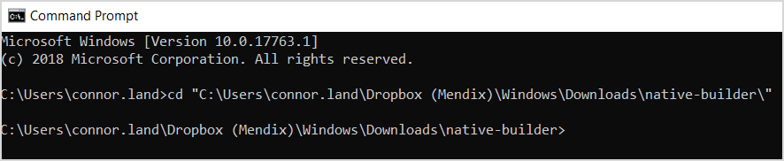

## 1 Introduction

The Native Builder takes your Mendix project containing a native profile and packages a native app for iOS and Android. To learn more about using the Native Builder, see [How to Deploy your First Mendix Native App](/howto/mobile/deploying-native-app).

The Native Builder uses MxBuild, GitHub, and App Center to build your applications. The tool automates the configuration of these processes to streamline your app building experience. The Native builder allows you to create as many apps on GitHub as possible, as long as they are given unique app names using the `--project-name` parameter (for more information, see the [Commands](#commands) section below). Using the `prepare` and `build` command combination, the Native Builder packages your apps by doing the following:

1. Deploys your Mendix project locally.
2. Creates a new repository using the Mendix native template repository on GitHub named after the app name provided.
3. Creates a new branch in the new repository called **build/{build number provided to the tool}**.
4. Commits the required files and assets to the build branch in the new repository.
5. Configures your apps in App Center.
6. Starts a build for iOS and Android.
7. Provides progress information on the build.
8. Downloads the zipped app if the build succeeded, or the build log file if the build failed.

## 2 Commands {#commands}

Command-line arguments provide information to the Native Builder, such as where your Mendix project is located. Commands are configured using parameters, shown below. Some of these parameters are required or strongly recommended. The rest of them are optional, and should be used when they pertain to your app. To compose a command with parameters — which will start your Native Builder when executed — do the following:

1. Open your command line program as an administrator by right-clicking its icon or *.exe* file and selecting **Run as administrator**.
2.  Target your Native Builder's directory by typing `cd "{your Native Builder .exe location}"` and pressing <kbd>Enter</kbd>:

	

### 2.1 Prepare

The `Prepare` command handles the creation of the app on both GitHub and App Center, sets up icon assets and splash images, and then verifies for Java, Mendix, and project paths. A configuration file is generated relative to the user folder to keep that information for later use. You can update this configuration by using the `prepare` command and passing the arguments you would like to update.

An example of a `prepare` command:

```bash
native-builder.exe prepare --github-access-token <token> --appcenter-api-token <token> --java-home <absolute-path> --mxbuild-path <absolute-path> --project-path <absolute-path-to-mpr-file> --projectName CoolApp --app-identifier "com.company.myapp" --app-name "My Cool App" --mendix-version 8.5.0
```

| Parameters                  | Description                                                          | Example                                             |
| --------------------------- | -------------------------------------------------------------------- | --------------------------------------------------- |
| `--github-access-token`     | GitHub access token.                                                 | `c0e1dasf1e102c55ded223dbdebdbe59asf95224`          |
| `--appcenter-api-token`     | App Center API token.                                                | `3e18asdfb43f4fe6c85afsd0bf60dde72f134`             |
| `--appcenter-organization`  | App Center organization name.                                        | `my-company`                                        |
| `--project-name`            | Unique name of the project. **(Required)**                               | `CoolApp`                                           |
| `--app-name`                | Display name of the app.                                             | `My Cool App`                                       |
| `--app-identifier`          | Unique app identifier.                                               | `com.mendix.MyAwesomeApp`                           |
| `--app-icon-path`           | Absolute path to the app icon.                                       | `C:\MyAppIcon.png`                                  |
| `--app-round-icon-path`     | Absolute path to the app round icon, specific to Android.            | `C:\MyAppRoundIcon.png`                             |
| `--app-splash-screen-path`  | Absolute path to the app splash screen image.                        | `C:\MyAppSplash.png`                                |
| `--java-home`               | Absolute path to the directory where Java executable is located.     | `C:\Program Files\Java\jdk-10.0.1`                  |
| `--project-path`            | Absolute path to the Mendix project file.                            | `C:\MyApp\MyApp.mpr`                                |
| `--mxbuild-path`            | Absolute path to MxBuild executable.                                 | `C:\Program Files\Mendix\8.0.0\modeler\mxbuild.exe` |
| `--runtime-url`             | URL of the Mendix runtime.                                           | `https://myapp.mendixcloud.com`                     |
| `--mendix-version`          | The Mendix Studio Pro version your Mendix project is using. **(Required)**          | `8.5.0`                                             |
| `--firebase-android-config-path`          | Absolute path to a *google-services.json* file.          | `C:\MyApp\google-services.json`                     |
| `--firebase-ios-config-path`          | Absolute path to a *GoogleService-Info.plist* file.          | `C:\MyApp\GoogleService-Info.plist`                 |


### 2.2 Build

#### 2.2.1 Generating Apps for Distribution

The `Build` command builds the JavaScript bundles and assets, creates a build on GitHub, and initializes the build on App Center. 

If you already ran `prepare`, this is an example of a `build` command:

```bash
native-builder.exe build --project-name "CoolApp" --app-version "1.0.0" --build-number 1
```

| Parameters                  | Description                                                          | Example                                             |
| --------------------------- | -------------------------------------------------------------------- | --------------------------------------------------- |
| `--project-name`            | Unique name of the project used during `prepare`.                                    | `CoolApp`                                           |
| `--app-version`             | Version of the app, semantic version only.  **(Strongly recommended)**                   | `1.2.3`                                             |
| `--build-number`            | Build number, an arbitrary unique integer value. **(Required)**                          | `1`                                                 |
| `--github-access-token`     | GitHub access token.                                                      | `c0e1dasf1e102c55ded223dbdebdbe59asf95224`          |
| `--appcenter-api-token`     | App Center API token.                                                     | `3e18asdfb43f4fe6c85afsd0bf60dde72f134`             |
| `--appcenter-organization`  | App Center organization name.                                             | `my-company`                                        |
| `--app-name`                | Display name of the app.                                                  | `My Cool App`                                       |
| `--app-identifier`          | Unique app identifier.                                                    | `com.mendix.MyAwesomeApp`                           |
| `--app-icon-path`           | Absolute path to the app icon.                                            | `C:\MyAppIcon.png`                                  |
| `--app-round-icon-path`     | Absolute path to the app round icon, specific to Android.                 | `C:\MyAppRoundIcon.png`                             |
| `--app-splash-screen-path`  | Absolute path to the app splash screen image.                             | `C:\MyAppSplash.png`                                |
| `--java-home`               | Absolute path to the directory where Java executable is located.          | `C:\Program Files\Java\jdk-10.0.1`                  |
| `--project-path`            | Absolute path to the Mendix project file.                                 | `C:\MyApp\MyApp.mpr`                                |
| `--mxbuild-path`            | Absolute path to MxBuild executable.                                      | `C:\Program Files\Mendix\8.0.0\modeler\mxbuild.exe` |
| `--runtime-url`             | URL of the Mendix runtime.                                                | `https://myapp.mendixcloud.com`                     |
| `--output-path`             | Absolute path to the location where artifacts should go.                  | `C:\Downloads`                                      |
| `--platform`                | Platform with which to run command for. Defaults to both iOS and Android. | `ios` or `android`                                  |
| `--skip-mxbuild`            | Used if bundling JavaScript bundle and assets. Defaults to `false`.       | `true` or `false`                                   |

#### 2.2.2 Generating Custom Developer Apps

When used, the `build dev-app` command will create a preview app much like the Make It Native app. However, the preview app it makes will be a custom developer app specific to both your project and your Studio Pro version. This command creates a **develop** branch on GitHub, and initializes the build on App Center. It also expects you to have run the `prepare` command at least once.

Here is an example of a command featuring `build dev-app`:

```bash
native-builder.exe build dev-app --project-name "CoolApp" --output-path "C:\bundles\developer"
```

| Parameters            | Description                                                                          | Example            |
| --------------------- | ------------------------------------------------------------------------------------ | ------------------ |
| `--project-name`      | Unique name of the project used during `prepare`. **(Required)**                                    | `CoolApp`          |
| `--output-path` | The absolute output path for the *ZIP* archives.                                             | `C:\bundles\developer`       |
| `--platform`          | Platform with which to run command for. Defaults to both iOS and Android. | `ios` or `android` |

### 2.3 Regenerate

The `regenerate` command recreates the project on GitHub with the latest version of `Native Template`, renames the previous app with a new name to preserve changes (if any), and then updates the build configuration of the App Center apps. Running `regenerate` also expects that `prepare` has been run at least once for the `--project-name`.

{}
There is no automated way to preserve changes you made to a previous template. If you have some, you must apply them manually in the new GitHub repository. In addition, when changing your app's Mendix version, please also update the `mxbuild-path` using the `prepare` command.
{}


| Parameter                  | Description                                                                 | Example                                             |
| -------------------------- | --------------------------------------------------------------------------- | --------------------------------------------------- |
| `--project-name`           | Absolute path to the directory where Java executable is located. | `My Cool App`                                       |
| `--mendix-version`          | The Mendix Studio Pro version the project is using. **(Required)**                   | `8.5.0` or `8.5`                              |

An example of a `regenerate` command:

```bash
native-builder.exe regenerate --project-name "CoolApp" --mendix-version 8.5.0
```

| Parameters       | Description                                       | Example   |
| ---------------- | ------------------------------------------------- | --------- |
| `--project-name` | Unique name of the project used during `prepare`. | `CoolApp` |

### 2.4 Creating an Over the Air Deployment Release

The `push-update` command handles generating a new JavaScript bundle and assets, and deploying that over the air (OTA) update.

Here is an example of a command featuring `push-update`:

```bash
native-builder.exe release push-update --project-name "CoolApp" --target-version "1.0.0" --build-number 1 --rollout-percentage 100
```

| Parameters             | Description                                                                                                    | Example                                                          |
| ---------------------- | -------------------------------------------------------------------------------------------------------------- | ---------------------------------------------------------------- |
| `--project-name`       | Unique name of the project used during `prepare`. **(Required)**                                                              | `CoolApp`                                                        |
| `--target-version`     | Version or range of versions of the already published app that this update should affect. **(Required)**                      | Semantic version See [Semantic Versioning](https://semver.org/)  |
| `--rollout-percentage` | Percentage number of users that should get this update. Once set, the value can not be reduced afterwards. **(Required)**    | A number between `1` and `100`.                                  |
| `--build-number`       | App Center build number that this update should target. **(Required)**                                                       | Any number as defined during `build`                             |
| `--description`        | More info associated with this update that users would see before downloading.                      | Any text message.                                                |
| `--mandatory`          | Determines if this update should be considered important and forced on the users. Defaults to true. | `true` or `false`                                                |
| `--platform`           | Platform with which to run command for. Defaults to both iOS and Android.                           | `ios` or `android`                                               |
| `--deployment-target`  | OTA target group. Defaults to `Production`.                                                          | `Staging`                                                        |
| `--skip-mxbuild`       | Used if bundling JavaScript bundle and assets. Defaults to `false`.                                  | `true` or `false`                                                |

### 2.5 Updating an OTA Deployment Release's Metadata

The `patch-update` command allows you to update the metadata of a published update that has not been rolled out to all users (in technical terms, an update which does not have a `rollout-percentage` value of `100`).

Here is an example of a command featuring `patch-update`:

```bash
native-builder.exe release patch-update --project-name "CoolApp" --label "v4" --target-version  "1.0.1"
```

| Parameters             | Description                                                                                                          | Example                                                |
| ---------------------- | -------------------------------------------------------------------------------------------------------------------- | ------------------------------------------------------ |
| `--project-name`       | Unique name of the project used during `prepare`. **(Required)**                                                                     | `CoolApp`                                              |
| `--label`              | Unique label of the update to patch. **(Required)**                                                                                 | This can be gotten by using the `release list` command |
| `--target-version`     | Version or range of versions of the already published app that the update should affect.                  | Semantic versioning See [Semantic Versioning](https://semver.org/)    |
| `--rollout-percentage` | Percentage number of users that should get the update. Once set, the value can not be reduced afterwards. | A number between `1` and `100`.                        |
| `--description`        | More info associated with the update that users would see before downloading.                             | Any text message.                                      |
| `--mandatory`          | Determines if the update will be mandatory.                           | `true` or `false`                                      |
| `--platform`           | Specifies which platform your command is run for. Defaults to both iOS and Android.                                 | `ios` or `android`                                     |
| `--deployment-target`  | OTA target group. Defaults to `Production`.                                                                | `Staging`                                              |

### 2.6 Rolling Back to a Previous Deployment Release

The `rollback-update` command allows you to revert to a previous deployment release with the same target version of your app. This command creates a new deployment using a previous deployment release specified with the `--label` argument.

Here is an example of a command featuring `rollback-update`:

```bash
native-builder.exe release rollback-update --project-name "CoolApp" --label "v4"
```

Be aware of the following:

* The `--label` parameter can point to a previous deployment release only
* If you rollback to a broken release, it will be deployed to the users. To fix this situation, you will then have to either do a new release or rollback to a working release.

| Parameters            | Description                                                                          | Example                                                |
| --------------------- | ------------------------------------------------------------------------------------ | ------------------------------------------------------ |
| `--project-name`      | Unique name of the project used during `prepare`. **(Required)**                                     | `CoolApp`                                              |
| `--label`             | A unique label of the stable version to rollback to. **(Required)**                                  | This can be gotten by using the `release list` command |
| `--platform`          | Platform with which to run command for. Defaults to both iOS and Android. | `ios` or `android`                                     |
| `--deployment-target` | OTA target group. Defaults to `Production`.                                | `Staging`                                              |

### 2.7 Listing Deployment Releases

The `list` command displays a pretty-printed list of all deployed releases.

Here is an example of a command featuring `list`:

```bash
native-builder.exe release list --project-name "CoolApp"
```

| Parameters            | Description                                                                          | Example            |
| --------------------- | ------------------------------------------------------------------------------------ | ------------------ |
| `--project-name`      | Unique name of the project used during `prepare`. **(Required)**                                    | `CoolApp`          |
| `--platform`          | Platform with which to run command for. Defaults to both iOS and Android. | `ios` or `android` |
| `--deployment-target` | OTA target group. Defaults to `Production`.                                | `Staging`          |

### 2.8 Generating Only the App Bundles

When used, the `bundle` command will only run the MXBuild step (skipping the App Center build step). This command outputs *ZIP* archives with the corresponding JavaScript bundle and resources for each platform.

Here is an example of a command featuring `bundle`:

```bash
native-builder.exe bundle --project-name "CoolApp" --output-path "C:\bundles"
```

| Parameters            | Description                                                                          | Example            |
| --------------------- | ------------------------------------------------------------------------------------ | ------------------ |
| `--project-name`      | Unique name of the project used during `prepare`. **(Required)**                                    | `CoolApp`          |
| `--output-path` | The absolute output path for the *ZIP* archives. **(Required)**                                             | `C:\bundles`       |
| `--platform`          | Platform with which to run command for. Defaults to both iOS and Android. | `ios` or `android` |

### 2.9 iOS-Specific Configurations

Commands to modify the iOS configuration are grouped under the `config ios` command.

#### 2.9.1 Adding and Removing Entitlements

To add or remove entitlements, use the `add-entitlements` or `remove-entitlements` commands:

```bash
native-builder.exe config ios add-entitlements --project-name "CoolApp" --entitlements notification nfc
```

| Parameters            | Description                                                                          | Example            |
| --------------------- | ------------------------------------------------------------------------------------ | ------------------ |
| `--project-name`      | Unique name of the project used during `prepare`. **(Required)**                                    | `CoolApp`          |
| `--entitlements` | A list of the entitlements to add to your project. Supported options are `notification` and `nfc`                 | `notification nfc`       |

#### 2.9.2 Adding and Removing Background Modes

To add or remove background modes, use the `add-background-modes` or `remove-background-modes` commands:

```bash
native-builder.exe config ios add-background-modes --project-name "CoolApp" --modes notification
```

| Parameters            | Description                                                                          | Example            |
| --------------------- | ------------------------------------------------------------------------------------ | ------------------ |
| `--project-name`      | Unique name of the project used during `prepare`. **(Required)**                                    | `CoolApp`          |
| `--modes` | A list of background modes to add to your project. The `notification` option is supported.                | `notification`       |

## 3 Expanded Parameter Explanations

### 3.1 --project-name

This parameter is the unique name of your app, and can contain any characters. This name is used to persist common parameter configurations like `--github-access-token` to your machine. This improves reusability with other commands that would need it. It is also used as the app’s name in GitHub and App Center.

### 3.2 --runtime-url

This parameter should point to the runtime you want to run your app against. If testing against a locally deployed app, use your machine's IP address (for example, `http://192.168.1.12:8080`). If testing against a Mendix Cloud-deployed app, use the fully qualified runtime URL of your deployment server (for example, `https://myapp.mendixcloud.com`). The correct protocol needs to be appended, otherwise the URL will be prefixed by default with `http://`.

### 3.3 --appcenter-organization

In App Center you can be a member of one or more organizations. If the app needs to be built as part of an organization, then provide the name of that organization to Native Builder using `--appcenter-organization`. If you leave the command-line argument out, the app will be part of your personal App Center account.

### 3.4 --app-name

This parameter is the display name of your app, and can contain any characters you choose. You can see this name when users install your app on a device. For iOS apps this serves as the [CFBundleDisplayName](https://developer.apple.com/library/archive/documentation/General/Reference/InfoPlistKeyReference/Articles/CoreFoundationKeys.html#//apple_ref/doc/uid/20001431-110725). For Android apps this serves as the `android:label` property of the `application` tag in the *AndroidManifest.xml* file.

### 3.5 --app-version

This parameter specifies the version of the app you want to build. See [Semantic Versioning](https://semver.org/) for more information on how to select a proper version number.

### 3.6 --app-identifier

This parameter serves as a unique identifier for your app, which must conform to Android's [application ID](https://developer.android.com/studio/build/application-id) requirements as well as Apple's [CFBundleIdentifier](https://developer.apple.com/library/archive/documentation/General/Reference/InfoPlistKeyReference/Articles/CoreFoundationKeys.html) requirements. Once your app is uploaded to the Apple App Store or the Play Store, the app’s identifier can no longer be modified. If you do modify the identifier after an app is published, it will be treated as a different app by both stores. An app identifier is specified as reverse DNS notation, for example {com.mendix.MyAwesomeApp}.

### 3.7 --platform

This parameter allows selective builds per specific platform or for both. By default, the Native Builder tries to build for both platforms but this parameter can limit a build to either iOS or Android only.

### 3.8 --skip-mxbuild

In rare cases, errors might occur after the bundling process has completed. This parameter will allow you to skip MxBuild during testing to save time.

### 3.9 --app-icon-path

This parameter specifies an app icon file. The image must be a *.png* file, and have a resolution of 1024x1024. Mendix will do the resizing for you. If a file path is not provided, default app icons will be provided by branch **master**.

### 3.10 --app-round-icon-path

This parameter specifies an app round icon file which is specific to Android. The image must be a *.png* file, and have a resolution of 1024x1024. Mendix will do the resizing for you. If a file path is not provided, default app icons will be provided by branch **master**.

### 3.11 --app-splash-screen-path

This parameter specifies an app splash file. The image must be a *.png* file, and have a resolution of 1440x2560. Mendix will do the resizing for you. If a file path is not provided, default app splash images will be provided by branch **master**.

### 3.12 --build-number

This unique configuration represents the version build number for the release builds for both Android and iOS. Every build that is scheduled for release should have a unique, incrementing number. This number will be used as the name of the branch name on App Center and GitHub. 

For over-the-air updates, each build is associated with a particular release group (`--deployment-target`)  which would get the update. By default, this value is set to **Production** and should usually be kept this way. If changed, the new value should be noted as only devices running on that environment would get updates.

The highest integer Android will allow is 2,147,483,647. Consider starting with 1 and incrementing by one with each release. Alternatively, you can use dates in the “YYmmddHHmm” format, such as {2007310950} for a build run on July 31, 2020 at 09:50.

### 3.13 --mendix-version

This parameter makes the Native Builder pick a compatible version of the Native Template based on your Mendix project's Studio Pro version. This parameter needs to be a valid semantic version of Studio Pro, for example 8.5.1. The version provided needs to be as specific as possible, as even patch versions might include fixes that might not be compatible with all Native Templates available. To determine which Mendix version you are using check the **About** page or splash screen of your Mendix project's version of Mendix Studio Pro.

### 3.14 --verbose {#verbose}

This parameter provides additional details when the Native Builder incurs errors. When `--verbose` is used and the Native Builder errors, the Native Builder will output a complete stack trace of the error. This is useful for cases where the Native Builder fails with an unknown error.


## 4 Advanced Usage {#advanced-usage}

### 4.1 Custom Native Code

If you have custom native dependencies or code, you can include them in your app by merging your changes to the **master** branch of the GitHub repository which the Native Builder is making. Every build branches off from **master** and your changes will be included. Remember to synchronize your repository occasionally to get the latest changes from Mendix native template.

For more information on syncing your repository, see [When to Sync Your Native Template](#sync-your-repository) below.

### 4.2 Custom App Center Configuration

In App Center you can configure your builds at the branch level. If no configuration is available for branch **master**, Native Builder will create a default configuration. If a configuration is already present, it will not be modified by the tool. When a branch for a build is initialized, the configuration of **master** is copied over. Consecutive builds will not alter this branch's configuration. This is to avoid overriding your custom configuration unless the `regenerate` command is used.

### 4.3 Connecting to a Local Running Instance of Studio Pro

Advanced users might wish to connect to a local running instance of Studio Pro. Be aware that if you make the changes described in this section to your template, you must revert all those changes to use the Native Builder with your template.

While following the instructions below, be sure to replace any instance of `LOCAL_IP_ADDRESS` with *your* local IP address (for example, {10.0.0.2}). If you are running Studio Pro on a port other than 8080, make sure to replace that too.

#### 4.3.1 Getting Started

1. Clone your repository locally from GitHub.
2. Switch to the latest branch created by Native Builder (for example, {build/1})
3. Follow this [guide](https://github.com/mendix/native-template#21-install-dependencies) to install your dependencies.

#### 4.3.2 For iOS

For an iOS app, do the following:

1. Open **ios/NativeTemplate.xcworkspace** using Xcode.
2. Open **NativeTemplate/AppDelegate.swift**.
3. Replace this section of the code (on line **13**):

	```swift
	let bundleUrl = ReactNative.instance.getJSBundleFile()
	```

	with the following code:

	```swift
	let bundleUrl = AppUrl.forBundle(url: "http://LOCAL_IP_ADDRESS:8080", remoteDebuggingPackagerPort: 8083, isDebuggingRemotely: false, isDevModeEnabled: false)
	```

4. Locate the *Info.plist* file and replace the value of `Runtime url` with *http://LOCAL_IP_ADDRESS:8080*.
5. Run the app by clicking the **Play** button.

#### 4.3.3 For Android

{}Starting with Android 9 (API level 28), cleartext support is disabled by default. If you are debugging with a device using v28 or higher, you need to include the `android:usesCleartextTraffic="true"` property in the `application` tag in your **app/src/main/AndroidManifest.xml** file.{}

For an Android app, do the following:

1. Open the `android` directory using Android Studio.
2. Open **app/src/main/java/com/mendix/nativetemplate/MainApplication.java**.
3. On line **36** replace `false` with *true*.
4. Open **app/src/main/res/raw/runtime_url**.
5. Replace the file's contents with *http://LOCAL_IP_ADDRESS:8080*.
6. Run the app by clicking the **Play** button.

## 5 When to Sync Your Native Template {#sync-your-repository}

When Mendix updates the native template, the Native Builder will not automatically sync your GitHub repository. You will have to manually sync it yourself. The Native Builder avoids automatic synchronization because of possible merge conflicts with customized apps.

The following error scenarios could indicate that your repository is out of sync with the latest native template:

* Your App Center build fails
* Your app crashes while you are testing it after adding a new pluggable widget or JavaScript action

If either of these things happen, make sure that you are using the latest native template version by consulting [mendix / native-template](https://github.com/mendix/native-template).

If your native template is not the latest version, synchronize your repository with the latest version of the native template. For instructions on syncing a GitHub repository, see GitHub's [Syncing a fork](https://help.github.com/en/articles/syncing-a-fork).

## 6 Resolving Errors

### 6.1 GitHub Errors

**Invalid Access Token** — Your access token is invalid. Consult the [GitHub Token](/howto/mobile/deploying-native-app#github-token) section in *How to Deploy Your First Mendix Native App* and provide the access token to Native Builder.

**Unable to Create the Repository: the Access Token Needs Access to the Repo Scope** — Your access token is valid, but has too few permissions for Native Builder to work. Native Builder clones a template GitHub repository, creates a branch, and commits files. Consult the [GitHub Token](/howto/mobile/deploying-native-app#github-token) section in *How to Deploy Your First Mendix Native App* and provide the new access token to Native Builder.

**Unable to Delete Branch Build/{build number}** — Something went wrong while communicating with GitHub. Verify your connection, check that GitHub is available, and try running Native Builder again.

**Unable to Create Branch Build/{build number}** — Something went wrong while communicating with GitHub. Verify your connection, check that GitHub is available, and try running Native Builder again.

**Unable to Commit {build number}** — Something went wrong while communicating with GitHub. Verify your connection, check that GitHub is available, and try running Native Builder again.

### 6.2 App Center Errors

**Invalid API Token** — Your API token is invalid. Follow the [App Center Token](/howto/mobile/deploying-native-app#appcenter-token) section in *How to Deploy Your First Mendix Native App* and provide the API token to Native Builder.

**Unable to Configure Build:{explanation}** — Something went wrong while communicating with App Center. Verify your connection, check that App Center is available, and try running Native Builder again.

**Build {build number} for App {app number} Has Failed** — The native build on App Center has failed. Read the log file that Native Builder has downloaded. The log file is named *{AppName}-{BuildNumber}.log* and is located in the same folder as your Native Builder executable.

**The Build Configuration is Overridden with the Default** — While Native Builder is checking to identify if the branch it is building has been manually configured, it may detect false positives. This could lead to your custom configuration getting overridden. If that happens, consider running the build directly using App Center and skip using the Native Builder for this branch.

**Unknown Error** — If you do not understand an error, you can sign in to App Center and delete the build configuration for the **master** branch. Then run Native Builder again. The tool will recreate the default build configuration for **master** and your branch.

### 6.3 Unknown Errors

If the Native Builder fails to complete a run and no error is provided, consider using the [--verbose](#verbose) parameter to get a full stack trace of the error. When communicating an issue with support it is always handy to supply these extra logs, together with build logs, to achieve timely solutions.

## 7 Read More

* [How to Deploy your First Mendix Native App](/howto/mobile/deploying-native-app)
* [How to Get Started with Native Mobile](/howto/mobile/getting-started-with-native-mobile)
* [How to Style Your Mendix Native App](/howto/mobile/how-to-use-native-styling)
