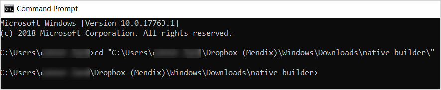

## 1 Introduction

The Native Builder takes your Mendix project containing a native profile and packages a native app for iOS and Android.

## 2 Prerequisites

* Download the Native Builder [executable](https://www.dropbox.com/sh/hpw7sshut9bco68/AABackrr75rPSgW7u5LBMkMra?dl=0) to a folder of your preference and extract all contents
	* Use v1.0.0 with Mendix 8.0
	* Use v2.0.0 with Mendix 8.1.0 and above
	* Use v3.0.0 with Mendix 8.3.0 and above
* Make a [GitHub](https://github.com/) account
* Make a [Microsoft App Center](https://appcenter.ms/) account
* Install [Java JDK 11](https://adoptopenjdk.net/) (if you have Studio Pro installed, you should already have JDK 11 in *C:\Program Files\AdoptOpenJDK*)

## 3 About the Native Builder

The Native Builder uses MxBuild, GitHub, and App Center to build your applications. The tool automates the configuration of these processes to streamline your app building experience. The Native builder allows you to create as many apps on GitHub as possible, as long as they are given unique app names using the `--project-name` parameter (for more information, see the [Commands](#commands) section below). Using the `prepare` and `build` command combination, the Native Builder packages your apps by doing the following:

1. Deploys your Mendix project locally.
2. Creates a new repository using the Mendix native template repository on GitHub named after the app name provided.
3. Creates a new branch in the new repository called **build/{build number provided to the tool}**.
4. Commits the required files and assets to the build branch in the new repository.
5. Configures your apps in App Center.
6. Starts a build for iOS and Android.
7. Provides progress information on the build.
8. Downloads the zipped app if the build succeeded, or the build log file if the build failed.

## 4 Getting Your Tokens

The sections below describe how to get tokens which allow the Native Builder to authenticate with GitHub and App Center. If you already have tokens for your GitHub and App Center, you do not need to repeat these sections.

### 4.1 GitHub Token {#github-token}

1. Go to [GitHub](https://github.com/) and sign in.
2. Go to [Settings](https://github.com/settings/profile) by clicking on your profile picture in the top right.
3. Click [Developer settings](https://github.com/settings/apps) at the bottom of the left menu.
4. Navigate to [Personal access tokens](https://github.com/settings/tokens) and then click **Generate new token** to create a new personal access token.
5. In the **Note** field, write *Native Builder.*
6. Under **Select scopes**, select **repo**.
7. Click the **Generate token** button.
8. Store your token in a secure place. You will not be able to see it again. If you lose it, you will have to create a new token and delete your old one.

### 4.2 App Center Token {#appcenter-token}

1. Go to [App Center](https://appcenter.ms/apps) and sign in.
2. Click your profile icon in the top right corner, then click **Settings**, and then **Account Settings**.
3. In the **API Tokens** tab, click the **New API token** button.
4. Add a description of your token, select **Full Access**, then click **Add new API token**, and then **New API Token**. Store this token in a secure place as well. You will not be able to see it again. If you lose it, you will have to create a new token and delete your old one.

## 5 Commands {#commands}

Command-line arguments provide information to the Native Builder, such as where your Mendix project is located. You will now compose a command and parameters, which will start your Native Builder when executed:

1. Open your command line program as an administrator by right-clicking its icon or *.exe* file and selecting **Run as administrator**.
2.  Target your Native Builder's directory by typing `cd "{your Native Builder *.exe* location}"` and pressing <kbd>Enter</kbd>:

	

### 5.1 Prepare

The `Prepare` command handles the creation of the app on both GitHub and App Center, sets up icon assets and splash images, and then verifies for Java, Mendix, and project paths. A configuration file is generated relative to the user folder to keep that information for later use. You can update this configuration by using the `prepare` command and passing the arguments you would like to update.

An example of a `prepare` command:

```
native-builder.exe prepare --github-access-token <token> --app-center-api-token <token> --java-home <absolute-path> --mxbuild-path <absolute-path> --project-path <absolute-path-to-mpr-file> --projectName CoolApp --app-identifier "com.company.myapp" --app-name "My Cool App"
```

| Parameters                  | Description                                                          | Example                                             |
| --------------------------- | -------------------------------------------------------------------- | --------------------------------------------------- |
| `--github-access-token`     | GitHub access token.                                                 | `c0e1dasf1e102c55ded223dbdebdbe59asf95224`          |
| `--app-center-api-token`    | App Center API token.                                                | `3e18asdfb43f4fe6c85afsd0bf60dde72f134`             |
| `--app-center-organization` | (Optional) App Center organization name.                             | `my-company`                                        |
| `--project-name`            | Unique name of the project.                                          | `CoolApp`                                           |
| `--app-name`                | Display name of the app.                                             | `My Cool App`                                       |
| `--app-identifier`          | Unique app identifier.                                               | `com.mendix.MyAwesomeApp`                           |
| `--app-icon-path`           | (Optional) Absolute path to the app icon.                            | `C:\MyAppIcon.png`                                  |
| `--app-round-icon-path`     | (Optional) Absolute path to the app round icon, specific to Android. | `C:\MyAppRoundIcon.png`                             |
| `--app-splash-screen-path`  | (Optional) Absolute path to the app splash screen image.             | `C:\MyAppSplash.png`                                |
| `--java-home`               | Absolute path to the directory where Java executable is located.     | `C:\Program Files\Java\jdk-10.0.1`                  |
| `--project-path`            | Absolute path to the Mendix project file.                            | `C:\MyApp\MyApp.mpr`                                |
| `--mxbuild-path`            | Absolute path to MxBuild executable.                                 | `C:\Program Files\Mendix\8.0.0\modeler\mxbuild.exe` |
| `--runtime-url`             | URL of the Mendix runtime.                                           | `https://myapp.mendixcloud.com`                     |

### 5.2 Build

The `Build` command builds the JavaScript bundles and assets, creates a build on GitHub, and initializes the build on App Center. 

If you already ran `prepare`, this is an example of a `build` command:

```
native-builder.exe build --projectName "CoolApp" --app-version "1.0.0" --build-number 1
```

| Parameters                  | Description                                                                          | Example                                             |
| --------------------------- | ------------------------------------------------------------------------------------ | --------------------------------------------------- |
| `--github-access-token`     | GitHub access token.                                                                 | `c0e1dasf1e102c55ded223dbdebdbe59asf95224`          |
| `--app-center-api-token`    | App Center API token.                                                                | `3e18asdfb43f4fe6c85afsd0bf60dde72f134`             |
| `--app-center-organization` | (Optional) App Center organization name.                                             | `my-company`                                        |
| `--project-name`            | Unique name of the project used during `prepare`.                                    | `CoolApp`                                           |
| `--app-name`                | Display name of the app.                                                             | `My Cool App`                                       |
| `--app-identifier`          | Unique app identifier.                                                               | `com.mendix.MyAwesomeApp`                           |
| `--app-icon-path`           | (Optional) Absolute path to the app icon.                                            | `C:\MyAppIcon.png`                                  |
| `--app-round-icon-path`     | (Optional) Absolute path to the app round icon, specific to Android.                 | `C:\MyAppRoundIcon.png`                             |
| `--app-splash-screen-path`  | (Optional) Absolute path to the app splash screen image.                             | `C:\MyAppSplash.png`                                |
| `--java-home`               | Absolute path to the directory where Java executable is located.                     | `C:\Program Files\Java\jdk-10.0.1`                  |
| `--project-path`            | Absolute path to the Mendix project file.                                            | `C:\MyApp\MyApp.mpr`                                |
| `--mxbuild-path`            | Absolute path to MxBuild executable.                                                 | `C:\Program Files\Mendix\8.0.0\modeler\mxbuild.exe` |
| `--runtime-url`             | URL of the Mendix runtime.                                                           | `https://myapp.mendixcloud.com`                     |
| `--app-version`             | Version of the app, semantic version only.                                           | `1.2.3`                                             |
| `--output-path`             | (Optional) Absolute path to the location where artifacts should go.                  | `C:\Downloads`                                      |
| `--build-number`            | Build number, an arbitrary unique integer value.                                     | `1`                                                 |
| `--platform`                | (Optional) Platform with which to run command for. Defaults to both iOS and Android. | `ios` or `android`                                  |
| `--skip-mxbuild`            | (Optional) Used if bundling JavaScript bundle and assets. Defaults to `false`.       | `true` or `false`                                   |

### 5.3 Regenerate

The `regenerate` command recreates the project on GitHub with the latest version of `Native Template`, renames the previous app with a new name to preserve changes (if any), and then updates the build configuration of the App Center apps. Running `regenerate` also expects that `prepare` has been run at least once for the `--project-name`.

| Parameter                  | Description                                                                 | Example                                             |
| -------------------------- | --------------------------------------------------------------------------- | --------------------------------------------------- |
| `--java-home`              | Absolute path to the directory where Java executable is located.             | `C:\Program Files\Java\jdk-10.0.1`                  |
| `--project-path`           | Absolute path to the Mendix project file.                                    | `C:\MyApp\MyApp.mpr`                                |
| `--mxbuild-path`           | Absolute path to MxBuild executable.                                         | `C:\Program Files\Mendix\8.0.0\modeler\mxbuild.exe` |
| `--runtime-url`            | URL of the Mendix Runtime.                                                   | `https://myapp.mendixcloud.com`                     |
| `--github-access-token`    | GitHub access token.                                                         | `c0e1dasf1e102c55ded223dbdebdbe59asf95224`          |
| `--appcenter-api-token`    | App Center API token.                                                        | `3e18asdfb43f4fe6c85afsd0bf60dde72f134`             |
| `--app-name`               | Name of the app to build.                                                    | `CoolApp`                                           |
| `--app-version`            | Version of the app.                                                          | `1.2.3`                                             |
| `--build-number`           | Build number, an arbitrary unique integer value.                             | `1`                                                 |
| `--app-identifier`         | Unique app identifier.                                                       | `com.mendix.MyAwesomeApp`                           |
| `--app-icon-path`          | (Optional) Absolute path to the app icon.                                    | `C:\MyAppIcon.png`                                  |
| `--app-round-icon-path`    | (Optional) Absolute path to the app round icon, specific to Android.         | `C:\MyAppRoundIcon.png`                             |
| `--app-splash-screen-path` | (Optional) Absolute path to the app splash screen image.                     | `C:\MyAppSplash.png`                                |
| `--appcenter-organization` | (Optional) Organization name used in App Center.                             | `my-company`                                        |
| `--output-path`            | (Optional) Absolute path to the location where artifacts should be outputed. | `C:\Downloads`                                      |

An example of a `regenerate` command:

```
native-builder.exe regenerate --projectName "CoolApp"
```

| Parameters       | Description                                       | Example   |
| ---------------- | ------------------------------------------------- | --------- |
| `--project-name` | Unique name of the project used during `prepare`. | `CoolApp` |

### 6 Expanded Parameter Explanations

#### 6.1 --project-name

This parameter is the unique name of your app, and can contain any characters. This name is used to persist common parameter configurations like `--github-access-token` to your machine. This improves reusability with other commands that would need it. It is also used as the app’s name in GitHub and App Center.

#### 6.2 --runtime-url

This parameter should point to the runtime you want to run your app against. If testing against a locally deployed app, use your machine's IP address (for example, {http://192.168.1.12:8080}). If testing against a Mendix Cloud-deployed app, use the fully qualified runtime URL of your deployment server (for example, {https://myapp.mendixcloud.com}). The correct protocol needs to be appended, otherwise the URL will be prefixed by default with `http://`.

#### 6.3 --appcenter-organization

In App Center you can be a member of one or more organizations. If the app needs to be built as part of an organization, then provide the name of that organization to Native Builder using `--appcenter-organization`. If you leave the command-line argument out, the app will be part of your personal App Center account.

#### 6.4 --app-name

This parameter is the display name of your app, and can contain any characters you choose. You can see this name when users install your app on a device. For iOS apps this serves as the [CFBundleDisplayName](https://developer.apple.com/library/archive/documentation/General/Reference/InfoPlistKeyReference/Articles/CoreFoundationKeys.html#//apple_ref/doc/uid/20001431-110725). For Android apps this serves as the `android:label` property of the `application` tag in the *AndroidManifest.xml* file.

#### 6.5 --app-version

This parameter specifies the version of the app you want to build. See [Semantic Versioning](https://semver.org/) for more information on how to select a proper version number.

#### 6.6 --app-identifier

This parameter serves as a unique identifier for your app, which must conform to Android's [application ID](https://developer.android.com/studio/build/application-id) requirements as well as Apple's [CFBundleIdentifier](https://developer.apple.com/library/archive/documentation/General/Reference/InfoPlistKeyReference/Articles/CoreFoundationKeys.html) requirements. Once your app is uploaded to the Apple App Store or the Play Store, the app’s identifier can no longer be modified. If you do modify the identifier after an app is published, it will be treated as a different app by both stores. An app identifier is specified as reverse DNS notation, for example {com.mendix.MyAwesomeApp}.

#### 6.8 --platform

This parameter allows selective builds per specific platform or for both. By default, the Native Builder tries to build for both platforms but this parameter can limit a build to either iOS or Android only.

#### 6.9 --skip-mxbuild

In rare cases, errors might occur after the bundling process has completed. This parameter will allow you to skip MxBuild during testing to save time.

#### 6.10 --app-icon-path

This parameter specifies an app icon file. The image must be a *.png* file, and have a resolution of 1024x1024. Mendix will do the resizing for you. If a file path is not provided, default app icons will be provided by branch **master**.

#### 6.11 --app-round-icon-path

This parameter specifies an app round icon file which is specific to Android. The image must be a *.png* file, and have a resolution of 1024x1024. Mendix will do the resizing for you. If a file path is not provided, default app icons will be provided by branch **master**.

#### 6.12 --app-splash-screen-path

This parameter specifies an app splash file. The image must be a *.png* file, and have a resolution of 1440x2560. Mendix will do the resizing for you. If a file path is not provided, default app splash images will be provided by branch **master**.

#### 6.13 --build-number

This unique configuration represents the version build number for the release builds for both Android and iOS. Every build that is scheduled for release should have a unique, incrementing number. This number will be used as the name of the branch name on App Center and GitHub. 

For over-the-air updates, each build is associated with a particular release group (`--deployment-target`)  which would get the update. By default, this value is set to **Production** and should usually be kept this way. If changed, the new value should be noted as only devices running on that environment would get updates.

The highest integer Android will allow is 2,147,483,647. Consider starting with 1 and incrementing by one with each release. Alternatively, you can use dates in the “YYmmddHHmm” format, such as {2007310950} for a build run on July 31, 2020 at 09:50.

## 7 Advanced Usage

### 7.1 Custom Native Code

If you have custom native dependencies or code, you can include them in your app by merging your changes to the **master** branch of the GitHub repository which Native Builder is making. Every build branches off from **master** and your changes will be included. Remember to sync your repository occasionally to get the latest changes from Mendix native template. For more information on syncing your repository, see [When to Sync Your Native Template](#sync-your-repository) below.

### 7.2 Custom App Center Configuration

In App Center you can configure your builds at the branch level. If no configuration is available for branch **master**, Native Builder will create a default configuration. If a configuration is already present, it will not be modified by the tool. When a branch for a build is initialized, the configuration of **master** is copied over. Consecutive builds will not alter this branch's configuration. This is to avoid overriding your custom configuration unless the `regenerate` command is used.

### 7.3 Connecting to a Local Running Instance of Studio Pro

Advanced users might wish to connect to a local running instance of Studio Pro. Be aware that if you make the changes described in this section to your template, you must revert all those changes to use the Native Builder with your template.

While following the instructions below, be sure to replace any instance of `LOCAL_IP_ADDRESS` with *your* local IP address (for example, {10.0.0.2}).

#### 7.3.1 Getting Started

1. Clone your repository locally from GitHub.
2. Switch to the latest branch created by Native Builder (for example, {build/1})
3. Follow this [guide](https://github.com/mendix/native-template#21-install-dependencies) to install your dependencies.

#### 7.3.2 iOS

For an iOS app, do the following:

1. Open **ios/NativeTemplate.xcworkspace** using Xcode.
2. Open **NativeTemplate/AppDelegate.swift**.
3. Replace this section of the code (on line **13**):

   ```swift
   let bundleUrl = ReactNative.instance.getJSBundleFile()
   ```

   with the following code:

   ```swift
   let bundleUrl = AppUrl.forBundle(url: "http://LOCAL_IP_ADDRESS:8080", remoteDebuggingPackagerPort: 8083, isDebuggingRemotely: true)
   ```

4. Locate the *Info.plist* file and replace the value of `Runtime url` with *http://LOCAL_IP_ADDRESS:8080*.
5. Run the app by clicking the **Play** button.

#### 7.3.3 Android

{}Starting with Android 9 (API level 28), cleartext support is disabled by default. If you are debugging with a device using v28 or higher, you need to include the `android:usesCleartextTraffic="true"` property in the `application` tag in your **app/src/main/AndroidManifest.xml** file.{}

For an Android app, do the following:

1. Open the `android` directory using Android Studio.
2. Open **app/src/main/java/com/mendix/nativetemplate/MainApplication.java**.
3. On line **36** replace `false` with *true*.
4. Open **app/src/main/res/raw/runtime_url**.
5. Replace the file's contents with *http://LOCAL_IP_ADDRESS:8080*.
6. Run the app by clicking the **Play** button.

## 8 When to Sync Your Native Template {#sync-your-repository}

When Mendix updates the native template, the Native Builder will not automatically sync your GitHub repository. You will have to manually sync it yourself. The Native Builder avoids automatic synchronization because of possible merge conflicts with customized apps.

The following error scenarios could indicate that your repository is out of sync with the latest native template:

* Your App Center build fails
* Your app crashes while you are testing it after adding a new pluggable widget or JavaScript action

If either of these things happen, make sure that you are using the latest native template version by consulting the [native-template GitHub page](https://github.com/mendix/native-template).

If your native template is not the latest version, synchronize your repository with the latest version of the native template. For instructions on syncing a GitHub repository, see GitHub's [Syncing a fork](https://help.github.com/en/articles/syncing-a-fork).

## 9 Resolving Errors

### 9.1 GitHub Errors

**Invalid Access Token** — Your access token is invalid. Consult the [GitHub Token](#github-token) section above and provide the access token to Native Builder.

**Unable to Create the Repository: the Access Token Needs Access to the Repo Scope** — Your access token is valid, but has too few permissions for Native Builder to work. Native Builder clones a template GitHub repository, creates a branch, and commits files. Consult the [GitHub Token](#github-token) section above and provide the new access token to Native Builder.

**Unable to Delete Branch Build/{build number}** — Something went wrong while communicating with GitHub. Verify your connection, check that GitHub is available, and try running Native Builder again.

**Unable to Create Branch Build/{build number}** — Something went wrong while communicating with GitHub. Verify your connection, check that GitHub is available, and try running Native Builder again.

**Unable to Commit {build number}** — Something went wrong while communicating with GitHub. Verify your connection, check that GitHub is available, and try running Native Builder again.

### 9.2 App Center Errors

**Invalid API Token** — Your API token is invalid. Follow the [App Center Token](#appcenter-token) section above and provide the API token to Native Builder.

**Unable to Configure Build:{explanation}** — Something went wrong while communicating with App Center. Verify your connection, check that App Center is available, and try running Native Builder again.

**Build {build number} for App {app number} Has Failed** — The native build on App Center has failed. Read the log file that Native Builder has downloaded. The log file is named *{AppName}-{BuildNumber}.log* and is located in the same folder as your Native Builder executable.

**The build configuration is overridden with the default** — While Native Builder is checking to identify if the branch it is building has been manually configured, it may detect false positives. This could lead to your custom configuration getting overridden. If that happens, consider running the build directly using App Center and skip using the Native Builder for this branch.

**Unknown Error** — If you do not understand an error, you can sign in to App Center and delete the build configuration for the **master** branch. Then run Native Builder again. The tool will recreate the default build configuration for **master** and your branch.

## 10 Read More

* [Get Started with Native Mobile](getting-started-with-native-mobile)
* [Style Your Mendix Native App](how-to-use-native-styling)
