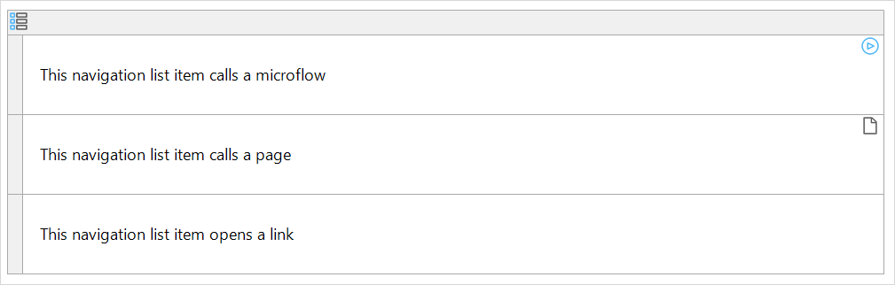

{}
The navigation list widget is not supported on native mobile pages.
{}

## 1 Introduction

A navigation list can be used to attach an action to an entire row. Such a row is called a navigation list item. A navigation list with three empty rows.

## 2 Properties

An example of navigation list properties is represented in the image below:

Navigation list properties consist of the following sections:

* [Common](#common)
* Design Properties
* [General](#general)
* [Visibility](#visibility)

### 2.1 Common Section {#common}

{}

### 2.2 General Section {#general}

#### 2.2.1 Action

Action defines what action is performed when a navigation list item is "clicked." This can either be opening a page or calling a microflow. For details on opening a page, see [Opening Pages](opening-pages). For details on calling a microflow, see [Starting Microflows](starting-microflows). 

Microflows attached to a navigation list item have no **Confirmation** or **Advanced** microflow settings.

### 2.3 Visibility Section {#visibility}

{}

{}

## 3 Navigation List Item

Each row in the navigation list is a navigation list item. A navigation list item can be associated with an action. Conditional visibility is available for list items.

## 4 Read More

* [Page](page)
* [Container Widgets](container-widgets)
* [Properties Common for Widgets](common-widget-properties)