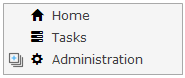

The navigation tree widget shows a configured menu in the form of a tree. Items can have subitems in which case the main item can be expanded. The menu structure of the navigation tree can have three levels. In the end a [Menu Item](menu-item) points to either the page or the microflow that will opened or started when the item is clicked.

{}

{}

## Common Properties

{}

{}

{}

## General Properties

{}
