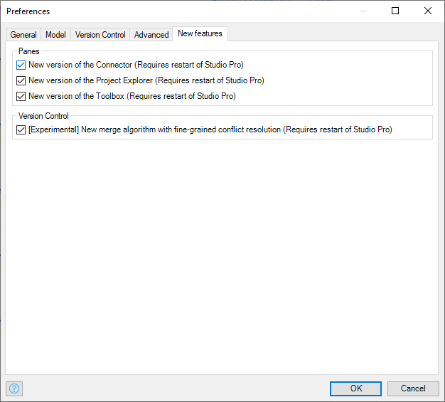
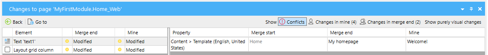

# The New Merge Algorithm
    
In Mendix 9.0.2 you can opt-in to use a new merge algorithm. This algorithm is used when doing an Update or a Merge to merge the change in your project model. The new algorithm has a number of advantages when compared to the current one:
    
1. The algorithm allows for fine-grained conflict resolution. This means that when there are conflicting changes to a document, you no longer have to choose between whole documents: your whole page vs their whole page. Instead, you can resolve conflicts at the level of individual elements, like data views, entities, attributes and microflow actions. Also, all non-conflicting changes from both sides will automatically be accepted.
    
2. Lists of widgets now allow both people to change them. So, two people inserting a widget in the same container (e.g. data view) is perfectly fine. This used to be a conflict in the old algorithm forcing you to choose between one or the other. If the changes are too close (e.g. two people inserting at the same position), there will be a so-called list order conflict to remind you to look at the final order of the widgets in the list. 
    
3. There are some more cases where the new algorithm does not give a conflict, while the old one did. An example is one person moving an entity and the other deleting it. That used to be a conflict but no longer is. The entity will simply be deleted.

Note: the underlying algorithm is done but the user interface will improve as we get closer to the general availability of Mendix 9. We will update the documentation as the UI improves.

## Enabling The New Algorithm

Make sure that you repository is in a clean state: everything has been committed and there is no outstanding changes or conflicts. 

Go to Edit > Preferences > New features and check the relevant box. Restart Studio Pro and you are good to go!

## Example Setup

To illustrate the new conflict resolution mode, we will look at an example. Let us take a simple page so that you can clearly see what is going on:

One person makes the following changes in the main line:

* Change the text 'Home' to 'Welcome!'
* Add a Mendix logo above the text 'Welcome!'
* Delete the subtitle 'Welcome to your new app'
* Add a text 'Write some text here` in the bottom layout grid

This results in the page now looking like this:

Another person in a branch, makes other changes:

* Change the text 'Home' to 'My homepage'
* Add a data grid to the bottom layout grid

This results in their page looking like this:

## Merging With The Old Algorithm

If we merge the branch into the main line with the old merge algorithm, it will find two conflicts:

* Both people changed the text 'Home'
* The layout grid in the bottom was changed by both people (adding different widgets)

The only thing you can do is to choose the whole page as it is in the main line or as it is in the branch line. You cannot combine changes from both sides, meaning that you may have to do rework if you want changes from both sides.

## Merging With The New Algorithm

Let us see what the new algorithm does in this situation:

There are still two conflicts. One conflict is about the text that both sides changed. The other conflict is a so-called *list order conflict*. Both people added something to the bottom layout grid and that is fine. However, the merge algorithm cannot guess the right order of the two new widgets and so it reports this list order conflict. This is purely a reminder for the person who is doing the merge to look at the final list. 

### Start Conflict Resolution

Now, let us resolve those individual conflicts. Remember, we do not have to choose between the whole page of the main line and the whole page of the branch line anymore! To start the resolution process, we click the new "Resolve..." button. The page is opened in a special mode with an orange tab:

Note that the following non-conflicting changes have already been applied to the page:

* Add a Mendix logo above the text 'Home' (main line)
* Delete the subtitle (main line)
* Add text widget to the bottom layout grid (main line)
* Add a data grid to the bottom layout grid (branch line)

And you will keep seeing the page as its going to be while you are resolving conflicts.

### Resolving the First Conflict

For the first conflict, we can inspect what both people did and decide which side to take. Select one of the three lines that represent the conflict and choose "Resolve using Mine" or "Resolve using Theirs". 

You will see the document update immediately when you click the button. If you are unhappy with your choice, you can use undo to go back and try another option. Note that the document needs to be focused for the keyboard shortcuts Ctrl+Z and Ctrl+Y to work.

There is a third option to deal with a conflict: "Mark as resolved". This means: "I have seen the conflict, but I do not want to choose either side. I'll keep things the way they were in the original, before anyone started changing things."

Once you have chosen one of the three options to resolve the first conflict, green checkmarks will appear to indicate that this conflict has been dealt with.

### Resolving the Second Conflict

The second conflict is a list order conflict. It is a reminder to take a look at the order of the widgets in the bottom layout grid. Was the text supposed to come first or the data grid? You arrange the widgets in the desired order in the page editor and then choose "Mark as Resolved" for the list order conflict.

You can even decide to delete one of the widgets or add some of your own. The page is fully editable while resolving conflicts! Note that some edit operations will make it impossible to choose a side for certain conflicts. For example, if you had not resolved the first conflict and you delete the 'Home' widget, you cannot resolve the first conflict anymore, because the widget is simply not there anymore. You can only mark the conflict it as resolved then.

### Finishing Conflict Resolution

Once all conflicts have been resolved, you can click the 'Accept and Exit' button to finalize the results. The document will be saved in its merged form and the conflict for that document will be gone. The result is a document that contains changes from both sides and possibly some manual edits.

At any time, you can also choose to abort conflict resolution by clicking the 'Cancel' button. The conflict will remain and you can resolve it at a later time.

## Conclusion

The new merge algorithm allows for fine-grained conflict resolution which means that you can mix and match changes from both sides. All the time you see what the page (or microflow or whatever) looks like at the moment, so that you know what you are doing. You can undo and redo changes so that experimenting is without danger. And finally, you can edit the page while resolving conflicts so that you have all the freedom to get the desired results. 
