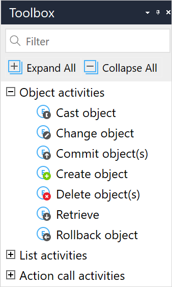

## 1 Introduction

When working with the Mendix Platform, objects of entities are always being manipulated. This happens implicitly within [data widgets](data-widgets) on a page, or explicitly using activities in microflows and nanoflows.

The activities in this section of the microflow and nanoflow toolbox generally work on single objects, however **commit object(s)**, **delete object(s)**, and **retrieve** also work on lists of objects. For other activities which work with lists, see [List Activities](list-activities).

The activities described in this document are in the **Object Activities** section of the **Toolbox**.

{{% image_container width="40%" %}}

{}

## 2 Cast Object

The **Cast object** activity changes the type of object from a generalized object type to the specialized object type. For more information, see [Cast Object](cast-object).

{}
This activity can only be used in **Microflows**.
{}

## 3 Change Object

The **Change object** activity changes the members of an object. For more information, see [Change Object](change-object).

## 4 Commit Object(s)

The **Commit objects(s)** activity either stores objects of persistable entities in the database or stores objects of non-persistable entities in memory to allow them to be rolled back. For more information, see [Commit Object(s)](committing-objects).

## 5 Create Object

The **Create object** activity creates an object. For more information, see [Create Object](create-object).

## 6 Delete Object(s)

The **Delete object(s)** activity deletes one or more objects. For more information, see [Delete Object(s)](deleting-objects).

{}
This activity can only be used in **Microflows**.
{}

## 7 Retrieve

The **Retrieve** activity gets one or more objects of an entity. For more information, see [Retrieve](retrieve).

## 8 Rollback

The **Rollback object** activity undoes uncommitted changes made to an object. For more information, see [Rollback Object](rollback-object).
