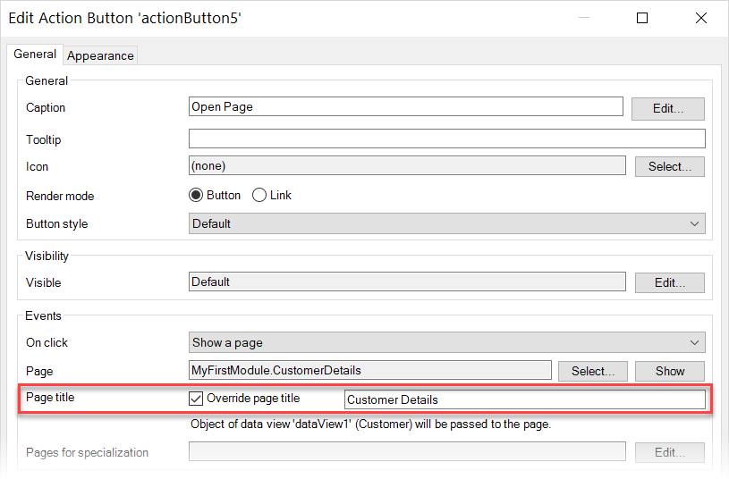

## 1 Introduction

Events specify actions which can be triggered when the end-user interacts with a widget. This interaction can occur in a number of ways:

* [On click](#on-click) – this is the most common interaction and can be used with many widgets
* [On change](#on-change) – for input widgets
* [On enter](#on-enter) – for input widgets
* [On leave](#on-leave) – for input widgets

## 2 Triggering Actions

### 2.1 On Click {#on-click}

An **On click** event specifies an event that is executed when a user clicks a widget. Often **On click** property is a part of the **Events** section in properties. For example, you can specify that when a user clicks a customer's profile image, the page with this customer's details will open:

{}
{}

On click event is common for many widgets, for example, an image, buttons, a list view. 

The **On click** property specifies what [action](#actions) is executed when a user click a widget.

### 2.2 On Change{#on-change}

The on-change property specifies an action that will be executed when leaving the widget, either by using the <kbd>Tab</kbd> key or by clicking another widget, after the value has been changed.

### 2.3 On Enter{#on-enter}

The on-enter property specifies an action that will be executed when the widget is entered, either by using the <kbd>Tab</kbd> key or by clicking it with the mouse.

### 2.4 On Leave{#on-leave}

The on-leave property specifies an action that will be executed when leaving the widget, either by using the <kbd>Tab</kbd> key or by clicking another widget.

This differs from the [On change](#on-change) property in that the event will always be triggered, even if the value has not been changed.

## 3 Event Actions {#actions}

When an event is triggered, you can choose what action is triggered. Possible options are the following ones:

* [Do nothing](#do-nothing) *(default)* 
* [Show a page](#show-page) 
* [Call a microflow](#call-microflow) 
* [Call a nanoflow](#call-nanoflow) 
* [Open link](#open-link) 
* [Create object](#create-object) 
* [Save changes](#save-changes) 
* [Cancel changes](#cancel-changes) 
* [Close page](#close-page) 
* [Delete](#delete) 
* [Synchronize](#synchronize) 
* [Sign out](#sign-out) 

### 3.1 Do Nothing {#do-nothing}

No action is taken. This option is useful for setting up a page without defining the underlying functionality yet.

### 3.2 Show a Page {#show-page}

The **Show a page** event opens the specified page. Select the page which opens using the options below:

* **Page** – a [page](page) that should open.

* **Page title** – the page you open can be given a unique title, depending on where you open it from. This allows you to re-use the same page for different purposes. For example, by setting the title to **New Customer** from one button and **Edit Customer** from another, you can use the same page for editing new and existing customers.

    This option is activated by checking the **Override page title** check box in the **Edit** dialog window:

    

* **Page for specializations** – allows you to configure a different page for each specialization of the context object. If this action is placed inside a data view, it is possible to configure different page(s) for each specialization of the data view object. If this action is placed in a data grid, it is possible to configure different pages for each specialization of the data grid entity. This setting is not shown when there is not a context object or when the context object has no specializations.

### 3.3 Call a Microflow {#call-microflow}

The **Call a microflow** event executes the specified microflow. The following settings are specific for this event:

* **Microflow** – a [microflow](microflow) that should be executed.

* **Microflow settings** – specify what parameters will be passed to the microflow, whether to show a progress bar or not, etc. For more information on microflow settings, see [Starting Microflows](starting-microflows).

### 3.4 Call a Nanoflow {#call-nanoflow}

The **Call a microflow** event executes the specified nanoflow. 

Set the **Nanoflow** property to specify a [nanoflow](nanoflow) that should be executed.

### 3.5 Open Link {#open-link}

The **Open link** event triggers an action based on a link type, some of which are specific to mobile devices. The following properties are specific for this event:

* **Link Type** – the type of action triggered when pressing the button. For information on available link types, see the [Link Types](#on-click-link-type) section below. 
* **Address** – usage of the address property depends on the chosen link type and whether you want to use a literal or to use the value of an attribute.
  * **Use literal value**  – allows you to enter a fixed address.
  * **Use attribute** – allows you to select an attribute which contains the value to be used as the address. In this case, the widget must have an entity as its context (for example, it is inside a data view).

#### 3.5.1 Link Types {#on-click-link-type}

The table below described link types available for the **Open link** on click event:

| Value     | Description                                          | Example                                   |
| --------- | ---------------------------------------------------- | ----------------------------------------- |
| **Web**   | Navigate to a website URL                            | `https://mysubdomain.mydomain.tld/mypage` |
| **Email** | Specifies an email address to which to send an email | `firstname.secondname@mailprovider.tld`   |
| **Call**  | Starts a phone call to this number                   | `+1-202-555-0165`                         |
| **Text**  | Specifies a number to which to send a text message   | `+1-202-555-0112`                         |

_Default value:_ Web

{}

When you Specify  **Email**, **Call**, or **Text** options, the corresponding default app will be opened on the device when the action is triggered, for example, the default email client will be opened to compose a message.

{}

### 3.6 Create Object {#create-object}

The **Create object** event creates a new object. The following properties are specific for this event:

* **Entity (path)** – specifies which entity to create. It is also possible to choose an association (if available) from the context object. If an entity is configured, a new instance of the entity will be created. If an entity through association from the context object is configured, a new instance of the entity will be created and an object associated with the context will be created.
* **On {event} page** – specifies which [page](page) should be shown to allow the end-user to enter values for the new created object. This page must accept a context parameter object (for example, a data view) with the same entity or a sub-type of the created entity. **{event}** specifies which event is being used to trigger this action (**click**, for example).

### 3.7 Save Changes {#save-changes}

The **Save changes** event commits all changes made on the page. The following properties are specific for this event:

* **Close page** – specifies whether the current page should be closed.
* **Sync automatically** –  specifies whether synchronization should happen when the save button is clicked for a Mendix application running in an offline profile. When an object is saved in a Mendix application running in an offline profile it is stored in a local database until it can be synchronized with the server (for more information on the capabilities of offline apps, see [Offline First](offline-first). In practice, this means that uploading a new object to the server requires two distinct actions: saving the object and [syncing it](offline-first#synchronization).

### 3.8 Cancel Changes {#cancel-changes}

The Cancel changes event rolls back all changes made on the page. 

Set the **Close page** property to indicate whether the current page should be closed.

### 3.9 Close Page {#close-page}

The **Close page** event closes a pop-up window (for pop-up pages) or navigates to the previously visited page (for content pages).

### 3.10 Delete {#delete}

The **Delete event** deletes an object. Its behavior depends on a data container it is placed in. When placed in a data view, deletes the connected object; it does not delete objects in a nested data view unless configured through delete behavior. When placed in a data grid, template grid, or reference set selector control bar, it deletes the selected object(s). When placed inside a list view, it deletes the corresponding list view item.

Set the **Close page** property to indicate whether the current page should be closed.

### 3.11 Synchronize {#synchronize}

The **Synchronize** event [synchronizes](offline-first#synchronization) the data stored locally on your device with the server database.

### 3.12 Sign Out {#sign-out}

The **Sign out** event signs the currently signed-in user out. When no user is signed in, no action is performed.

## 4 Read More

* [Pages](pages)
* [Page](page)

