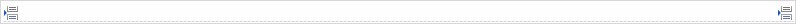

## 1 Introduction

When inserting a page break, the current page will be cut off after the break and widgets below the break will be inserted in a new page.

{}

A page break.

{}

## 2 Common Properties

{}

