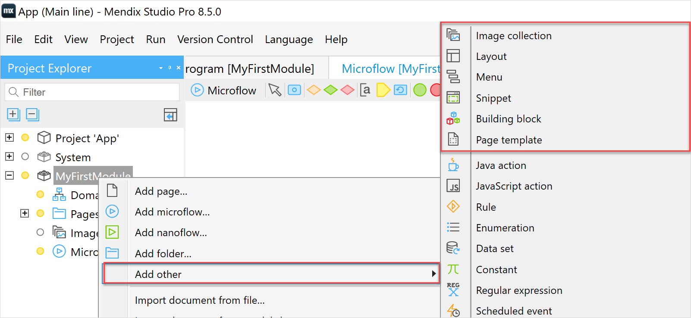

## 1 Introduction

The main difference between a page and page resources is that page is an independent document, while a page resource is a helping document that cannot function on its own. For example, a layout cannot function on its own, but it gives structure to a page. 

You can add the following page resources:

* [Layout](layout)
* [Page template](page-templates)
* [Snippet](snippet)
* [Building block](building-block) 
* [Menu](menu)
* Image collection

## 2 Adding Page Resources

To add a resource document, do the following:

1.  In the [Project Explorer](project-explorer), right-click the module or a folder you want to add a resource to and select **Add other**:

    

2. In the **Page Resources** category, select the document you would like to add to your project.

## 3 Read More

* [Pages](pages)