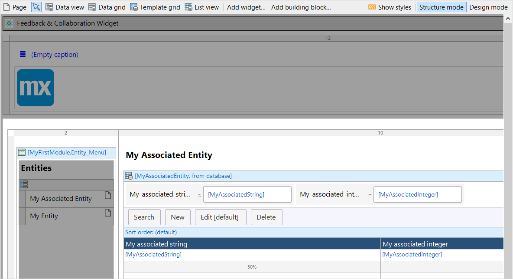
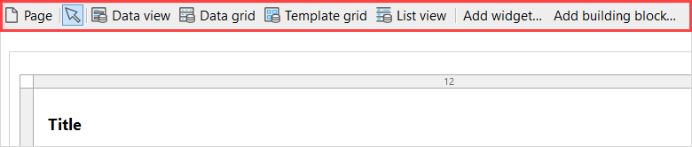
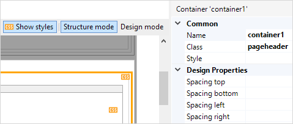
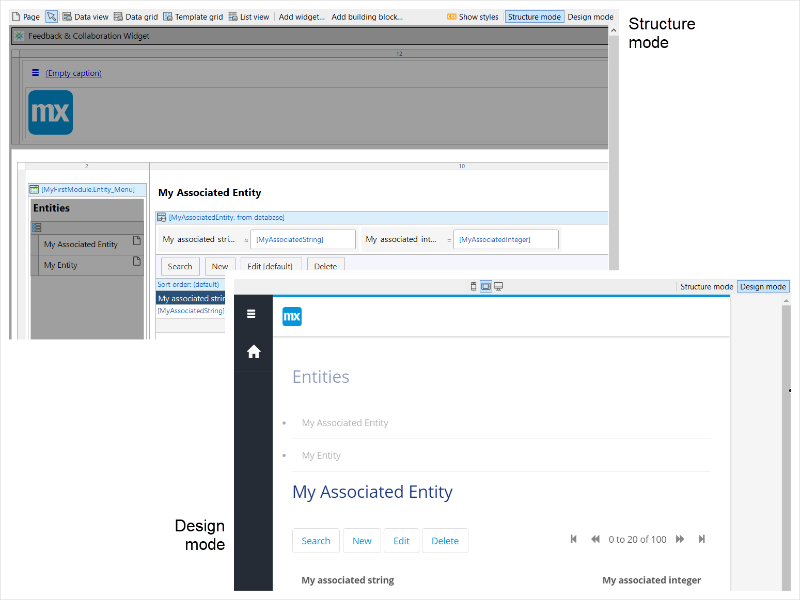

## 1 Introduction

{}

This document describes the types of page editor and the properties of a page. For details on what pages are for and what kind of widgets can be placed on them, see [Pages](pages).

{}

Pages define the end-user interface of a Mendix application. Every page is based on a [layout](layout). A page fills the "gaps" defined by a layout with widgets such as the [data view](data-view) and [data grid](data-grid).

## 2 Page Editor Modes

There are two different ways to edit your page:

* [Structure Mode](#structure-mode), the default editor which clearly shows the relationship between page elements, together with additional information about each element
* [Design Mode](#design-mode), a WYSIWYG (**W**hat **Y**ou **S**ee **I**s **W**hat **Y**ou **G**et) editor which better reflects what the page will look like when it is published

You can switch to the WYSIWYG editor from the default editor by clicking the **Design mode** button in the page editor.
You can return to the structural editor by clicking **Structure mode**.

Both modes allow you to edit your page by doing the following:

* Dragging widgets from the **Toolbox** pane onto the page
* Dragging widgets, and their contents, from one place on the page to another
* Viewing and editing properties of each widget in the **Properties** pane
* Opening a **Properties** dialog window from the menu you get when you right-click the widget

### 2.1 Structure Mode {#structure-mode}

In Structure mode, the page widgets are laid out so that it is easy to see the logical relationship between them. It has the following features which are not available in Design mode:

* Widgets are shown with additional information easily visible – for example, data sources for data views and the width assigned to columns

    

* Each widget has a drop zone before/above and after/below it – this makes it easier to place widgets correctly when they appear close together in Design mode
* Right-click on a drop zone allows you to insert a widget into it
* There is a menu at the top of the page of frequently-used widgets – these cannot be dragged, but are positioned by clicking a drop zone after selecting the widget

    

* Widgets are shown without styling applied to them, but you can see which widgets do have styling applied via the class or style property by clicking the **Show styles** button.

    

### 2.2 Design Mode {#design-mode}

In Design mode, the page is laid out as it will appear when published so that it is easy to see the spatial relationship between the elements.

For example, the example page shown in [Structure Mode](#structure-mode), above, will look like this in **Design mode** for a tablet:

It has the following features which are not available in Structure mode:

* The widgets are shown as they will be on the page – for example two text widgets which are laid out vertically in structural mode may actually be laid out horizontally when the app is published, and this will be reflected in Design mode

* The page layout can be seen for different device modes – for example phone or browser by clicking the appropriate device mode button

    

* The widgets have design properties and CSS classes and styles applied to them so you can see what they will look like

## 3 Common Properties

{}

{}

{}

{}

## 4 Design Properties

{}

{}

## 5 General Properties

### 5.1 Title

The title of the page that is shown using the [page title widget](page-title). If the page is shown in a pop-up window, the title appears in the title bar of the pop-up. The title can be overridden from places where forms are opened to make it possible to reuse a page for different purposes. For example, a [grid create button](grid-new-button) and an [action button](action-button) (for editing) can refer to the same page, but they override the titles to **New** and **Edit**, respectively.

### 5.2 Layout

This is the [layout](layout) on which this page is based.

### 5.3 URL

The URL of the page can be used to directly navigate to the page (for example, from external links or bookmarks). It will be shown in the address bar of the browser when you visit the page. When navigating to a page without a URL configured, the last visited URL is shown. Note that the full URL of the page will be the base URL of your application followed by `/p` and then by the configured URL of the page (for example, `http://example.mendixcloud.com/p/home_page`).

Pages with top-level data views (parameterized pages) can also have URLs. The URL property of such pages should contain the `{Id}` path segment at the end. In the browser, the `{Id}` segment will be replaced with the actual identifier of an entity.

In simple e-commerce applications, the URLs can be configured as follows:

* */orders/* – the URL for a page with a data grid for `Orders` (in a browser, the URL will look like `http://example.mendixcloud.com/p/orders/`)

* */order/{Id}* – the URL for a page with data from a particular `Order` (actual URLs in a browser will look like `http://example.mendixcloud.com/p/order/3212449487634321`, wherein `3212449487634321` is the unique identifier of the `Order`)

## 6 Navigation Properties

### 6.1 Visible For

These are the module roles for which the page is visible. This has an effect on [menu widgets](menu-widgets) and on buttons that are visible only if allowed (for example, an [action button](action-button) for editing).

For more information, see [Module Security](module-security).

## 7 Pop-Up Properties

The pop-up properties are only relevant for pop-up pages (as opposed to content pages).

### 7.1 Width (Pixels)

This specifies the pop-up width in pixels. When set to 0, the width is determined automatically.

*Default value:* 0

### 7.2 Height (Pixels)

Specifies the pop-up height in pixels. When set to 0, the height is determined automatically.

*Default value:* 0

### 7.3 Resizable

Specifies whether the pop-up is resizable (Yes) or fixed-size (No).

*Default value:* Yes

### 7.4 Close Action

Configures the behavior of the popup close button (the little cross in the top-right corner). The default behavior of the popup close button is to rollback any changes and close the popup. If you want to customize the behavior of the popup close button, you can point to a button on the page. When the popup close button is clicked, it will then act as if the selected button is clicked. If the selected button is not available the popup close button will revert back to the default behavior.

*Default value:* Default (cancel)

## 8 Usage Properties

### 8.1 Mark as Used

You can search for unused items in Studio Pro by pressing <kbd>Ctrl</kbd> + <kbd>Shift</kbd> + <kbd>F</kbd>. Pages that are only used from Java code will be listed as unused, because Studio Pro cannot look inside Java source code.

By setting the propery **Mark as used** to **Yes**, you specify that the document is used implicitly and Studio Pro will no longer list it when searching for unused items.

*Default value:* No
