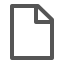
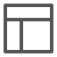
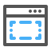
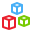
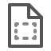

This document describes what pages are for and what kind of widgets can be placed on them. The properties of a page, snippet, or layout document can be found on the documentation pages of those document types: [Page](page), [Snippet](snippet), and [Layout](layout) .

Type | Description
--- | ---
 Pages | [Pages](page) define the end-user interface of a Mendix application. Apart from pages, there are two other types of documents that come into play when creating an interface: layouts and snippets. Pages are the things that are actually shown to the end user. Snippets and layouts are building blocks for creating pages, but they are not shown to the user directly.
 Layouts | [Layouts](layout) specify what comes where. Each page is based on a layout. The layout contains widgets and structures that return on every page based on that layout. For example, it is common to put a menu bar widget on a layout so that it is visible on all pages. 
 Snippets | [Snippets](snippet) define reusable interface parts. They can be used on pages and layouts. By using snippets, you have to make changes in fewer places if you want to modify the interface. For example, you can have a snippet that is used both in the contents area of a template grid and in a data view. If you add a row to a table in the snippet, that change will show up in both places.
 Building blocks | [Building blocks](building-block) allow users to easily click together pages with pre-styled sets of widgets. Building blocks will automatically appear in the page editor toolbox, allowing for easy reuse. By designing a comprehensive library of building blocks, a great deal of the fussy work involved in page design can be averted.  
 Page templates | Newly created pages are based on [page templates](page-templates). By mapping out common design patterns, a lot of the initial work involved in creating a new page can be simplified by setting up a proper set of page templates. 
 Add-on widgets | Also know as custom widget from the app store can extend the functionality of the core widgets shipped with the Mendix Modeler. In general the documentation is found in the app store, though some of the R&D supported widgets can be found here.

Pages, layouts, and snippets are built using widgets. There are many kinds of widgets, and not every widget can be used on each of the three document types. Layouts support mostly widgets for giving structure to pages, but not widgets for showing data. This is to make the intention of layouts clear: they should define what comes where and not much more. However, snippets can be placed on layouts, and that is an indirect way to include more kinds of widgets on a layout.

We discern the following categories of widgets:

* [Menu widgets](menu-widgets) allow the user to navigate through the application
    * Examples: menu bar widget, navigation tree
* [Data widgets](data-widgets) are central to building forms in Mendix; with these widgets, you can view and edit the data in the application
    * Examples: data view, data grid
* [Layout widgets](layout-widgets) form the backbone of the interface and are typically used on layouts
    * Examples: layout container, title
* [Common widgets](common-widgets) are commonly found on any page, layout, and snippet
    * Examples: label, image
* [Container widgets](container-widgets) can contain other widgets again
    * Examples: table, group box
* [Input widgets](input-widgets) make it possible to show and edit the values of attributes and associations
    * Examples: text box, date picker
* [File widgets](file-widgets) allow you to work with files, including images stored in files
* [Button widgets](button-widgets) are buttons that trigger actions
    * Examples: save button, microflow button
* [Report widgets](report-widgets) aggregate data and show it in the form of a table or a chart
    * Examples: basic report, report chart
* [Chart widgets](chart-widgets) Graphically resprent data in various chart types
    * Examples: line chart, bar chart, heatmap
* Add-on widgets can be downloaded from the [Mendix App Store](https://appstore.mendix.com/) or created by yourself using JavaScript
