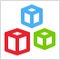

This document describes what pages are for and what kind of widgets can be placed on them. The properties of a page, snippet, or layout document can be found on the documentation pages for those document types: [Page](page), [Snippet](snippet), and [Layout](layout).

Type | Description
--- | ---
[Layout](layout) | A [layout](layout) is a frame that your page is placed in. If you change the layout, all pages based on it will inherit this change.  Layout contain predefined elements that ensure unified and consistent look and feel of your application across one platform: the position of the header, size of the logo, position of the menu, etc. For example, in responsive layouts the header can be wide and with a big logo, while in mobile layouts the header will be narrower and the logo will be smaller due to the limited space. 
[Page template](page-templates) | A [page template](page-templates) is a basis for your page that predefines its structure. For example, you can create a page template for a customer list that will contain list views with images in it. Thus, every time you need to create a page with similar list on it, you will base it on this template.    By mapping out common design patterns, a lot of the initial work involved in creating a new page can be simplified by setting up a proper set of page templates. 
[Snippet](snippet) | A [snippet](snippet) defines reusable interface parts. They can be used on pages and layouts. By using snippets, you will make changes in fewer places if you want to modify the interface. For example, you can have a snippet that is used both in the contents area of a template grid and in a data view. If you add a row to a table in the snippet, that change will show up in both places. 
[Building block](building-block) | A [building block](building-block) is pre-styled set of widgets. Building blocks will automatically appear in the page editor toolbox, allowing for easy reuse. By designing a comprehensive library of building blocks, a great deal of the fussy work involved in page design can be averted. 
[Page](page) | A [page](page) is the end-user interface of a Mendix application. Pages are the things that are actually shown to the end-user. 

All the documents described above are built using widgets. There are many kinds of widgets, and not every widget can be used on all of the document types. Layouts support widgets for giving structure to pages, but not widgets for showing data. This is to make the intention of layouts clear: they should define what comes where and not much more. However, snippets can be placed in layouts, and that is an indirect way to include more kinds of widgets in a layout.

Widgets are grouped into the following categories:

* [Menu widgets](menu-widgets) allow the user to navigate through the application
    * Examples: menu bar widget, navigation tree
* [Data widgets](data-widgets) are central to building forms in Mendix; with these widgets, you can view and edit the data in the application
    * Examples: data view, data grid
* [Layout widgets](layout-widgets) form the backbone of the interface and are typically used in layouts
    * Examples: layout container, title
* [Common widgets](common-widgets) are commonly found on any page, layout, or snippet
    * Examples: label, image
* [Container widgets](container-widgets) can contain other widgets
    * Examples: table, group box
* [Input widgets](input-widgets) make it possible to show and edit the values of attributes and associations
    * Examples: text box, date picker
* [File widgets](file-widgets) allow you to work with files, including images stored in files
* [Button widgets](button-widgets) are buttons that trigger actions
    * Examples: save button, microflow button
* [Report widgets](report-widgets) aggregate data and show it in the form of a table or a chart
    * Examples: basic report, report chart
* [Chart widgets](chart-widgets) graphically represent data using various chart types
    * Examples: line chart, bar chart, heatmap
* Add-on widgets can be downloaded from the [Mendix App Store](https://appstore.mendix.com/) or created by yourself using JavaScript
