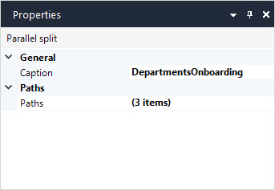

## 1 Introduction

The parallel split is used to have parallel processes in your workflow. For example, when onboarding a new employee, you can have several processes running in parallel: the HR preparing necessary documents, the IT department preparing a workstation, and the Administration department scheduling a training for the employee:

## 2 Properties

An example of parallel split properties is represented in the image below:

Parallel split properties consist of the following sections:

* [General](#general)
* [Paths](#paths)

### 2.1 General Section {#general}

The **Caption** describes what happens in this element. It is displayed in the workflow element to make the workflow easier to read and understand without needing to add annotations.

### 2.2 Paths Section {#paths}

The **Paths** property allows you to add as many paths as there are parallel processes. 

## 3 Read More

* [Workflow Properties](workflow-properties)