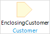

## 1 Introduction

A parameter is a special kind of variable that is used an input for the microflow. Parameters are filled in the location from where the flow is triggered.

If you want to use an object of the *Customer* entity in a microflow, use the parameter. In the picture below, the object name is *EnclosingCustomer* and is shown in black. The data type is object, therefore the entity name is shown underneath the object name in blue.

## 2 Output Properties

### 2.1 Name

**Name** refers to the value of the parameter.

### 2.2 Data Type

The data type of a parameter defines the type of the value that it expects. See [Data Types](data-types) for the possible data types.

Default: *Object*
