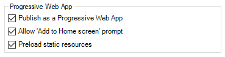
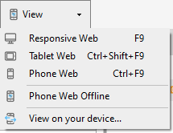
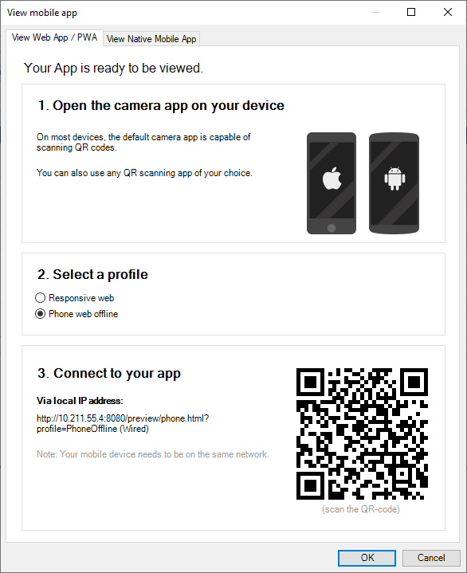
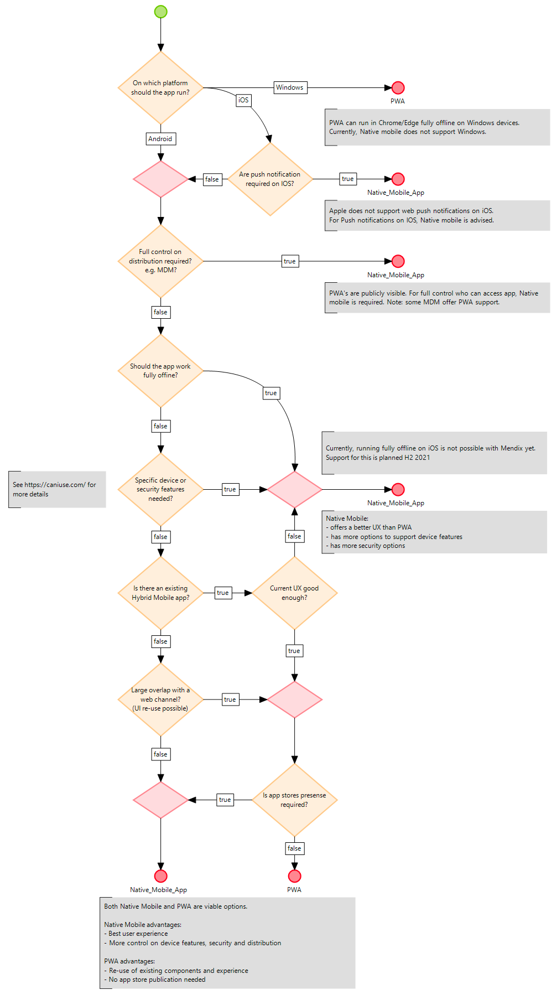

## 1 Introduction

Progressive web apps (PWAs) are an evolution of traditional web apps. Overall, PWAs tend to behave more like native mobile apps, and their popularity is increasing. One difference and possible advantage of PWAs compared to hybrid and native mobile apps is that PWAs do not need to be distributed via an app store but can be accessed directly via the browser.

Progressive web apps have three main characteristics:

* **Installable:** PWAs let you add your app to your user's home screen and start a full screen app. This makes PWAs feel more fully-capable native apps.
* **Reliable:** Using service workers, PWAs can work offline or partially offline. Mendix PWAs can work partially offline (resources like styling, pages, and images are cached) or fully offline (like hybrid offline and native mobile apps).
* **Capable:** PWAs can leverage several device capabilities like the camera and location, and can offer support for web push notifications. Note that support for features depend on which browser is used.

## 2 Enabling PWA Features

As PWAs are basically web apps with additional features, Mendix offers these features as part of the web navigation profiles. Based on the requirements, one can create a fully offline capable PWA or a web application that does require a connection but still uses PWA features.

To create a full offline-first PWA, one can add one of the following profiles, depending on the form factor needed: Responsive Web Offline, Phone Web Offline, Tablet Web Offline. For more information about offline-first apps, see [Offline-First](https://docs.mendix.com/refguide/offline-first).

Within the navigation profiles the following PWA features can be configured:



To be able to fully test the PWA functionalities the app needs to be deployed to the cloud. This is because the service worker is only enabled in the cloud over HTTPS.

### 2.1 Publish as a Progressive Web App

When checked and deployed to the cloud, the app registers a [service worker](https://developers.google.com/web/fundamentals/primers/service-workers) that is the basis for PWA. On offline navigation profiles, this option is always enabled. In online navigation profiles, enabling this option will also give the end-user a custom page when the device has no connection. Where desired, this page can be customized by adding an offline.html page to the theme folder (e.g. theme/offline.html). Note that this page should not load any other resources over the network.

### 2.2 Allow ‘Add to Home screen’ prompt

When this option is checked, the end-user might be actively asked to add the app to the home screen or desktop of their device. The behavior can differ per browser and over time. When unchecked, the app can still always be added to the home screen, but the user won't be actively asked.

### 2.3 Preload static resources

Enabling this option will make the app preload static resources like pages, images and widgets in the background, which can be beneficial for performance. This preloading happens when a user opens the app for the first time, or when the model has changed. This makes your app feel faster when navigating to new pages. It comes at a cost as it consumes more bandwidth and device storage initially, which is not always desired.

In the offline profiles, this feature is automatically enabled to allow the app to function fully offline.

Note that all pages and images reachable in the navigation profile are loaded by the browser, which can be undesirable from a security perspective, depending on the use case and requirements.

## 3 Preview/test a PWA

PWA’s can be directly viewed and tested in the browser on your machine or device. Via the View menu you can directly open the PWA profiles in your browser;



or on your device via the “View on your device...” option.



Note: If you are running on a Mac with Parallels, make sure that port 8080 (or whichever port you have configured for your app) is forwarded and that you use your Mac IP instead of the Virtual Machine’s IP.

**Important note when previewing/testing an offline PWA locally.**

When previewing/testing an offline-first PWA locally, a connection is always needed to load it. After initial loading the app behaves fully offline-first, but it can not be reloaded without a connection. Once the app is deployed to the cloud, end-users can always load it without a connection after the first visit.

### 3.1 PWA Lighthouse check

To check the PWA capabilities [Lighthouse](https://developers.google.com/web/tools/lighthouse) can be used. Lighthouse is an open-source, automated tool for improving the quality of web pages. It can check if your app meets the Progressive Web App requirements and can offer suggestion for improving your web app.

## 4 Distribute or share the PWA

As PWA’s are web apps, these can be shared easily by sharing the URL of the PWA.

When opening the app on a device or browser, Mendix automatically determines the navigation profile based on the user agent and the browser capabilities. If the browser does not support offline functionality, an online profile will be used instead.

Currently Google Chrome and Microsoft Edge (Chromium edition) fully support running offline-first apps.

**Example of profile selection**
For example, when a Phone Web Offline profile is configured and the app is opened in the browser, the following scenarios can occur:

| Device & Browser         | Result                                                                                                                                                         |
| ------------------------ | -------------------------------------------------------------------------------------------------------------------------------------------------------------- |
| Desktop browser          | Responsive Web profile is loaded                                                                                                                               |
| Android - Chrome browser | Phone Web Offline profile is loaded                                                                                                                            |
| iOS - Any browser        | If there is a Phone Web profile, this is loaded; otherwise, the Responsive Web profile is loaded. This is because offline PWAs are not (yet) supported on iOS. |

Next to that, it is possible to force a profile by providing the profile name in the url as a query parameter; e.g. `http://localhost:8080/?profile=PhoneOffline`. Possible profile values are:

| Profile name           | Value in url      |
| ---------------------- | ----------------- |
| Responsive web         | Responsive        |
| Responsive web offline | ResponsiveOffline |
| Phone web              | Phone             |
| Phone web offline      | PhoneOffline      |
| Tablet web             | Tablet            |
| Tablet web offline     | TabletOffline     |

When forcing a specific profile on a cloud deployment, it can be necessary to first clear the browser cache.

## 5 Advanced settings

PWAs use a web manifest that provides information to the browser about the application. Mendix generates one automatically based on the model. It can be customized for specific needs by changing the `manifest-overrides.webmanifest` json file in the theme folder. The `background_color` and `theme_color` properties will often be useful to customize:

```json
{
    "background_color": "white",
    "theme_color": "#0CABF9"
}
```

For more information on the available properties in the web app manifest check out [this short introduction](https://web.dev/add-manifest/) or [the full reference at MDN](https://developer.mozilla.org/en-US/docs/Web/Manifest).

## 6 Accessing device features

Browsers offer access to device features through API’s that can be leveraged in PWA’s. These device features can be used by available widgets and Nanoflow actions. It is also possible to leverage additional device features by extending the platform using [JavaScript actions](https://docs.mendix.com/refguide/javascript-actions) or [Pluggable widgets](https://docs.mendix.com/howto/extensibility/pluggable-widgets).

For more information on browser support for certain device features, check out [Can I Use](https://caniuse.com/).

## 7 PWA or a Native Mobile App?

Mendix offers options to build both native mobile apps and PWAs. Depending on the requirements or constraints, one or the other can be a better fit. It is also possible to have both Native Mobile and PWA profiles in a single project, which can run next to each other and share large parts.

Use the following diagram to help in making a decision whether to build a PWA and/or a native mobile app.


