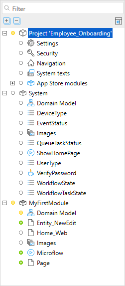

## 1 Introduction

The **Project Explorer** shows the complete structure of your project including all documents inside the modules:

{}
{}

The **Project Explorer** consists of the following:

* **Project** folder – contains settings and documents that apply to your project as a whole. For more information, see [Projects](project).
* **Modules**  – contain settings and documents, such as pages, microflows, a domain model, that apply to this module. For more information, see [Modules](modules). 

## 2 Performing Basic Functions

In the **Project Explorer**, you can do the following:

* **Open the document** – double-click the document to open it
* **Select the active document** – click the icon in the top-right corner of the **Project Explorer** to quickly view the active document in the **Project Explorer** tree. By default the active document is always selected so you can quickly see where the document you are editing is located. You can change this behavior in the **Edit** > **Preferences** dialog window.
* **Expand all documents** – click the plus icon in the top-left corner of the **Project Explorer** to expand all document and see the whole structure of your project 
* **Collapse all documents** – click the minus icon in the top-left corner of the **Project Explorer** to collapse all documents  
* **Expand or collapse an individual folder** – to expand/collapse documents in an individual folder click the plus/minus icon or double-click the folder. 
* **Perform actions specific to the selected folder** – right-click the selected folder to see what functions you can perform. The list of functions depends on the folder, for example, when right-clicking the **System** module, you can only find usages of this module, while when right-clicking **MyFirstModule** you can add a page, add a microflow, rename the module, export the module package, and much more.

## 3 Read More

* [Projects](project)
* [Modules](modules)
* [Security](security)