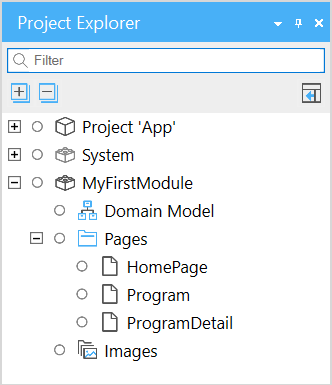

## 1 Introduction

The **Project Explorer** shows the complete structure of your project including all documents inside the modules:

By default the active document is always selected in the project explorer so you can quickly see where the document you are editing is in the tree. You can change this behavior in the **Edit** > **Preferences** window pane.

## 2 Performing Basic Functions

In the Project Explorer you can do the following:

* Doable-click the document to open it
* 

## 3 Read More

* [Projects](project)
* [Modules](modules)
* [Security](security)