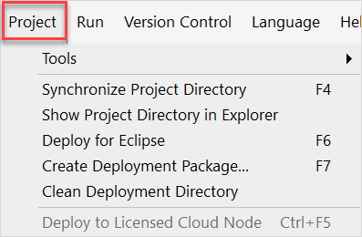
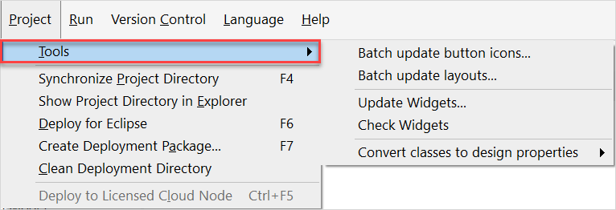

## 1 Introduction

In the **Project** menu, you can view and/or manipulate settings that are connected to your project and deployment. For example, you can create a deployment package.

{}
{}

## 2 Tools

Under **Project** > **Tools**, you can find settings on updating widgets, button icons, and layouts, checking widgets, and converting your classes to **Design** properties.  

### 2.1 Batch Update Button Icons

The **Batch Update Button Icons** option allows you to update many button icons in a single batch process.

### 2.2 Batch Update Layouts

The **Batch Update Layouts** option allows you to update the layouts of many pages in a single batch process.

### 2.3 Update Widgets {#update-widgets}

The **Update Widgets** option presents the current versions of the widgets you are using in your app project, what the latest versions of the widgets are, and an update option.

### 2.4 Check Widgets

The **Check Widgets** option checks that the widgets you have implemented in the app project have been built correctly.

### 2.5 Convert Classes to Design Properties

The **Convert classes to design properties** option allows you to convert classes in widgets into design properties to assist in changing the widget styling. See [How To Implement Native Mobile Styling](/howto/mobile/native-styling) for more information.

## 3 Synchronize Project Directory

The **Synchronize Project Directory** option creates folders inside the project directory (resources, widgets, theme, etc.), if necessary. It also reads the widget packages that are currently inside the widgets folders. For example, if you add widgets to the widgets folder, you needs to synchronize the project directory for them to appear in the **Toolbox**.

Shortcut key: <kbd>F4</kbd>

## 4 Show Project Directory in Explorer

The **Show Project Directory in Explorer** option shows the directory that contains the project file (*.mpr*) and other assets such as resources and Java actions in Windows Explorer

## 5 Deploy for Eclipse

The **Deploy for Eclipse** option deploys the project to the deployment directory. The Java stubs are generated so that you can start editing them in Eclipse. This action does not compile the Java actions. Use this if you are writing Java actions and you want to compile and debug them through Eclipse.

Shortcut key: <kbd>F6</kbd>

## 6 Create Deployment Package

The **Create Deployment Package** option creates a Mendix Deployment Archive package (*.mda*) that contains all necessary files to run the project. This can be used if you want to deploy your project on a Windows server or on a custom Mendix Cloud.

Shortcut key:  <kbd>F7</kbd>

For more information on settings displayed on the Create Deployment Package dialog box, see [Create Deployment Package](create-deployment-package-dialog).

## 7 Clean Deployment Directory

The **Clean Deployment Directory** option cleans the deployment directory.

## 8 Deploy to Licensed Cloud Node {#deploy}

The **Deploy to Licensed Cloud Node** option deploys the latest committed revision of a Team Server project to the associated Mendix Cloud node.

Shortcut key:  <kbd>Ctrl</kbd> + <kbd>F5</kbd>

{}
This is not supported for apps in Mendix Cloud v3.
{}

{}
The [Mendix Studio Target](/developerportal/deploy/studio-deployment-settings#target) needs to be set and the deploying user needs to have transport rights to the set target.
{}

For more information on using this option, see [Deploy to the Cloud](deploy-to-the-cloud-dialog).

## 9 Read More

* [Studio Pro Overview](studio-pro-overview)
* [Deployment](/developerportal/deploy)
