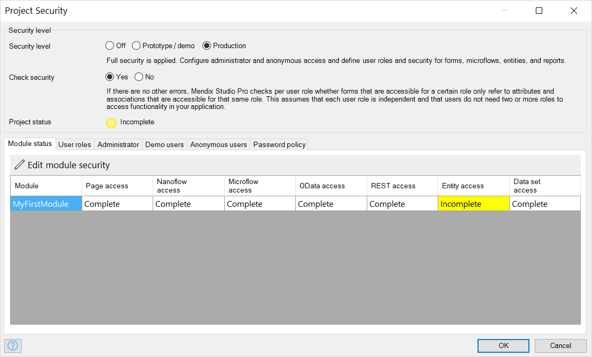

## 1 Introduction

In the **Project Security** dialog window you can configure security settings related to the project, such as the security level, user roles, administrator credentials, and anonymous users:



{}
For more general information on security, see [Security](security).
{}

## 2 Security Level {#level}

The security level defines how security is applied and which security settings need to be configured.

| Security level | The way security is applied | Security settings to be configured |
| --- | --- | --- |
| Off | No security is applied. Users do not have to sign in and can access everything. | None |
| Prototype/demo | Security is applied to signing in, forms, and microflows. Users can access all data. | Administrator and anonymous access, user roles, and security for forms and microflows. |
| Production | Full security is applied. | Administrator and anonymous access, user roles, and security for forms, microflows, entities, and reports. |

{}
Security levels **Off** and **Prototype/demo** are only allowed in the development and test environments. For acceptance and production you need to use the **Production** security level and configure all security settings accordingly.
{}

### 2.1 Settings Availability for Different Security Levels

Security settings availability depend on the security level that you set. Find the list of all security settings and their availability per security level in the table below: 

| Setting Name    | Security Off | Prototype/demo Security                                      | Production Security                                          |
| --------------- | ------------ | ------------------------------------------------------------ | ------------------------------------------------------------ |
| Check security  | N/a          | N/a                                                          | Available, see the [Check Security](#check-security) section. |
| Project status  | N/a          | Available, see the [Project Status](#project-status) section. | Available, see the [Project Status](#project-status) section. |
| Module status   | N/a          | Available, see the [Module Status](#module-status) section.  | Available, see the [Module Status](#module-status) section.  |
| User roles      | N/a          | Available, see the [User roles](#user-roles) section.        | Available, see the [User roles](#user-roles) section.        |
| Administrator   | N/a          | Available, see the [Administrator](#administrator) section.  | Available, see the [Administrator](#administrator) section.  |
| Demo users      | N/a          | Available, see the [Demo users](#demo-users) section.        | Available, see the [Demo users](#demo-users) section.        |
| Anonymous users | N/a          | Available, see the [Anonymous users](#anonymous-users) section. | Available, see the [Anonymous users](#anonymous-users) section. |
| Password policy | N/a          | Available, see the [Password policy](#password-policy) section. | Available, see the [Password policy](#password-policy) section. |

### 2.2 Check Security {#check-security}

If the security level is set to **Production**, you can specify whether the consistency of security settings should be checked. 

When **Check Security** is enabled, for each user role Studio Pro checks which forms are accessible, either directly in the menu bar or indirectly by following forms and microflows. For each of those forms, Studio Pro checks whether referred attributes and associations are accessible for the current user role. If not, an error is added to the error list. These errors are only shown if there are no other consistency errors.

### 2.3 Project Status {#project-status}

The project status indicates the security status for the current project security level.

| Project status | Description |
| --- | --- |
| Complete | All security settings for the current security level have been configured. |
| Incomplete | Some security settings for the current security level need to be configured. For more information, see the [Module Status](#module-status) section. |

## 3 Module Status {#module-status}

The **Module Status** tab shows the security status for each module. It shows the total number of items for which security needs to be configured, as well as the number of items for which security has been configured already. 

At the **Prototype/demo** security level, the status of form access and microflow access is shown.

Additionally, at the **Production** security level, the status of entity access and dataset access (if applicable) is shown.

## 4 User Roles {#user-roles}

A user role aggregates a number of access rights on data, forms, and microflows. An end-user of the application is assigned one or more user roles by an administrator, and gets all access rights that these user roles represent. For more information, see [User Roles](user-roles).

## 5 Administrator {#administrator}

In the **Administrator** tab of **Project Security**, you can change the default credentials and a user role for the Administrator user. For more information, see [Administrator](administrator). 

## 6 Demo Users {#demo-users}

Demo users are a demonstration of each [user role](user-roles) existing in your app. You can use demo users to test how your app looks like for each user role or to demonstrate your app to other people. For more information, see [Demo Users](demo-users). 

## 7 Anonymous Users {#anonymous-users}

**Allow anonymous users**

Here you can configure whether anonymous users are allowed to access your application.

| Value | Description |
| --- | --- |
| Yes | Anonymous users are allowed. End-users do not have to sign in to access the application. If the user clicks a button of which the microflow requires a user role other than the anonymous user role, the user is presented with a sign in screen. |
| No | Anonymous users are not allowed. End-users have to sign in to access the application. |

**Anonymous user role**

This is the user role that end-users of your application have when they are not signed in.

**Sign-in microflow**

When anonymous users are allowed, here you can optionally configure a sign-in microflow. This microflow can be used to transfer data from the anonymous user to the signed-in user. In this microflow the current user is set to the signed-in user.

The sign-in microflow has two parameters.

| Name | Type | Description |
| --- | --- | --- |
| AnonymousUser | Object of entity 'System.User' | The 'User' object of the anonymous user. This object will be automatically deleted after the execution of the sign-in microflow. |
| SignedInUser | Object of entity 'System.User' | The 'User' object of the signed-in user. |

{}

Clean up objects that were attached to the anonymous user and that you do _not_ transfer to the signed-in user. Since the anonymous user is deleted after running the sign-in microflow, you can use [delete behavior](associations) to automatically clean objects that were attached to the anonymous user.

{}

The sign-in microflow is executed when an end-user:

1.  Uses your application without signing in (thus as an anonymous user), and then
2.  clicks a button for which she does not have access, which causes a sign-in screen to appear, and then
3.  signs in to your application.

{}

An anonymous user in a web shop adds some items to her shopping cart and then clicks the 'Check out' button. A sign-in screen appears, and the user signs in. The sign-in microflow is executed and transfers the shopping cart of the anonymous user to the signed-in user.

{}

## 8 Password Policy {#password-policy}

You can specify a number of requirements for passwords. These requirements will be enforced when creating new users or changing passwords of existing users.

**Minimum length**

Specifies the minimum length of passwords.

**Require digit**

Specifies whether at least one digit is required in passwords.

**Require mixed case**

Specifies whether passwords must contain at least one lowercase character and one uppercase character.

**Require symbol**

Specifies whether passwords must contain at least one special symbol.

The following characters are considered symbols:

```java
` ~ ! @ # $ % ^ & * ( ) - _ = + [ { ] } \ | ; : ' " < , > . / ?
```

## 9 Read More