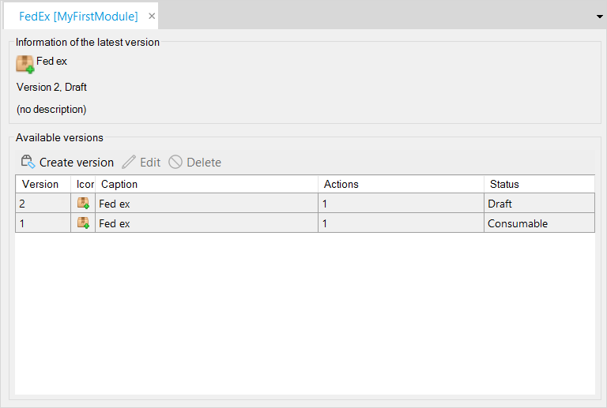

An App Service can be created via **File** > **New Document**.

Names of Published App Service documents must be unique, also with regard to Published Web Services.

### Create version

The button **Create version** instantiates a new app service version. For more information, see [Published App Service](published-app-service).

### Edit

Opens the selected app service version dialog. Only **Draft** versions are editable. The settings of **Consumable** versions can only be viewed.

### Delete

Deletes the selected app service version.
