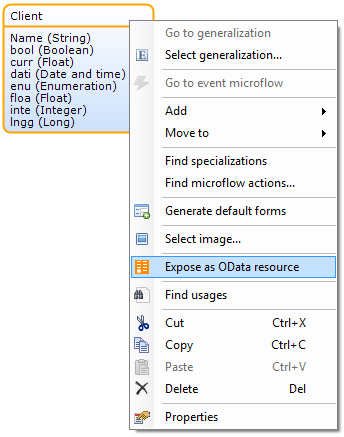
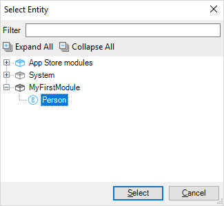

{}

This document describes the properties of a published OData resource. If you want a general overview of OData services, you can check the [Published OData Services](published-odata-services) documentation.

{}

## 1 Adding or Editing a Resource

The **Add resource** or **Edit** button in the Published OData Service document will open an editor window for the published resource. The editor window is separated in two parts: **Resource** and **Uniform Resource Identifier**. The former lets you specify which entity and entity attributes to expose, whereas the latter lets you customize the location where the resource will be published.

Another way to add a resource is by right-clicking on an entity in the domain model and clicking **Expose as OData resource**. Doing so will prompt you to select or create a published OData service document to add the new resource to. After the document has been selected, the published resource editor will be displayed.

### 1.1 Resource

Press **Select** to open a dialog box that allows you to select an entity from the domain model to publish. Click on an entity in the displayed tree and press **Select** to confirm.

IBM DB2 does not support read-isolated data retrieval operations that are non-blocking in a multi-user environment. Therefore the data retrieved by OData might not be 100% consistent if the same data rows are modified concurrently by another user. For the details see this [IBM DB2](db2) page.

## 2 Selecting Exposed Attributes & Associations

When an entity to publish has been selected, press **Select** to open a dialog that allows you to select individual attributes to expose.

The _System_._ID_ attribute is used as a key in OData services and is therefore not allowed to be unchecked.

Attributes of published entities are nillable by default, meaning that if their value is **empty** then they will be encoded as explicit nulls in the OData content. If you deselect the _nillable_ column, the attribute cannot be **empty** (otherwise a runtime error would occur).

Attributes of type binary are not allowed to be exported through OData services, other than the Contents field of System.FileDocument.

## 3 Mapping from Internal Names to Exposed Names

Use the **Exposed entity name** field to customize the name of your resource that is exposed to the outside world. By default, the name is the same as the name of the exposed entity from your domain model. You can change this to any name which starts with a letter followed by letters or digits with a maximum length of 480 characters. Be aware however that the location URIs must be unique. Exposing two different resources on the same location will result in a consistency error.

This also applies to attributes and associations. In the **Exposed attributes and associations** screen, you can also override the **exposed name**. 

For associations, the exposed name is the name given to the navigation property (which is the property referring to the associated object(s)). You can also specify the name of the association using the **exposed association name** column. By default, the name is the same as the name of the association in the domain model.

When these names have been overridden, the name of the entity, attribute or association as defined in your domain model will not be exposed to the outside world, for all OData communication the exposed name will be used.

These features make it easier to refactor your domain model without affecting external APIs.

## 4 Exposed Set Name

Use the **Exposed set name** field to set the name of the entity set. This is the last part of the URL of the resource.

Default: *{Entity name}s*

## 5 Use Paging

If you enable this option, you can set a maximum number of objects per response, with a link included to the next set of objects. A client like Tableau can use this to show progress and will automatically keep following the links until all data is retrieved. Memory usage of clients can be improved if you use paging with a reasonable page size.

**Note that enabling this does mean that retrieved data can be inconsistent**, because you're no longer retrieving data within a single transaction. For example, you are sorting on an Age attribute in an entity called Customer and retrieving customers with 1000 objects per page. Now a customer gets deleted in between two calls, it means that the customer with Age 23 at position 1001 now moves to position 1000, meaning that this object that you _would_ have gotten on the next page now moves to the first page and is not retrieved anymore. The other way around with data inserts in between calls can cause you to see duplicates. So only use this option when this kind of inconsistency is acceptable.

Default: *No*

## 6 Page Size

When Use paging is set to Yes, you can set the amount of objects per page here.

Default: *10000*
