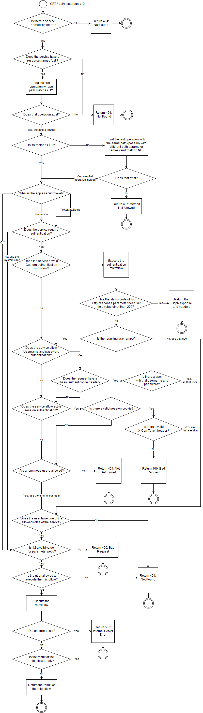

{}

The 'Published REST Service' was introduced in version 7.8.0. This feature is still in private beta, and is subject to change before the final release.

{}

When a REST HTTP request arrives at the server, the server needs to determine which [operation](published-rest-operation) to execute. This flowchart shows how that works:

