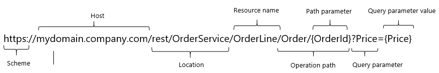

{}

The **published REST service** feature was introduced in version 7.10.0.

{}

## 1 Introduction

Use a published REST service to expose your entities and microflows to other apps using the REST standard.

## 2 General

### <a name="service-name"></a>2.1 Service Name

Service name uniquely identifies the service in the app. It is also displayed in [OpenAPI (Swagger) documentation page](open-api).

When service is initially created, service name is used in the creation of the default location for the service. If the service name contains any spaces or special characters, they will be replaced with the `_` character in the service location. 

### 2.2 Version

{}

The **Version** feature was introduced in version 7.12.0.

{}

Version is used to display version information in [OpenAPI (Swagger) documentation page](open-api). You can set any string in the version field, but it is recomended to follow [semantic versioning](https://semver.org/) scheme.

By default, version is set to "1.0.0".

### 2.3 Location

{}

**Location** is editable since version 7.12.0.

{}

Location shows URL on which a service can be reached.

By default, location is built up by appending service name and "v1" to the "rest/" prefix. Service name will be stripped off of any invalid URL characters; like spaces and special characters.

Example:
```
http//localhost:8080/rest/my_service_name/v1
```

You can change the the default location to almost any valid URL.

#### 2.3.1 Reserved prefixes

Following URL prefixes are reserved and are not allowed to be used in location:

* `ws/`
* `ws-doc/`
* `rest-doc/`
* `odata/`
* `odata-doc/`
* `api-doc/`
* `xas/`
* `p/`
* `reload/`

### 2.4 Allowed Roles

The allowed roles define which [module role](module-role) a user must have to be able to access the service.

### <a name="public-documentation"></a>2.5 Public Documentation

The public documentation is used in the service's [OpenAPI 2.0 (Swagger) Documentation](open-api). You can use [GitHub-flavored markdown](gfm-syntax) for rich text.

### <a name="export-swagger-json"></a>2.6 Export swagger.json

To save a service's [OpenAPI (Swagger) documentation](open-api) somewhere on your machine, simply right-click the service in the **Project Explorer** and select **Export swagger.json** (or just click the **Export swagger.json** button, depending on your Modeler version). This is a machine-readable file in the [OpenAPI 2.0 file format](https://github.com/OAI/OpenAPI-Specification/blob/master/versions/2.0.md). Most API tools support this format.

When the app is running, this file is available under `/rest-doc/servicename/swagger.json`.

## 3 Security

### <a name="authentication"></a>3.1 Authentication

{}

The **Authentication** feature was introduced in version 7.11.0. In earlier versions, it was always **Username and password**.

{}

Select whether clients need to authenticate with a username and a password (using basic authentication) or not.

### 3.2 Allowed Roles

The allowed roles define which [module role](module-role) a user must have to be able to access the service. This option is only available when **Authentication** is set to **Username and password**.

## 4 Resources

A REST service exposes a number of [resources](published-rest-resource). On a resource you can define GET, PUT, POST, PATCH, and DELETE operations.

## 5 Operations

When you select a resource, you see the [operations](published-rest-operation) that are defined for that resource.

Resources and Operations are appended to [Location](#Location) to form a URL on which they can be accessed.



## 5 Related Content

For more information on which operation gets executed for a given request URL, see [Published REST Routing](published-rest-routing).
