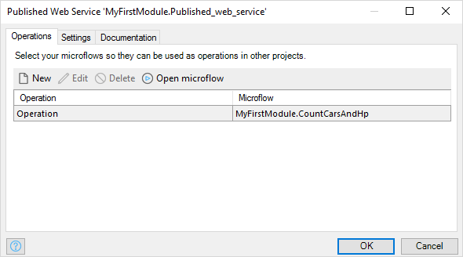

{}

This document describes the properties of a published web service. If you want a general overview of how Mendix publishes microflows as web services, you can check the [Published Web Services](published-web-services) overview documentation.

{}

## Operations



Provide the actual operations of which the web service is composed. Each of these operations is a Microflow.

See [Operations](operations).

## Settings


### Validate against WSDL

If set to 'yes', incoming requests will be validated against the WSDL.

Note that when this property was introduced in Mendix 5.8.0, behavior changed slightly in this respect. Primitive values already used to be validated in all cases, but now we're validating the entire incoming XML message. To not break old web service requests that may not validate against the WSDL but that did not cause actual issues, we do not turn this feature on by default when converting projects made in older versions. This does however mean that if you want to validate primitives again, you must turn this feature on.

_Default value:_ Yes

### Authentication

The authentication settings to define for communicating with the web service.

### Target namespace

This is the value of the targetNamespace attribute in the published WSDL file for this service. In Mendix, a target namespace must be a valid Uniform Resource Identifier (URI). For more information on XML namespaces, see [Wikipedia](http://en.wikipedia.org/wiki/XML_namespace).

It is important to correctly configure the target namespace before publishing your WSDL to third parties. Changing it later might break the third-party applications that call your published web services.

### Generated XML

{}

The **Generated XML** feature was introduced in version 7.13.0.

{}

Check _Include tags for associations_ if you need to include tags for associations in XML. This is usually not necessary, and support for this will be removed in a future version.

To see the effect of this checkbox, consider a person with two dogs and a cat.

When you don't check _Include tags for associations_, the XML looks like this:

```xml
<Person name="John">
  <Dog name="Max" />
  <Dog name="Rex" />
  <Cat name="Chester" />
</Person>
```

When you check _Include tags for associations_, the XML looks like this:

```xml
<Person name="John">
  <Person_Dog>
    <Dog name="Max" />
    <Dog name="Rex" />
  </Person_Dog>
  <Person_Cat>
    <Cat name="Chester" />
  </Person_Cat> 
</Person>
```

### Export WSDL file & Export XML schema definition

By using this button, you can save the generated WSDL file, and its XML schema definition on your local hard drive. You can do this already before running your project, unlike when you download it from `http://localhost:8080/ws-doc/` .

### Documentation

Can be used to describe what the web service is used for.
