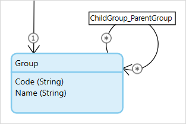
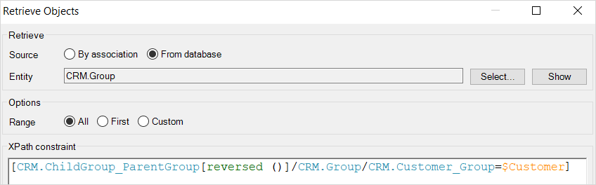

When using more generic domain models, you often turn to using inheritance or self references to allow for simple yet efficiently designed models. This makes building your microflows and application logic much easier, but it can become challenging to query the correct objects; especially when your are using a self-reference. In this example, a self-reference to Group is used. This will allow you to build a group structure with an unlimited amount of sub-groups.

There are 5 groups relevant to this example. Group with ID 4 and 5 are the parent groups and each have the same three subgroups. 

If you have the ParentGroup available in your microflow you can easily retrieve the subgroup. The platform automatically determines which of the two groups from the association is used. Each association has a left side (the association owner) and a right side (child in the association). XPath constraint can are read from left to right as well, and this is key to how you should interpret which of the two groups is being used.  

If we assume that the $ParentGroup variable is the group S2 with ID 5\. The following data highlighted in blue will be returned. The Platform applies the constraint by default on the right/child side of the association and returns the relevant ChildGroups.

However when you only have the SubGroup available and you want to retrieve all its ParentGroups from the database it becomes more complicated. You can use the expression [reversed()] to instruct the platform to read the constraint opposite of what it would normally do. So instead of reading the association from left to right the platform will interpret the id's from right to left. Keep in mind that this instruction only applies to one association. So if you would have used multiple associations they are always interpreted the normal way. 
The reversed() expression can only be applied on self-references, when an association is created between two different object types the platform will be capable of determining the correct join automatically.

Let's assume the $SubGroup variable is group G2 with ID 2\. This query will return the data highlighted in blue, and thus all the ParentGroups. 

This a simple example however the [reversed()] expression can also be used in more complicated queries such as the one below. If we assume that our Customer is associated with group G2 with ID 2, our query will return the exact same dataset as the previous example. 
This constraint will return all the Groups with an association to the group that is associated with the Customer variable. Because the reversed association is specified for the group association it will be interpreted from right to left. The ParentGroup is considered to be the right side of the association, therefore the query will be returning ParentGroups. The ChildGroup needs to be associated with the Customer variable to be applicable in this constraint. 
If you do not specify the [reversed()] expression the query will be interpreted from left to right and since the ChildGroup is configured on the left side of the association the child groups could have been returned.  

