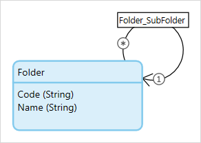

## 1 Introduction

Sometimes, you want to create a more generic domain model to allow more flexibility in the type and structure of your data. In this case, you often turn to using inheritance or self references to allow for simple yet efficiently designed models. This makes building your microflows and application logic much easier, but it can become challenging to query the correct objects: especially when you are using a self-reference.

## 2 The Example

In this example, a self-reference to **Group** is used. The self-reference is an association called **ChildGroup_ParentGroup**. This allows you to build a group structure with unlimited numbers and levels of sub-groups.

There are 5 groups relevant to this example. The group with ID 4 and 5 are the parent groups and each have the same three subgroups. 

For more information on how domain models are implemented in databases, see the [Implementation](domain-model#implementation) section of *Domain Model*.

### 2.1 Retrieving the Child Group from the Parent Group

If you have the $ParentGroup object available in your microflow you can easily retrieve the child group(s). The platform automatically determines which of the two groups from the association is used. Each association has a left side (the association owner) and a right side (child in the association). The XPath constraint is read from left to right as well, and this is key to how you should interpret which of the two groups is being used.  

If we assume that the $ParentGroup object is the group S2 with ID 5, the following data, highlighted in blue, will be returned. The platform applies the constraint by default on the right/child side of the association and returns the relevant ChildGroups.

### 2.2 Retrieving the Parent Group from the Child Group

When you only have the $ChildGroup object available and you want to retrieve its ParentGroup(s) from the database, it becomes more complicated.

You can use the expression `[reversed ()]` to instruct the platform to read the constraint in the reverse direction to that which it would normally use. So, instead of reading the association from left to right the platform will interpret the id's from right to left. Keep in mind that this instruction only applies to one association. So if you had used multiple associations they will continue to be interpreted the normal way.

The `[reversed()]` expression can only be applied on self-references. When an association is between two different object types, the platform will be determine the correct join automatically.

Let's assume the $ChildGroup object is group G2 with ID 2. This query will return the data highlighted in blue, and thus all the ParentGroups. 

### 2.3 Creating More Complex Queries

The previous example was a simple one. However the `[reversed()]` expression can be used in more complicated queries such as the one below.

This constraint will return all the Groups with an association to the group that is associated with the $Customer object. Because the reversed association is specified for the group association, it will be interpreted from right to left. The ParentGroup is considered to be the right side of the association, therefore the query will be returning ParentGroups.

If you do not specify the [reversed()] expression the query will be interpreted from left to right and since the ChildGroup is configured on the left side of the association the child groups could have been returned.  

If we assume that our Customer is associated with group G2 with ID 2, our query will return the exact same dataset as the previous example.
