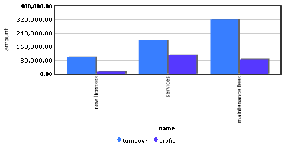
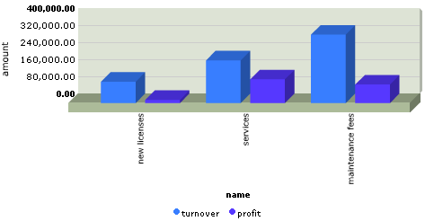
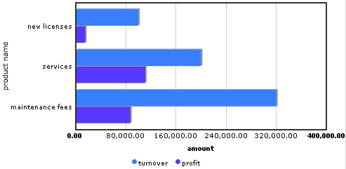
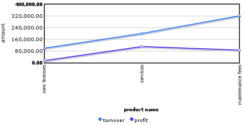
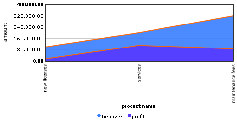

{}

This widget been deprecated in version 6.10.0 and is marked for removal in version 8.0.0.

{}

A report chart is used to display a data set graphically as a set of vertical bars.

For each object in the data set one or more bars are displayed, depending on the defined Series of the report chart.

## Data Source Properties

### Data Set

The data set determines which data will be shown in the report chart.

## General Properties

### Aspect Ratio

This property determines the aspect ratio (width : height) of the report chart as the end user will see it.

### Generate Report on Page Load

If this property is false, the report chart will not show its data until the user clicks [Report](report-button). This is especially useful if the report uses parameters that should be specified by the user. 

## Chart Properties

### Type

With this property you can choose the type of the report chart. The following types are avalailable.

| Name | Layout |
| --- | --- |
| VerticalBars |  |
| VerticalBars3D |  |
| HorizontalBars |  |
| Lines |  |
| Area |  |

### Horizontal Axis Properties

{}

If the chart type is HorizontalBars, the axisses are swapped, and these properties apply to the vertical axis instead of the horizontal axis.

{}

### Caption

This is the caption that end users see near the horizontal axis of the chart.

### Data Set Column

This property refers to the column of the data set of which the value is displayed on the horizontal axis.

### Format

If the data set column of the horizontal axis has type DateTime, through this property you can choose how the date is displayed.

## Vertical Axis Properties

{}

If the chart type is HorizontalBars, the axisses are swapped, and these properties apply to the horizontal axis instead of the vertical axis.

{}

### Caption

This is the caption that end users see near the vertical axis of the chart.

### Precision

If numbers are displayed on the vertical axis, this property indicates the number of positions that's displayed after the dot in these numbers.

### Use Min/Max

If this property is false, the minimum and maximum value of the vertical axis is automatically adapted to the values that are displayed in the vertical direction.

If this property is true, the minimum and maximum value of the vertical axis are determined by the following properties.

### Minimum

Minimum value of the vertical axis. This is only used if property 'Use min/max' (described above) is true.

### Maximum

Maximum value of the vertical axis. This is only used if property 'Use min/max' (described above) is true.

## Common Properties

### Name, Class, Style

For details, see [Common Widget Properties](common-widget-properties).
