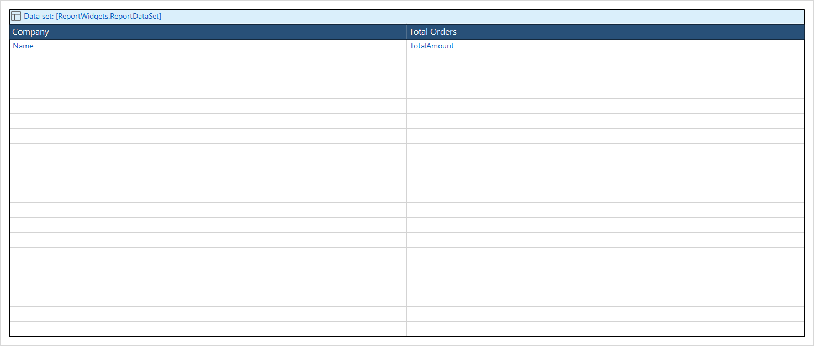
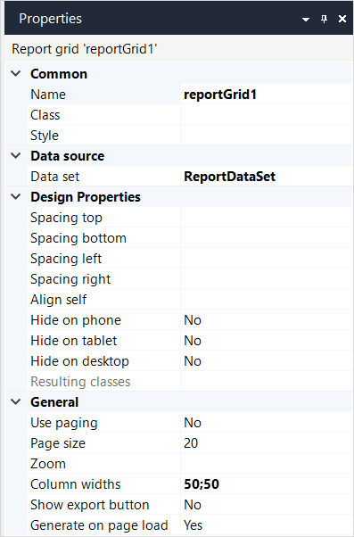
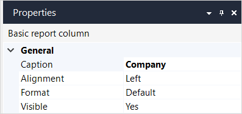

{}The report grid widget is not supported on native mobile pages.{}

## 1 Introduction

A **Report grid** shows data retrieved from the database in a [Dataset](datasets) in a grid format. Each time a report is created, the data is retrieved from the database.

The difference between a data grid and a report grid is that you can use a data grid to edit the data shown. A report grid will only display data. However, in a report grid, you can create additional information by merging and processing attributes when you define the dataset which retrieves the data.

The report grid is shown with the data set source shown between square brackets and colored blue. The data fields returned by the dataset are shown in the report grid columns, under the column captions.

## 2 Report Grid Properties

## Data Source Properties

### Data Set

This is the dataset that determines the data that will be shown in the report grid.

## General Properties

### Use Paging

If the expected quantity of the data is too large to be displayed at once, **Use Paging** should be true so that the data is distributed over different pages.

### Page Size

If **Use Paging** is true, this property indicates the number of occurrences that is displayed on one page.

### Zoom

This property can refer to a page. When the user double-clicks an occurrence in the report, that page is displayed.

If the other page contains a report, the columns of the current report can be mapped to the parameters of the report in the other page.

### Column Widths

The widths of the columns are expressed as a percentage of the total width of the basic report. You can edit this property by dragging the border between the columns.

### Show Export Button

If this property is true, the **Export to Excel** button will be available for the user on the report grid.

### Generate Report on Page Load

If this property is false, the report grid will not show its data until the user presses the [Report Button](report-button). This is especially useful if the report uses parameters that should be specified by the user. 

## Common Properties

### Name, Class, Style

For details, see [Properties Common for Widgets](common-widget-properties).

## 3 Report Grid Column Properties

## 4 Report Grid Column Data Source

Drag from the Connector Pane...
