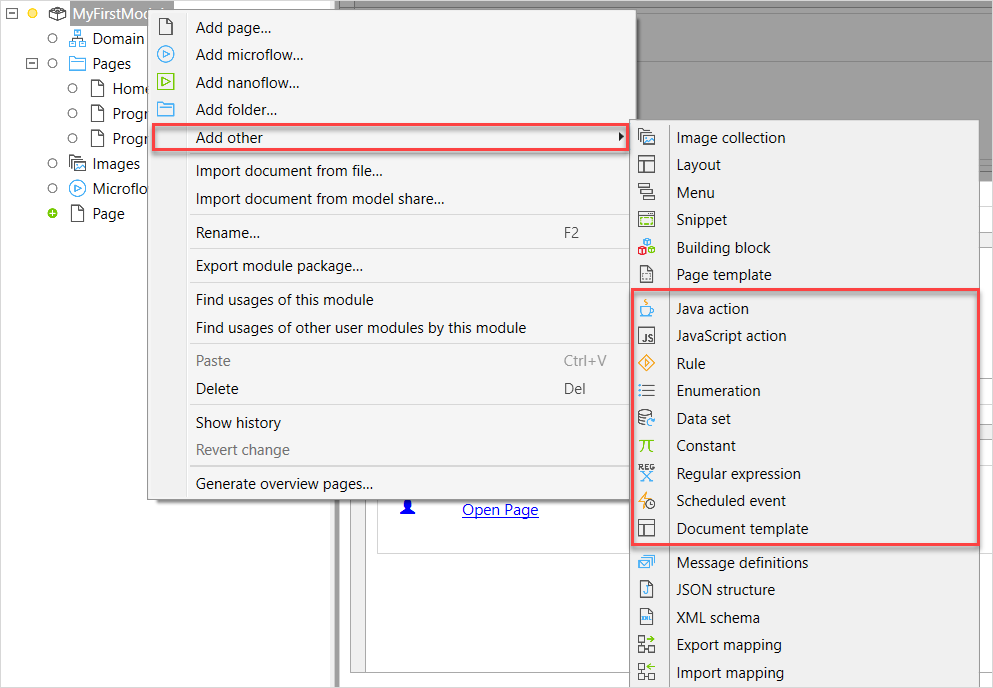

## 1 Introduction

Resources are helping documents in a module that cannot function on their own but can be used in other documents. For example, a microflow or a page can function on its own, but a Java action can only function in a microflow.  

Resources can be reused in different modules of your app. 

## 2 Adding Resources

To add a resource document, do the following:

1.  In the [App Explorer](project-explorer), right-click the module or a folder you want to add a resource to and select **Add other**:

    

2. In the **Resources** category, select the document you would like to add to your app.

## 3 Resources Overview

The **Resources** category contain various document types that can be used in different editors of Studio Pro:

| Element            | Is used in                      | Description                                                  |
| ------------------ | -------------------------------------- | ------------------------------------------------------------ |
| [Java action](java-actions) | Microflows                             | Java actions can extend the functionality of your application. They can be called from microflows. |
| [JavaScript action](javascript-actions) | Nanoflow                               | JavaScript actions can extend the functionality of your application. They can be called from nanoflows. |
| [Rule](rules)      | Microflows                             | Rules contain the application logic that should result in an enumeration or a Boolean. They are used in decisions in microflows. |
| [Enumeration](enumerations) | Domain model                           | Enumerations are used to define attributes of an enumeration type. |
| [Dataset](data-sets) | Pages                                  | Datasets define the data shown in reporting widgets.        |
| [Constant](constants) | Microflow expressions and Consumed web services | Constants are used to define configuration values.           |
| [Regular expression](regular-expressions) | Domain model                           | Regular expressions are used in validation rules to define criteria that a string should match to pass the validation. They cannot be used in other places which require regular expressions (for example, the *isMatch()* function). |
| [Scheduled event](scheduled-events) | Microflows                     | Scheduled events let the runtime execute a microflow at a specific moment in time. |
| [Document template](document-templates) | Microflows                             | Document template is used to format the document in a client and to download or print it. |

## 4 Read More

* [Microflows](microflows)
* [Domain Model](domain-model)
* [Pages](pages)
