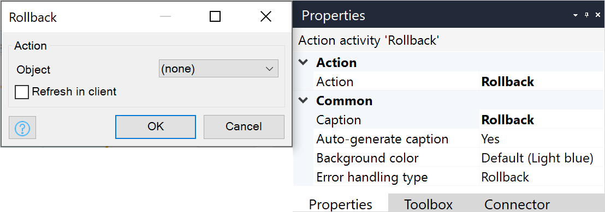
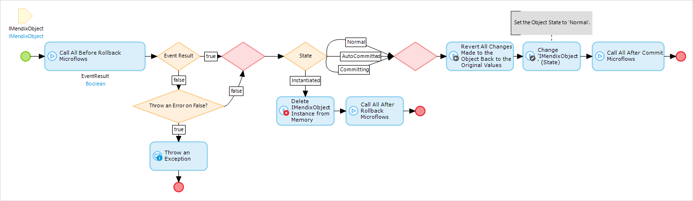

{}
This activity can be used in both **Microflows** and **Nanoflows**.
{}

## 1 Introduction

The rollback object action can be used to undo changes (that have not been committed) made to the object in the part of the flow preceding the activity. Furthermore, it deletes objects that have been created but never committed.

{}
When the rollback object action is performed in a sub-microflow, it rolls back the changes in its parent microflow as well as the sub-microflow.
{}

## 2 Properties

An example of rollback object properties is represented in the image below:

There are two sets of properties for this activity, those in the dialog box on the left, and those in the properties pane on the right.

The rollback object properties pane consists of the following sections:

* [Action](#action)
* [Common](#common)

## 3 Action{#action}

The **Action** section of the properties pane shows the action associated with this activity.

You can open a dialog box to configure this action by clicking the ellipsis (**…**) next to the action.

You can also open the dialog box by double-clicking the activity in the microflow or right-clicking the activity and selecting **Properties**.

### 3.1 Input Section

#### 3.1.1 Object

**Object** defines the object that needs to be rolled back.

#### 3.1.2 Refresh in Client

This setting defines how changes are reflected in the pages presented to the end-user.

Default: *No*

##### Microflow is Called from the Client in an Online App

If **Refresh in client** is set to *No*, the rollback is not reflected in the client.

If set to *Yes*, the object is refreshed across the client, which includes reloading the relevant [data sources](data-sources).

{}
Rolled back attribute values are always reflected in client. This includes updating their visibility and editability [properties](common-widget-properties). [Data sources](data-sources) are only reloaded if **Refresh in client** is set to *Yes*.
{}

##### Microflow is Called in an Offline, Native, or Hybrid App

When inside a microflow that is called from an offline, native, or hybrid app, the **Refresh in client** option is ignored and functions as if it was set to **No**.

For more information, see the [Microflows](offline-first#microflows) section of the *Offline-First Reference Guide*.

##### Action is in a Nanoflow

When inside a [nanoflow](nanoflows), the rollback object action reloads [data sources](data-sources) as if **Refresh in client** was set to *Yes*.

## 4 Common Section{#common}

{}

## 5 What Does Rollback Do?

Pressing a **Cancel** button or triggering a rollback activity will initiate the rollback events. These actions are not triggered in the case of a rollback because of an error.

* Events: all before and after events are executed, and if any before-rollback event returns false, an exception can be thrown
	* If an exception occurs during an event, all the applied changes are reverted with the default error handling behavior
	* Changes made prior to the rollback will be kept
* Database: there is no database communication happening during this event unless it is specified in a before- or after-create event
* Result: an object with the state **Instantiated** will be removed, and an object with any other state will be reverted back to the values it had during the last commit

